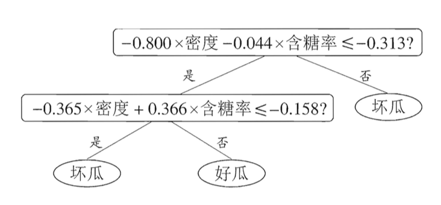

# 决策树

## 基础

决策树是基于树结构来进行决策的。决策过程中的每个判定问题都是对样本某个属性的*测试*。每个测试的结果或是导出最终结论，或是导出进一步的判定问题，其**考虑范围**是*在上次决策结果的限定范围内*。

**性质**：一棵决策树包含一个根结点、若干个内部结点和若干个叶结点；叶结点对应于决策结果，其他每个结点则对应于一个属性测试；每个结点包含的样本集合根据属性测试的结果被划分到子结点中；根结点包含样本全集。从根结点到每个叶结点的路径对应了一个判定测试序列。

**优点**：不需要太多的数据预处理，如不需要scaling 等；不对数据集做任何假设。

若不加限制，决策树会尽可能地去“贴合”训练集 (过拟合)，因为我们并未对决策树的**参数数量**进行限制。这种模型也叫做 *nonparametric model*。相反，一个 *parametric model*，如线性模型，因其限制了参数数量而限制了模型的**自由度**，这减少了过拟合的风险但增加了欠拟合的风险。

此外，决策树也可以用来预测样本属于某个类别的**概率**。流程和分类相同，遍历决策树达到叶子结点后，该叶子结点中属于类别k 的样本的**比例**即为待预测样本属于该类别的概率。

**预测的复杂度**：$O(\log_2m)$;

**训练的复杂度**：$O(n \times m\log m)$

**基本流程**：*分而治之（+贪心）*。

显然，决策树的生成是一个递归过程。**递归的三种情形**：

1. 当前节点包含的样本全属于同一个类别，无需划分；
2. 当前属性集为空，或所有样本在所有属性上取值相同，无法划分；-> **叶节点**，类别为所含样本最多的类别（*后验分布*）；
3. 当前节点包含的样本集合为空，不能划分； -> **叶节点**，类别为其父节点所含样本最多的类别（先验分布）；

## 划分选择

决策树的**关键**是如何选择最优划分属性。随着划分过程不断进行，我们希望决策树的分支结点所包含的样本尽可能属于同一类别，即结点的*纯度*(purity)越来越高。

### 信息增益

**信息熵** (information entropy) 是度量样本集合纯度最常用的一种指标。假定当前样本集合D 中第k 类样本所占**比例**为p~k~，则D 的信息熵定义为：
$$
Ent(D) = -\sum_{k = 1}^{|Y|}p_k \log_2 p_k
$$
显然，Ent(D)  的最小值为0，最大值为$\log_2|Y|$。Ent(D) 的值越小，D 的纯度越高。

样本的离散属性a 可能有V 个可能取值$\{a^1, a^2, \dots,a^V\}$。若使用a 来对样本集D 进行划分，则会产生**V个分支节点**，第v 个分支包含了D 中左右在属性a 上取值为a^v^ 的样本，记为D^v^。考虑到不同分支节点所包含的样本数不同，给分支节点赋予权重$\frac{|D^v|}{|D|}$。则可以计算出利用属性a 来对D 进行划分所获得的*信息增益* (information gain)。
$$
Gain(D, a) = Ent(D)-\sum_{v = 1}^V\frac{|D^v|}{|D|}Ent(D^v)
$$
一般而言，信息增益越大，则意味着使用属性a 来进行划分所获得的*纯度提升*越大。

**信息增益对可取值数目较多的属性有所偏好**。

### 增益率

$$
Gain\_ratio(D,a) = \frac{Gain(D,a)}{IV(a)}
$$

$$
IV(a) = -\sum_{v = 1}^V\frac{|D^v|}{|D|}\log_2\frac{|D^v|}{|D|}
$$

IV 称为属性a 的*固有值* (intrinsic value)。属性a 的可能取值数目越多，则IV 通常会越大。**增益率对可能取值数目较少的属性有所偏好**。可以采用一种**启发式**的方法：先从候选划分属性中找出信息增益高于平均水平的属性，再从中选择增益率最高的。

### 基尼指数

数据集D 的纯度可以用基尼值来衡量：
$$
Gini(D)=\sum_{k=1}^{|Y|}\sum_{k^\prime \ne k}p_k p_{k^\prime}=1-\sum_{k=1}^{|Y|}p^2_k
$$
直观地说，Gini(D) 反映了从数据集D 中随机抽取两个样本，其类别标记不一致的概率。因此，Gini(D) 越小，D 的纯度越高。

属性a 的*基尼指数*定义为：
$$
Gini\_index(D, a) = \sum_{v = 1}^V\frac{|D^v|}{|D|}Gini(D^v)
$$
因此，在候选属性集合A 中，选取使得换分后基尼指数最小的属性作为最优划分属性。

基尼指数和熵的不同在于：Gini impurity tends to isolate the most frequent class in its own branch of the tree, while entropy tends to produce slightly more balanced tree.

## 剪枝处理

*剪枝* (pruning) 是决策树学习算法对付*过拟合*的主要手段。有时决策树会分支过多，这时就可能因训练样本学得"太好"了，以致于把训练集自身的一些特点当作所有数据都具有的一般性质而导致过拟合。

剪枝的基本策略有*预剪枝* (prepruning) 和*后剪枝* (post-pruning)。

- **预剪枝**是指在决策树**生成过程**中，对每个结点在**划分前**先进行估计，若当前结点的划分不能带来决策树**泛化性能**提升，则停止划 分并将当前结点标记为叶结点；
- **后剪枝**则是先从训练集生成一棵完整的决策树， 然后**自底向上**地对非叶结点进行考察，若将该结点对应的子树替换为叶结点能带来决策树**泛化性能**提升，则将该子树替换为叶结点。

为了判断决策树的泛化性能，可预留一部分数据用作*验证集* (留出法等)。

### 预剪枝

原决策树为：

预剪枝后：

**优点**：预剪枝不仅降低了过拟合的风险，还显著减少了决策树的训练时间开销和测试时间开销。

**缺点**：预剪枝基于*贪心*本质禁止这些分支展开，给预剪枝决策树带来了**欠拟含**的风险。

### 后剪枝

已知原决策树的验证集精度为0.429。考虑节点6，若将其分支剪除，则节点6 变成叶节点后的类别标记为“好瓜”，此时验证集精度提升至0.571，于是后剪枝策略确定进行剪枝。然后再依次考察节点5，2，3 和1，最终得到结果：

最终的精度为0.714。

**二者对比**：后剪枝泛发性能佳，但训练时间开销大。

可看出，后剪枝决策树通常比预剪枝决策树保留了更多的分支。一般情形下，后剪枝决策树的欠拟合风险很小，泛化性能往往优于预剪枝决策树。但后剪枝过程是在生成完全决策树之后进行的，并且要白底向上地对树中的所有非叶结点进行逐一考察，因此其训练时间开销比未剪枝决策树和预剪枝决策树都要大得多。

### 其他

除了简单地比较精度，纯度的提升也可以用一些数理统计检测 (standard statistical tests) 来衡量，如$\chi ^2$ 测试。

除了剪枝处理，还有其他很多种方法来预防过拟合。例如，限制树的高度，叶子结点的数目等扽。在sklearn 中，

`DecisionTreeClassifier` 类提供了许多类似的参数，如`max_depth`, `min_samples_split`, `max_leaf_nodes` 等。

## 连续与缺失值

###连续值

由于连续属性的可取值数目不再有限，因此，不能直接根据连续属性的可取值来对结点进行划分。这时，需要使用**连续属性离散化技术**。最简单的策略就是**二分法**。

给定样本集D 和连续属性a，假设a 再D 上出现了n 个不同取值，按**大小**排序记为{a^1^, a^2^, …, a^n^}。基于划分点t 可将D 划分为子集$D^-_t, D^+_t$。显然，对两个相邻的属性取值a^i^ 和a^i+1^ 来说，t 取二者中间的任意值所产生的划分结果相同。因此，对于连续属性a，共有n - 1 个可考察的划分点集合：
$$
T_a=\{\frac{a^i + a^{i+1}}{2}\ |\ 1\le i\le n - 1\}
$$
即把a^i^ 和a^i+1^ 的中位点作为候选划分点。然后就可以和考察离散属性值一样考察这些划分点：
$$
Gain(D, a)=\max_{t \in T_a}\ Gain(D, a, t) = \max_{t \in T_a}Ent(D)-\sum_{\lambda \in \{-,+\}}\frac{|D^\lambda _t|}{|D|}Ent(D^\lambda _t)
$$
**注意**：与离散属性不同，若当前结点划分属性为连续属性，该属性还可作为其后代结点的划分属性。

### 缺失值

现实任务中常会遇到不完整样本，即样本的某些属性值缺失。

**两个问题**：

1. 如何在属性值缺失的情况下进行划分属性选择？
2. 给定划分属性，若样本在该属性上的值缺失，如何对样本进行划分？

给定数据集D 和属性a，令$\tilde D$ 为D 中在属性a 上没有缺失值的样本子集。

对于问题1，我们只可能根据$\tilde D$ 来判断属性a 的优劣。假设a 有V 个可能取值$\{a^1, a^2, \dots,a^V\}$，令$\tilde D^v$ 表示$\tilde D$ 在属性a 上取值为a^v^ 的样本子集，$\tilde D_k$ 表示$\tilde D$ 中属于第k 类的样本子集。显然有$\tilde D=\bigcup^{|Y|}_{k=1}\tilde D_k=\bigcup^V_{v=1}\tilde D^v$。假定每个样本x 有权重w~x~ (可为1)，并定义：
$$
\begin{align}
\rho & =\frac{\sum_{\mathbf{x} \in \tilde D}\omega_{\mathbf{x}}}{\sum_{\mathbf{x} \in D} \omega_{\mathbf{x}}} \\
\tilde p_k & = \frac{\sum_{\mathbf{x} \in \tilde D_k} \omega_{\mathbf{x}}}{\sum_{\mathbf{x} \in \tilde D} \omega_{\mathbf{x}}} \\
\tilde r_v &  = \frac{\sum_{\mathbf{x} \in \tilde D^v} \omega_{\mathbf{x}}}{\sum_{\mathbf{x} \in \tilde D} \omega_{\mathbf{x}}}
\end{align}
$$
**解释**：对于属性a, $\rho$ 表示无缺失值样本所占的比例；$\tilde p_k$ 表示无缺失值样本中第k 类所占的比例；$\tilde r_v$ 表示无缺失值样本中在属性a 上取值a^v^ 的样本所占的比例。显然，$\sum_{k=1}^{|Y|} \tilde p_k = 1,\ \sum_{v=1}^V \tilde r_v=1$。

因此，可以将信息增益的计算推广为：
$$
Gain(D, a) = \rho \times Gain(\tilde D, a) = \rho \times (Ent(\tilde D) - \sum_{v=1}^{V}\tilde r_v Ent(\tilde D^v))
$$

$$
Ent(\tilde D)=-\sum_{k=1}^{|Y|}\tilde p_k \log_2 \tilde p_k
$$

对于问题2，若样本x 在划分属性a 上的取值已知，则将x 划入对应的子节点，则样本权值在子节点中仍为w~x~；若未知，则x **同时划入所有子节点**，且样本权值在与属性值a^v^ 对应的子节点中调整为$\tilde r_v \cdot \omega_{\mathbf{x}}$，直观地看，这就是让**同一个样本以不同的概率划入到不同的子节点中去**。

## 多变量决策树

若我们把每个属性视为坐标空间中的一个坐标轴，则d 个属性描述的样本就对应了d 维空间中的一个数据点，对样本分类则意味着在这个坐标空间中寻找不同类样本之间的**分类边界**。决策树所形成的分类边界有一个明显的**特点**：**轴平行** (axis-parallel)，即它的**分类边界由若干个与坐标轴平行的分段组成**。

**优点**：这样的分类边界使得学习结果有较好的**可解释性**。

**缺点**：对数据集的*旋转*较为敏感。（**解决**：PCA。）

*多变量决策树* (multivariate decision tree) 中，非叶节点不再仅对某个属性，而是对属性的**线性组合**进行测试，即每个非叶节点是一个$\sum_{i=1}^d \omega_i a_i=t$ 的线性分类器，其中w~i~ 为属性a~i~ 的权重。w~i~ 和t 可在**该节点所含的样本集和属性集**上习得。

在多变量决策树的学习过程中，不是为每个非叶结点寻找一个最优划分属性，而是试图建立一个合适的线性分类器。

最后，决策树还对**数据集的微小变化**十分敏感。例如，对数据集一些极值的增减可以得到十分不同的决策树。（使用随机森林可以减轻决策树的这些缺点。）

# 决策树回归

决策树也可以用来做回归任务。和分类任务不同的是，回归决策树的叶子结点为输入数据给出一个预测值。通常，这个预测值就是该叶子结点做包含的样本数据的均值（和方差）。

回归决策树以最小化每个结点的MSE 来划分训练数据，即其试图让训练数据尽可能地靠近预测值。其**代价函数**为：
$$
J(k, t_k)=\frac{m_{left}}{m}MSE_{left} + \frac{m_right}{m}MSE_{right}\\
MSE_{node}=\sum_{i \in node}(\hat y_{node} - y^{(i)})^2,\ \hat y_{node}=\frac{1}{m_{node}}\sum_{i \in node}y^{(i)}
$$
和分类决策树相同，若不加限制，回归决策树也倾向与过拟合数据。