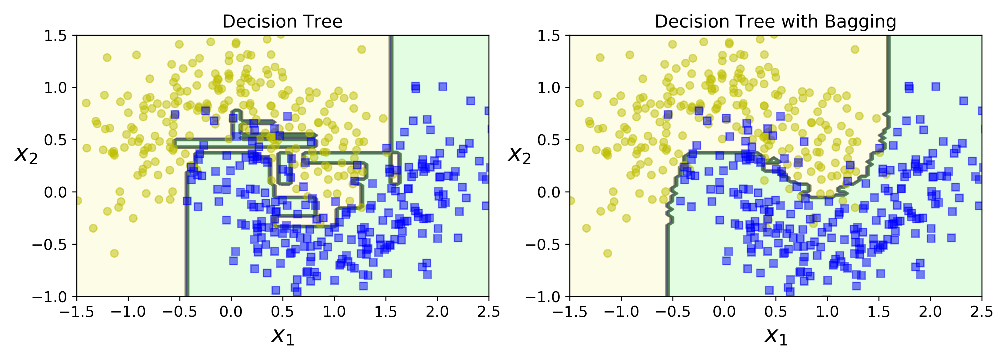
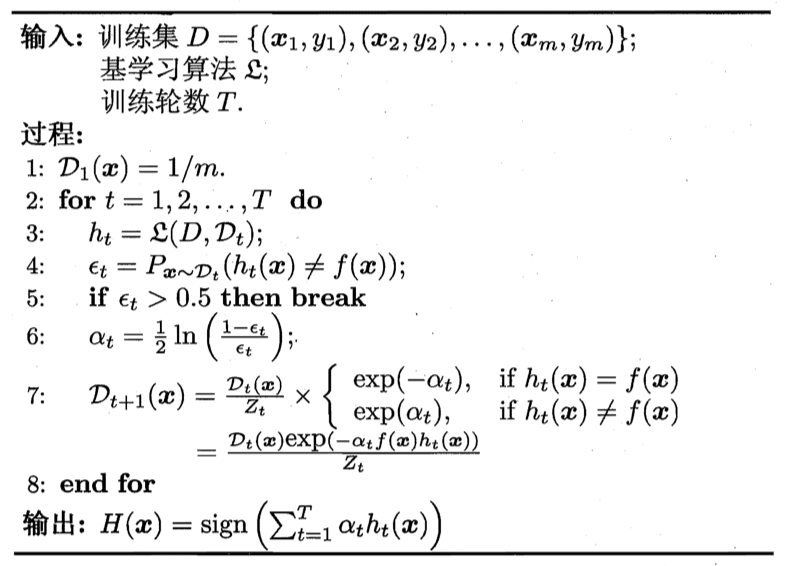
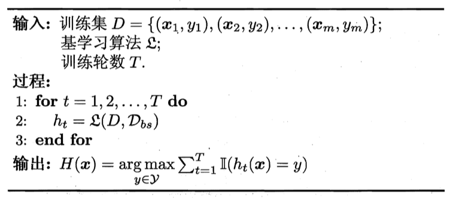
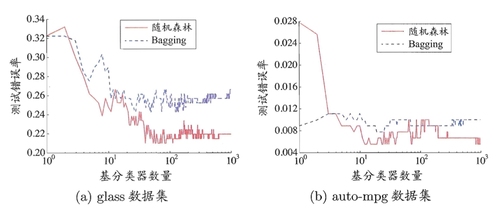
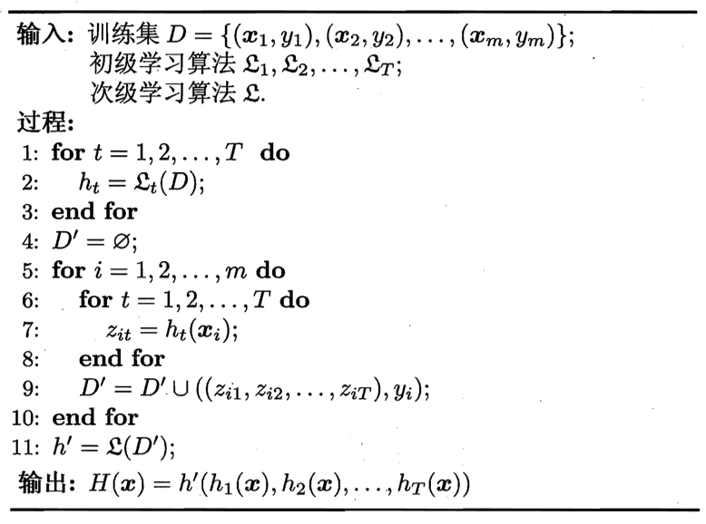
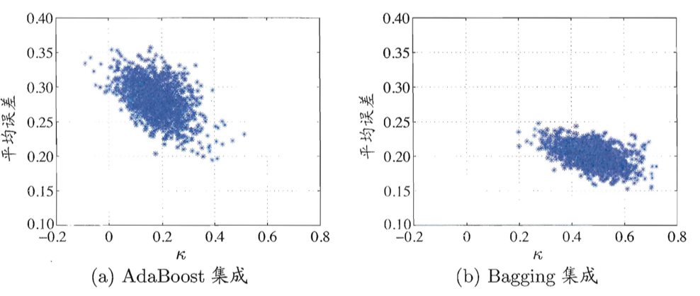
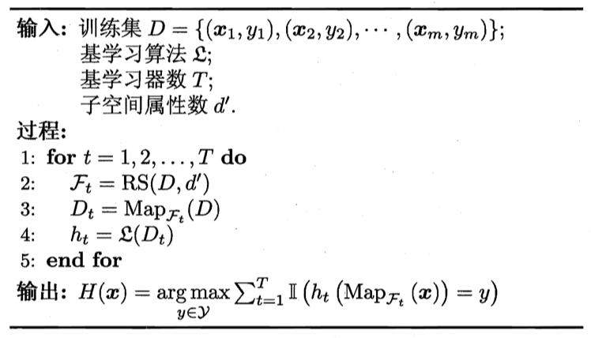

# 集成学习

## 个体与集成

**集成学习** (ensemble learning) 通过构建并结合**多个学习器**来完成学习任务，有时也被称作*多分类器系统* (multi-classifier system)。集成学习通过将多个学习器进行结合，常可获得比单一学习器显著优越的**泛化性能**。

下图展示了集成学习的一般结构：先产生一组*个体学习器* (individual learner)，再用某种策略将它们**结合**起来。

**同质集成**中的个体学习器亦称*基学习器* (base learner)，相应的学习算法称为*基学习算法* (base learning algorithm)；**异质集成**中的个体学习器由不同的学习算法生成，称为*组件学习器*。

要获得好的集成，个体学习器应该*好而不同*，即个体学习器要有一定的准确性，不能太坏，并且要有多样性，即学习器之间具有差异。（差异主要是希望不同类型的学习器会产生不同类型的错误，从而一个学习器的错误会被另一个“纠正”。）

通常，集成方法较之一个利用完整训练集训练的基学习器而言，会具有类似的偏差但会有更低的方差。由下图所示，单个决策树和Bagging 在相同的训练集上都会出现类似的错误，但显然Bagging 的决策边界更加平滑，会有更好的泛化性能。

考虑二分类问题$y \in \{-1,+1\}$ 和真实标记函数f，假定基分类器的错误率为$\epsilon$，数学表示为：
$$
P(h_i(\mathbf{x}) \ne f(\mathbf{x})) = \epsilon
$$
假设集成通过简单的**投票法**结合T 个基分类器，若超过半数分类正确，则集成分类就正确：
$$
H(\mathbf{x})=sign(\sum_{i=1}^Th_i(\mathbf{x}))
$$
假设基分类器的错误率**相互独立**，有Hoeffding 不等式可得，**集成的错误率**为：
$$
P(H(\mathbf{x}) \ne f(\mathbf{x}))=\sum_{k=0}^{T/2}
\begin{pmatrix}T \\ k\end{pmatrix}
(1-\epsilon)^k \epsilon^{T-k}
\le\exp(-\frac{1}{2}T(1-2\epsilon)^2)
$$
上式表明，随着集成中个体分类器数目T 的增大，集成的错误率降指数级下降，最终趋于0.

上面的推导假设来基学习器的误差相互独立。现实中显然是不可能的。个体学习器的*准确性*和*多样性*之间是存在冲突的。**如何产生*好而不同*的个体学习器**，是集成学习研究的核心。

根据个体学习器的生成方式，集成学习方法大致可分为两大类：

- 个体学习器间存在**强依赖关系**、必须**串行生成**的**序列化方**法，代表是 Boosting；
- **个体**学习器间不存在强依赖关系、可**同时生成**的**并行化方法**，是 Bagging 和*随机森林* (Random Forest).

## Boosting

Boosting 是一族可将弱学习器提升为强学习器的算法。

**工作机制**：先从初始训练集训练出一个基学习器，再根据基学习器的表现对训练样本分布进行调整，使得**先前基学习器做错的训练样本在后续受到更多关注**，然后基于调整后的样本分布来训练下一个基学习器；如此重复进行，直至基学习器数目达到事先指定的值 T， 最终将这 T 个基学习器进行**加权**结合。

其典型代表为AdaBoost 算法，流程如下：

AdaBoost 算法有多种推导，常用的是鲫鱼*加权模型* (additive model)，即基学习器的**线性组合**：
$$
H(\mathbf{x}) = \sum_{t=1}^T\alpha_t h_t(\mathbf{x})
$$
来最小化**指数损失函数** (exponential loss function)：
$$
l_{\exp}(H|D)=E_{\mathbf{x} \sim D}[e^{-f(\mathbf{x})H(\mathbf{x})}]
$$
若H 能令指数损失最小化，则考虑式(5) 对于H 的偏导：
$$
\frac{\partial l_{\exp}(H|D)}{\partial H(\mathbf{x})}=
-e^{-H({\mathbf{x}})}P(f(\mathbf{x})=1|\mathbf{x}) +e^{H(\mathbf{x})}P(f(\mathbf{x})=-1|\mathbf{x})
$$
令上式为0 可得：
$$
H(\mathbf{x}) = \frac{1}{2} \ln \frac{P(f(\mathbf{x}) = 1|\mathbf{x})}{P(f(\mathbf{x})=-1|\mathbf{x})}
$$
结合对数函数的图像，可以有：
$$
\begin{align}
sign(H(\mathbf{x})) & =sign \left(
\frac{1}{2} \ln \frac{P(f(\mathbf{x}) = 1|\mathbf{x})}{P(f(\mathbf{x})=-1|\mathbf{x})} \right) \\
 & =
 \begin{cases}
 1,\ P(f(\mathbf{x}) = 1|\mathbf{x}) > P(f(\mathbf{x})=-1|\mathbf{x}) \\
 -1,\ P(f(\mathbf{x}) = 1|\mathbf{x}) < P(f(\mathbf{x})=-1|\mathbf{x})
 \end{cases} \\
 & = \operatorname*{arg\,max}_{y \in \{-1, 1\}} P(f({\mathbf{x})=y|\mathbf{x}})
\end{align}
$$
上式表明sign(H) 达到了贝叶斯最优错误率。换言之，若指数损失函数最小化，则分类错误率也将最小化（指数损失是0/1 损失函数的一致(consistent) 替代损失函数）。

从算法图可以看到，第一个基分类器h1 是通过直接将算法应用到初始数据分布而得。此后迭代生成ht 和at。当基分类器ht 基于分布Dt 产生后，该分类器的权重at 应使得$\alpha_t h_t$ 最小化指数损失函数：
$$
\begin{align}
l_{\exp}(\alpha_t h_t|D_t) & = E_{\mathbf{x} \sim D_t}[e^{-f(\mathbf{x})\alpha_t h_t(\mathbf{x})}] \\
 & = E_{\mathbf{x} \sim D_t}[e^{-\alpha_t} \prod(f(\mathbf{x}) = h_t(\mathbf{x})) + e^{\alpha_t}\prod(f(\mathbf{x}) \ne h_t(\mathbf{x}))] \\
 & =e^{-\alpha_t}P_{\mathbf{x} \sim D_t}(f(\mathbf{x})=h_t(\mathbf{x}))+e^{\alpha_t}P_{\mathbf{x} \sim D_t}(f(\mathbf{x}) \ne h_t(\mathbf{x})) \\
 & = e^{-\alpha_t}(1-\epsilon_t) + e^{\alpha_t}\epsilon_t
\end{align}
$$
其中$\epsilon_t = P_{\mathbf{x} \sim D_t}(h_t(\mathbf{x}) \ne f(\mathbf{x}))$。对$\alpha_t$ 求偏导可得：
$$
\frac{\partial l_{\exp}(\alpha_t h_t | D_t)}{\partial \alpha_t} = -e^{-\alpha_t}(1-\epsilon_t) + e^{\alpha_t}\epsilon_t
$$
令上式为0 可得：
$$
\alpha_t = \frac{1}{2} \ln (\frac{1 - \epsilon_t}{\epsilon_t})
$$
上式即为算法中分类器权重更新公式。

AdaBoost 算法在获得$H_{t-1}$ 之后，样本分布将进行调整，使下一轮的基学习器ht 能够纠正$H_{t-1}$ 的一些错误。

**训练器要求**：理想的ht 将在分布Dt 下最小化分类误差。因此，弱分类器将基于分布Dt 来训练，且针对Dt 的分类误差应该小于0.5。

Boosting 算法要求基学习器能对特定的数据分布进行学习，这可通过**重赋权法** (re-weighting) 实施。对于无法接受带权样本的基学习算法，则可通过**重采样法** (re-sampling) 来处理，即在每一轮学习中，根据所需的分布对数据集重新进行采样。Boosting 算法在训练的每一轮都要检查当前生成的基学习器是否满足基本条件（是否比随机猜测好），若不满足，则当前基学习器被抛弃且学习过程停止。这可能导致基学习器过少而性能不佳。

从偏差 - 方差分解的角度看，Boosting 主要关注**降低偏差**。因此Boosting 能基于泛化性能较弱的学习器构建出很强的集成，常用的基学习器就有*决策树桩*。

## Bagging和随机森林

从前面可知，我们要给个体学习器足够但不同的数据集。为了解决这个问题，可以考虑使用**相互有交叠**的采样子集。

### Bagging

Bagging 是并行式集成学习方法的典型代表。它直接基于**自助采样法**。我们可以采样出T 个含有m 个训练样本的采样集，然后基于每个采样集训练出一个基学习器，再将这些基学习器进行结合。

在对预测输出进行结合时，Bagging 通常对分类任务使用**简单投票法**，对回归任务使用**简单平均法**。若分类预测时出现两个类收到同样票数的情形，则最简单的做法是**随机选择**一个，也可进一步考察学习器投票的**置信度**来确定最终胜者。

假定基学习器的计算复杂度为O(m)，则Bagging 的复杂度大致为T(O(m) + O(s))。可见Bagging十分高效。且Bagging 能不经修改地用于多分类、回归任务。

自助采样过程还给 Bagging 带来了另一个优点：由于每个 基学习器只使用了初始训练集中约 63.2% 的样本，剩下约 36.8% 的样本可用作**验证集**来对泛化性能进行**包外估计**。

### 随机森林

随机森林 (Random Forest) 是Bagging 的一个扩展变体。RF 在以决策树为基学习器构建Bagging 集成的基础上，进一步在决策树的训练过程中引入了**随机属性选择**：在BF 中，对决策树的每个节点，先从该节点的属性集合中随机选择一个包含k 个属性的**子集**，然后再从这个子集中选择一个最优属性用于划分。这里的参数k 控制了**随机性的引入程度**。若令k = d，则基决策树的构建与传统决策树相同；若令k = 1，则是随机选择一个属性用于划分。推荐$k=\log_2 d$。

随机森林中基学习器的多样性不仅来自样本扰动，还来自**属性扰动**。这就使得最终集成的泛化性能可通过个体学习器之间差异度的增加而进一步提升。

随机森林的起始性能往往相对较差，特别是在集成中只包含一个基学习器时。这很容易理解，因为通过引入属性扰动，随机森林中个体学习器的性能往往有所降低。随机森林的训练效率也会优于Bagging，因为属性划分时考察的属性集较小。

## 结合策略

### 平均法

对于数值型输出$h_i(\mathbf{x}) \in R$，最常见的结合策略就是使用*平均法* (averaging)。

- 简单平均法：

$$
H(\mathbf{x}) = \frac{1}{T} \sum_{i=1}^T h_i(\mathbf{x})
$$

- 加权平均法：

$$
H(\mathbf{x}) = \sum_{i=1}^T \omega_i h_i(\mathbf{x})
$$

**注意**：在集成学习中一般对学习器的权重施以**非负约束**。

加权平均法的权重一般是从训练数据中学习而得。现实任务中的训练样本通常不充分或存在噪声，这使得学得的权重**不完全可靠**。对于规模比较大的集成来说，要学习的权重较多，容易导致**过拟合**。

所以，在个体学习器性能相差较大时宜使用加权平均法；而在个体学习器性能相近时宜食用简单平均法。

### 投票法

对分类任务来说，学习器hi 将从类别标记集合$\{c_1, c_2, \ldots, c_N\}$ 中预测出一个标记。最常见的是使用**投票法** (voting)。设hi 在样本x 上的预测输出为一个N 维向量$(h_i^1(\mathbf{x}),;h_i^2(\mathbf{x}); \ldots,;h_i^N(\mathbf{x}))$。

- 绝对多数投票法：某标记得票超过半数，则预测为该标记；否则拒绝预测。

$$
H(\mathbf{x})=
\begin{cases}
c_j,\ if \sum_{i=1}^T h_i^j(\mathbf{x}) > 0.5 \sum_{k=1}^N\sum_{i=1}^T h_i^k(\mathbf{x}) \\
reject,\ otherwise
\end{cases}
$$

- 相对多数投票法：预测为得票最多的标记，若同时有多个标记获最高票，则从中随机选取。

$$
H(\mathbf{x})=c_{\arg\max_j \sum_{i=1}^T h_i^j(\mathbf{x})}
$$

- 加权投票法：

$$
H(\mathbf{x})=c_{\arg\max_j \sum_{i=1}^T \omega_i h_i^j(\mathbf{x})}
$$

现实任务中，不同类型的个体学习器可能产生**不同类型**的h 值，常见的有：

- 类标记：$h_i^j(\mathbf{x}) \in \{0, 1\}$，即预测类别标记为1，称为*硬投票*；
- 类概率：$h_i^j(\mathbf{x}) \in [0,1]$，相当于对后验概率$P(c_j|\mathbf{x})$ 的一个估计，称为*软投票*。（通常，软投票会取得比硬投票更高的精度，因为软投票 gives more weight to highly confident votes。）

### 学习法

当训练数据很多时，一种更为强大的结合策略是使用*学习法*，即通过**另一个学习器**来进行结合。Stacking 是学习法的代表。此时，个体学习器称为**初级学习器**，用于结合的学习器称为**次级学习器**或**元学习器** (meta-learner)。

**流程**：Stacking 先从初始数据集中训练出初级学习器，然后“生成”一个新数据集用于训练次级学习器。在新数据集中，初级学习器的输出被当作样例输入特征，而初始样本的标记仍被当作杨例标记。

**问题**：次级学习器是利用初级学习器产生的，若**直接使用**初级学习器的训练集来生成次级训练集，**过拟合**风险比较大。

**解决**：采用*交叉验证*获*留一法*，用未被初级学习器使用的样本来产生次级学习器的训练样本。

次级学习器的**输入属性表示**和**次级学习算法**对Stacking 集成的泛化性能都有很大影响。**贝叶斯模型平均** (Baues Model Averaging, RMA) 基于后验概率来为不同模型赋予权重，可以视为加权平均法的一种特殊实现。

## 多样性

### 误差-分歧分解

假定我们用个体学习器h1, h2, …, hT 通过加权平均法（式(18)）结合产生的集成来完成回归学习任务f。对于示例x，定义学习器hi 的**分歧** (ambiguity) 为
$$
A(h_i|\mathbf{x}) = (h_i(\mathbf{x}) - H(\mathbf{x}))^2
$$
则集成的*分歧*是
$$
\bar A(h | \mathbf{x})
= \sum_{i=1}^T \omega_i A(h_i | \mathbf{x})
= \sum_{i=1}^T \omega_i ( h_i (\mathbf{x}) - H(\mathbf{x}) )^2
$$
显然，分歧表征来个体学习器在样本x 上的不一致性，即在一定程度上反映了个体学习器的**多样性**。

个体学习器hi 和集成H 的平方误差分别为：
$$
\begin{align}
E(h_i | \mathbf{x}) & = (f(\mathbf{x}) - h_i (\mathbf{x}))^2 \\
E(H | \mathbf{x}) & = (f(\mathbf{x}) - H(\mathbf{x}))^2
\end{align}
$$
令$\bar E (h | \mathbf{x}) = \sum_{i=1}^T \omega_i E(h_i | \mathbf{x})$ 表示个体学习器误差的加权平均，则有
$$
\bar A (h | \mathbf{x}) = \sum_{i=1}^T \omega_i E(h_i | \mathbf{x}) - E(H | \mathbf{x}) \\
= \bar E (h | \mathbf{x}) - E(H | \mathbf{x})
$$
上式对所有样本x 均成立。令p(x) 表示样本的概率密度，则在全样本上有：
$$
\sum_{i=1}^T \omega_i \int A(h_i | \mathbf{x}) p(\mathbf{x})d\mathbf{x}
= \sum_{i=1}^T \omega_i \int E(h_i | \mathbf{x}) p(\mathbf{x})d\mathbf{x} - \int E(H |\mathbf{x})p(\mathbf{x})d\mathbf{x}
$$
类似的，个体学习器hi 在全样本上的泛化误差和分歧项分别为：
$$
\begin{align}
E_i = \int E(h_i | \mathbf{x}) p(\mathbf{x}) d\mathbf{x} \\
A_i = \int A(h_i | \mathbf{x}) p(\mathbf{x}) d\mathbf{x}
\end{align}
$$
集成的泛化误差为
$$
E = \int E(H | \mathbf{x}) p(\mathbf{x}) d\mathbf{x}
$$
将以上3 个式子代入式(27) 中，令$\bar E = \sum_{i=1}^T \omega_i E_i$ 表示个体学习器泛化误差的加权平均，$\bar A = \sum_{i=1}^T \omega_i A_i$ 表示个体学习器的加权分歧值，则有
$$
E = \bar E - \bar A
$$
这个式子表明，个体学习器准确性越高，多样性越大，集成越好。

但式(31) 很难应用在实际中。因为它是定义在整个样本空间上的，、。而且$\bar A$ 不是一个可直接操作的多样性度量，只能继承构造好后才能估计。此外，以上推导过程只能用于回归学习，难以直接推广到分类任务上。

### 多样性度量

*多样性度量* (diversity measure) 是用于**度量集成中个体分类器的多样性**。典型做法是考虑个体分类器的**两两相似/不相似性**。

对分类器hi 和hj 的预测结果列联表 (contingency table) 为

|            | $h_i = 1$ | $h_i = -1$ |
| ---------- | --------- | ---------- |
| $h_j = 1$  | a         | c          |
| $h_j = -1$ | b         | d          |

这里，a + b + c + d = m。

- 不合度量 (disagreement measure)：值域为 [0, 1]，值越大则多样性越大。

$$
dis_{ij} = \frac{b + c}{m}
$$

- 相关系数 (correlation coefficient)：值域为[-1, 1]，若hi 和hj 无关则为0，正相关为正，否则为负。

$$
\rho _{ij} = \frac{ad - bc}{\sqrt{(a + b) (a + c) (c + d) (b + d)}}
$$

- Q -统计量 (Q - statistic)：Qij 与相关系数的符号相同，且$|Q_{ij}| \le |\rho_{ij}|$。

$$
Q_{ij} = \frac{ad - bc}{ad + bc}
$$

- k -统计量 (k - statistic)：

$$
\kappa = \frac{p_1 - p_2}{1 - p_2}
$$

其中，p~1~ 是两个分类器取得一致的概率；p~2~ 是两个分类器**偶然达成一致**的概率：
$$
\begin{align}
p_1 & = \frac{a + d}{m} \\
p_2 & = \frac{(a+b)(a+c) + (c+d)(b+d)}{m^2}
\end{align}
$$
若分类器hi 和hj 在D 上完全一致，则k = 1；若他们仅是偶然达成一致，k = 0。k 通常为非负值，仅在hi 和hj 达成一致的概率甚至于低于偶然性的情况下取负值。

下图是*k -误差图*，是将每一对分类器作为图上的一个点。横坐标是k 值，纵坐标是它们的平均误差。显然，数据点云的位置越高，个体分类器的准确性越低；点云位置越靠右，则个体分类器的多样性越小。

### 多样性增强

增强多样性的常见做法有对数据样本、输入属性、输出表示和算法参数进行扰动。

#### 数据样本扰动

数据样本扰动通常是基于**采样法**，如在Bagging 中食用自助采样，在Adaboost 中食用序列采样。但数据样本扰动只对**不稳定基学习器**有效，如决策树，神经网络等。而稳定学习器**如线形学习器，SVM等，对数据样本扰动不敏感。

#### 输入属性扰动

训练样本通常由一组属性描述，从不同的*子空间*，即属性子集，训练出的个体学习器必然有所不同。**随机子空间算法** (random subspace) 从初识属性集中抽取出若干个属性集，在基于每个属性子集训练一个基学习器。如下图所示。

**优点**：对包含大量冗余属性的数据，在子空间中训练个体学习器不仅能产生多样性大的个体，还会因属性数的减少而大幅节省时间开销；同时，由于冗余属性多，减少一些属性后训练出的个体学习器也不至于太差。

#### 输出表示扰动

此类做法的**基本思路**是对输出表示进行操纵以增强多样性。可对训练样本的类别标记稍作变动，如**翻转法** (flipping output) 随机改变一些训练样本的标记；也可以对输出表示进行转化，如**输出调制法** (output smearing) 将分类输出转化为回归输出后构建个体学习器。此外还有**ECOC法**等等。

#### 算法参数扰动

基学习算法一般都有参数需进行设置，通过随机设置不同的参数，往往可产生差别较大的个体学习器。对参数较少的算法，可通过将其学习过程中某些环节用其他类似方式代替，从而达到扰动的目的，如决策树中的属性选择。

此外，使用单一 学习器时通常需使用交叉验证等方法来确定参数值，这事实上已使用了不同参数训练出多个学习器，只不过最终仅选择其中一个学习器进行使用，而集成学习则相当于把这些学习器都利用起来。

最后，不同的多样性增强机制可以同时使用。随机森林就使用了 数据样本扰动和输入属性扰动。