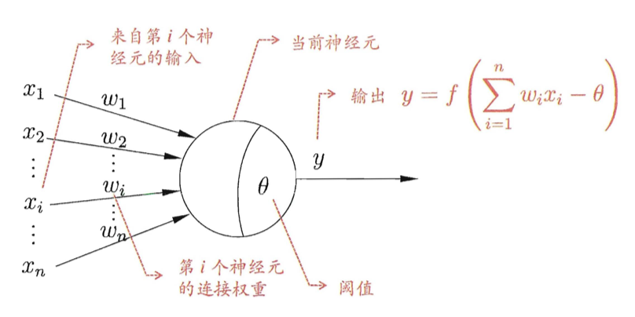
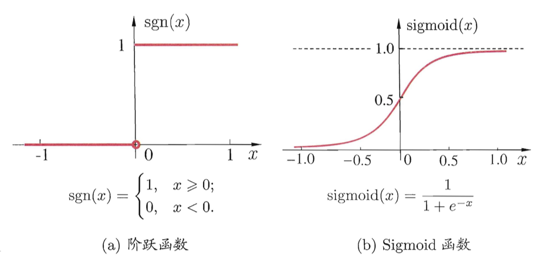
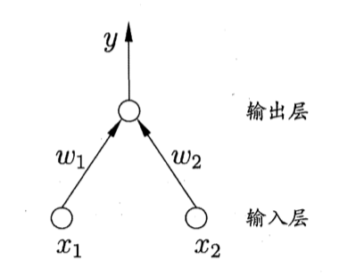
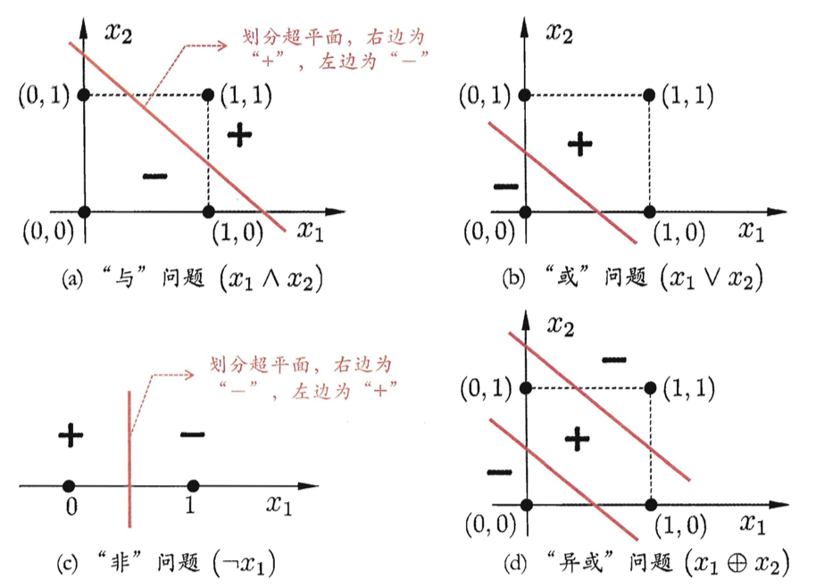
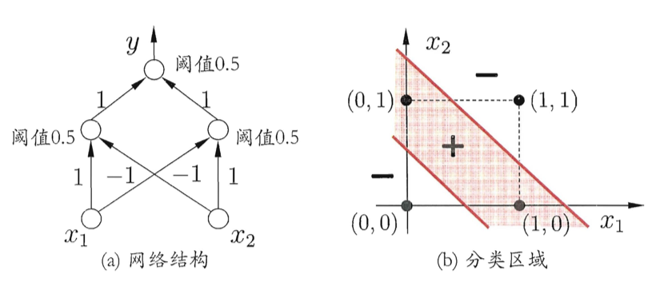
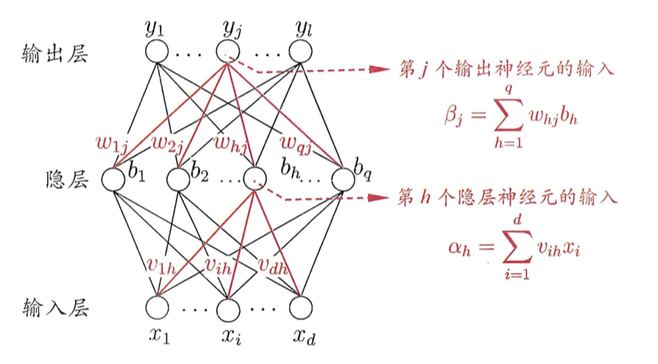
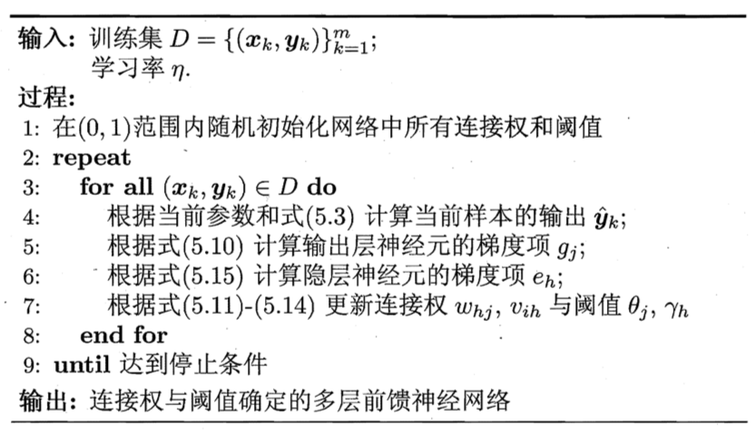
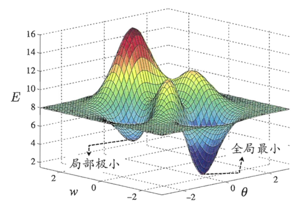
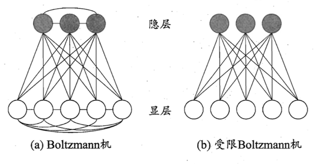

# 神经网络

## 神经元模型

**定义**：神经网络 (neural networks) 是由具有适应性的简单单元组成的**广泛并行互连**的网络，它的组织能够模拟生物神经系统对真实世界物体所作出的交互反应。

神经网络中最基本的成分是神经元 (neuron) 模型。常用的就是**M - P 神经元模型**。它接收到来自n 个其他神经元传递过来的输入信号，这些输入信号通过带权重的连接 (connection) 进行传递，神经元接收到的总输入值与神经元的阈值进行比较，然后通过**激活函数** (activation function) 处理以产生神经元输出。

理想的激活函数是*阶跃函数*，它将输入值映射为0或1。但阶跃函数具有**不连续、不光滑**等不太好的性质。实际中常用**Sigmoid 函数**作为激活函数。

把许多个这样的神经元按照一定的**层次结构**连接起来，就得到了神经网络。在数学上，一个神经网络就是包含了许多参数的数学模型，这个模型是若干个函数相互（嵌套）代入而得。

## 感知机与多层网络

*感知机* (Perceptron) 由**两层神经元**组成。输入层接收外界输入信号后传递给输出层，输出层是M - P 神经元，亦称*阈值逻辑单元* (threshold logic unit)。

感知机能够轻易实现逻辑与、或、非运输。设函数$y=f(\sum_i \omega_i x_i - \theta)$ 为阶跃函数：

- 与 $x_1 \wedge x_2$：$\omega_1 = \omega_2=1,\ \theta = 2$，则$y=f(1 \cdot x_1 + 1 \cdot x_2 - 2)$，仅在$x_1 = x_2 = 1$ 时y = 1；
- 或 $x_1 \vee x_2$：$\omega_1 = \omega_2 = 1,\ \theta = 0.5$，则$y=f(1 \cdot x_1 + 1 \cdot x_2 - 0.5)$，当x~1~ = 1 或x~2~ = 1时，y = 1；
- 非 $-x_1$：$\omega = -0.6, \omega-2 = 0,\ \theta = -0.5$，则$y = f(-0.6 \cdot x_1 + 0 \cdot x_2 + 0.5)$，当x~1~ = 1时，y = 0；当x~1~ = 0 时，y = 1。

给定训练数据集，权重$\omega_i$ 和阈值$\theta$ 可通过学习得到。阈值$\theta$ 可以看作是一个**固定输入**为-1.0 的*哑节点* (dummy node) 所对应的连接权重$\omega_{n+1}$，这样权重和阈值的学习就可以统一为权重学习。

感知机学习规则非常简单，对于训练样例 $(\mathbf{x}, y)$，若当前感知机输出$\hat y$，则感知机权重调整方式为：
$$
\begin{align}
\omega_i & \leftarrow \omega_i + \Delta \omega_i \\
\Delta \omega_i & = \eta (y - \hat y) x_i
\end{align}
$$
其中$\eta \in (0, 1)$ 时学习率。可以看出，若感知机对训练样例预测正确，则感知机不发生变化；否则将根据错误的程度进行权重调整。

注意到感知机只在输出层神经元进行激活函数处理，即只拥有一层功能神经元 (functional neuron)，**学习能力非常有限**。可以证明，若两类模式是**线性可分**的，则感知机对学习过程一定会收敛而求的适当的权向量；否则感知机学习过程将会发生振荡 (fluctuation)，不能求得合适解。

要解决非线性可分问题，就需要使用多层功能神经元。介于输出层和输入层之间的神经元被称为隐层或隐含层 (hidden layer)。每层神经元与下一层神经元**全互联**，不存在同层连接和跨层连接。这种结构称为*多层前馈神经网络* (multi-layer feedforward neural networkks)。**前馈**并不意味着网络中信号不能向后转，而是指网络拓扑结构上**不存在环或回路**。输入层神经元仅是接受输入，不进行函数处理，隐层与输出层包含功能神经元。

注意到感知机对于数据尺度 (feature scale) 敏感。

神经网络的学习过程，就是根据训练数据来调整神经元之间的**连接权** (connection weight) 以及每个功能神经元的阑值。

## 误差逆传播算法

给定训练集$D = \{(\mathbf{x}_1, \mathbf{y}_1), \ldots, (\mathbf{x}_m, \mathbf{y}_m) \},\ \mathbf{x}_i \in R^d,\ \mathbf{y}_i \in R^l$，即输入示例由d 个属性描述，输出l 维实值向量。

上图给出了一个有d 个输入神经元，l 个输出神经元，q 个隐层神经元的多层前馈网络。其中输出层第j 个神经元的阈值为$\theta_j$，隐层第h 个神经元的阈值用$\gamma_h$ 表示；输入层底i 个神经元与隐层底h 个神经元之间的连接权为$\nu_{ih}$，隐层第h 个神经元与输出层第j 个神经元之间的连接权为$\omega_{hj}$；隐层第h 个神经元的输入为$\alpha_h = \sum^d_{i=1} \nu_{ih} x_i$，输出层第j 个神经元的输入为$\beta_j = \sum_{h=1}^q \omega_{hj} b_h$， 其中b~h~ 为隐层第h 个神经元的输出。假设隐层和输出层都使用Sigmoid 函数。

对于样例$(\mathbf{x}_k, \mathbf{y}_k)$，假定神经网络的输出为$\mathbf{\hat y}_k = (\hat y^k_1, \ldots, \hat y^k_l)$，有
$$
\hat y_j^k = f(\beta_j - \theta_j)
$$
则网络在该样例上的**均方误差**为：
$$
E_k = \frac{1}{2} \sum_{j=1}^l (\hat y^k_j - y_j^k)^2
$$
在上图中共有(d + l + 1)q + l 个参数：输入层到隐层有 d * q 个权值，隐层到输出层有 q * l 个权值，q 个隐层神经元阈值和l 个输出层阈值。 BP (BackPropagation) 是一个**迭代学习算法**：在每一轮中采用广义的感知机学习规则对参数进行更新。任意参数v 的更新估计为：
$$
v \leftarrow v + \Delta v
$$
BP 算法基于**梯度下降**策略：以目标函数的**负梯度方向**对参数进行调整。对于式(4) 的误差E~k~，给定学习率后有：
$$
\Delta \omega_{hj} = -\eta \frac{\partial E_k}{\partial \omega_{hj}}
$$
考虑**链式法则**，$\omega_{hj}$ 先是作用在输出层第j 个神经元的输入值$\beta_j$ 上，再影响输出值$\hat y_j^k$，最后影响到E~k~，所以有：
$$
\frac{\partial E_k}{\partial \omega_{hj}} = 
\frac{\partial E_k}{\partial \hat y_j^k} \cdot 
\frac{\partial \hat y^k_j}{\partial \beta_j} \cdot
\frac{\partial \beta_j}{\partial \omega_{hj}}
$$
根据上图中$\beta_j$ 的定义，显然有
$$
\frac{\partial \beta_j}{\partial \omega_{hj}} = b_h
$$
而$\hat y_j^k = f(\beta_j - \theta_j)  = f(\epsilon_j) = \frac{1}{1+ e^{-\epsilon_j}}$，则有
$$
\begin{align}
\frac{\partial \hat y^k_j}{\partial \beta_j} & =
\frac{\partial \hat y^k_j}{\partial \epsilon_j} \cdot \frac{\partial \epsilon_j}{\partial \beta_j} \\
 & = -(1 + e^{-\epsilon_j})^{-2} (-1) e^{-\epsilon} \cdot 1 \\
 & = \frac{e^{-\epsilon_j}}{(1+e^{-\epsilon_j})^{2}} \\
 & = \frac{1}{1+e^{-\epsilon_j}} - \frac{1}{(1+e^{-\epsilon_j})^{2}} \\
 & = f(\epsilon_j)(1-f(\epsilon_j)) = \hat y^k_j \cdot (1 - \hat y^k_j)
\end{align}
$$
对于$\frac{\partial E_k}{\partial \hat y_j^k}$ 则有
$$
\frac{\partial E_k}{\partial \hat y_j^k} = 
\frac{1}{2} \frac{\partial }{\partial y^k_j}\sum_{j=1}^l (\hat y^k_j - y^k_j)^2 = 
\frac{1}{2} \cdot 2 \cdot (\hat y^k_j - y_j^k)
$$
合并以上两式则有:
$$
\begin{align}
g_j  & = -\frac{\partial E_k}{\partial \hat y_j^k} \cdot 
\frac{\partial \hat y^k_j}{\partial \beta_j} \\
 & = - (\hat y^k_j - y_j^k) \hat y^k_j  (1 - \hat y^k_j)
\end{align}
$$
如此，就得到了关于$\omega_{hj}$ 的更新公式：
$$
\Delta \omega_{hj} = \eta g_j b_h
$$
类似的，
$$
\frac{\partial E_k}{\partial \theta_j} = \frac{\partial E_k}{\partial \hat y ^k_j} \cdot \frac{\partial \hat y^k_j}{\partial \theta_j} = -g_j
$$
因此，
$$
\Delta \theta_j = -\eta g_j
$$
而
$$
\frac{\partial E_k}{\partial \nu_{ih}} = \frac{\partial E_k}{\partial b_h} \cdot 
\frac{\partial b_h}{\partial \alpha_h} \cdot 
\frac{\partial \alpha_h}{\partial \nu_{ih}}
$$
首先，$\frac{\partial \alpha_h}{\partial \nu_{ih}} = x_i$。

然后，$b_h = f(\alpha_h - \gamma_h)$ ，所以$\frac{\partial b_h}{\partial \alpha_h} = b_h (1-b_h)$。

由于隐层输出b~h~ 被传递给所有输出层节点，所以
$$
\begin{align}
\frac{\partial E_k}{\partial b_h} & =
\sum_{j=1}^l
\frac{\partial E_k}{\partial \hat y^k_j} \cdot
\frac{\partial \hat y^k_j}{\partial \beta_j} \cdot 
\frac{\partial \beta_j}{\partial b_h} \\
 & = \sum_{j=1}^l
 -g_j \omega_{hj}
\end{align}
$$
令
$$
e_h = - \frac{\partial E_k}{\partial b_h} \cdot 
\frac{\partial b_h}{\partial \alpha_h}  =
b_h (1-b_h)
\sum_{j=1}^l \omega_{hj} g_j
$$

所以，
$$
\Delta v_{ih} = \eta e_h x_i
$$
最后，
$$
\frac{\partial E_k}{\partial \gamma_{h}} = 
\frac{\partial E_k}{\partial b_h} \cdot 
\frac{\partial b_h}{\partial \gamma_h} = 
-e_h
$$
所以
$$
\Delta \gamma_h = -\eta e_h
$$
以上，式(17), (19), (24), (26) 就是神经网络中各个参数的**更新公式**。

学习率$\eta$ 控制着算沾每一轮迭代中的**更新步长**，若太大则容易振荡，太小则收敛速度又会过慢。常设置$\eta = 0.1$。此外，有时为了精细调节，式(17) 和 (19) 可以使用$\eta_1$；式(24) 和 (26) 可以使用$\eta_2$。

BP 的**工作流程**如下图：对每个训练样例，BP 算法执行以下操作：先将输入示例提供给输入层神经元，然后逐层将信号前传，直到产生输出层的结果；然后计算输出层的误差(第4 - 5 行) ，再将误差逆向传播至隐层神经元(第6 行)，最后根据隐层神经元的误差来别连接权和阈值进行调整(第7 行)。该迭代过程循环进行，直到达到某些停止条件为止。

**注意**：BP 算法的**目标**是最小化训练集D 上的**累计误差**（也是目标函数）：
$$
E = \frac{1}{m}\sum_{k=1}^m E_k
$$
上面介绍的*标准BP 算法* 每次仅针对一个训练样例来进行更新（随机梯度下降）。如果使用式(27) 作为目标函数，就得到了**累积误差逆传播** (accumulated error BP)（批量梯度下降）。

**优缺点**：

- 标准 BP 算法每次更新只针对**单个样例**，参数更新得非常频繁，而且对不同样例进行更新的效果可能出现**抵消**现象。因此，为了达到同样的累积误差极小点，标准 BP 算法往往需进行更多次数的迭代。
- 累积 BP 算法直接针对累积误差最小化，它在读取整个训练集 D 一遍后才对参数进行更新，其参数更新的频率低得多。但在很多任务中，累积误差下降到一定程度之后，进一步下降会非常缓慢，这时标准 BP 往往会更快获得较好的解，尤其是在训练集 D 非常大时更明显。

如何设置隐层神经元的个数仍是个未决问题，实际应用中通常靠*试错法* (trial-by-error)调整。

BP 神经网络经常遭遇**过拟合**。**解决**：两种策略：

- 早停：将数据分成训练集和验证集，训练集用来计算梯度、更新连接权和阔值。验证集用来估计误差，若**训练集误差降低但验证集误差升高**，则停止训练，同时返回具有**最小验证集误差**的连接权和阑值。
- 正则化：**基本思想**是在误差目标函数中增加一个用于描述网络复杂度的部分，例如**连接权与阔值的平方和**。仍令 E~k~ 表示第 k 个训练样例上的误差，$\omega_i$ 表示连接权和阙值，则误差目标函数 (27) 改变为：

$$
E = \lambda \frac{1}{m} \sum_{k=1}^m E_k + (1 - \lambda) \sum_i \omega_i^2
$$

## 全局最小和局部最小

我们常常谈到两种最优：*局部极小* (local minimum) 和*全局最小* (global minimum)。对于$\omega^*$ 和 $\theta^*$，若存在$\epsilon > 0$，使得
$$
\forall (\omega;\theta) \in \{(\omega; \theta) \ |\ ||(\omega;\theta) - (\omega^*;\theta^*)|| \le \epsilon \},
$$
都有$E(\omega;\theta) \ge E(\omega^*; \theta^*)$ 成立，则$(\omega^*;\theta^*)$ 为**局部最小解**；若对参数空间中的任意$(\omega;\theta)$ 都有$E(\omega;\theta) \ge E(\omega^*; \theta^*)$，则其为**全局最小解**.

显然，**参数空间中梯度为零**的点，只要起误差函数值小于邻点的误差函数值（二阶导数大于0），就只局部极小点。但我们想要的是全局最小。对于多层感知机来说，其目标函数不是一个凸函数。

常常采用以下策略来跳出局部极小，从而进一步接近全局最小：

- 以**多组**不同参数值初始化多个神经网络，按标准方法训练后，取其中误差最小的解作为最终参数；
- **模拟退火**：每一步都以二定的概率接受比当前解更差的结果，从而有助于跳出局部极小（但是也会造成跳出全局最小）。在每步迭代过程中， 接受次优解的概率要随着时间的推移而逐渐降低，从而保证算法稳定。
- **随即梯度下降**：与标准梯度下降法精确计算梯度不同，随机梯度下降法在计算梯度时**加入随机因素**。即便陷入局部极小点，它计算出的梯度仍可能不为零。这样就有机会跳出局部极小继续搜索。
- **遗传算法**。

**注意**：上述用于跳出局部极小的技术大多是**启发式**，理论上尚缺乏保障。

## 深度学习

典型的深度学习模型就是很深层的神经网络。对神经网络模型，提高容量的一个简单办法是增加隐层的数目，模型复杂度也可通过单纯增加隐层神经元的数目来实现。然而，多隐层神经网络难以直接用经典算法(例如标准 BP 算法)进行训练，因为误差在多隐层内逆传播时往往会*发散* (diverge)而不能收敛到稳定状态。

**无监督逐层训练** (unsupervised layer-wise training) 是多隐层网络训练的有效手段，其**基本思想**是**每次训练一层隐结点**。训练时将上一层隐结点的输出作为输入，而本层隐结点的输出作为下一层隐结点的输入，这称为**预训练** (pre- training)。在预训练全部完成后，再对整个网络进行**微调** (finetuning) 训练。

*预训练* + *微调*的做法可视为将大量参数**分组**，对每组先找到局部看来比较好的设置，然后再基于这些局部较优的结果联合起来远行全局寻优。

另一种节省训练开销的策略是**权共享** (weight shariing)。典型例子就是CNN。CNN 复合多个" 卷积层"和"采样层"对输入信号进行加工，然后在连接层实现与输出目标之间的映射。每个卷积层包含多个*特征映射* (feature map)，每个特征映射是一个由多个神经元构成的“平面”，通过一种卷积滤波器提取输入的一种特征。采样层亦称为"汇合" (pooling)层，其作用是基于局部相关性原理进行亚采样，从而在减少数据量的同时保留有用信息。CNN将原始图像映射成 120维特征向量，最后通过一个由84个神经元构成的连接层和输出层连接完成识别任务。CNN 可用 BP 算法进行训练。但在训练中，无论是卷积层还是采样层，其**每一组神经元都是用相同的连接权**，从而大幅减少了需要训练的参数数目。

## 其他常见神经网络

### Boltzmann 机

神经网络中有一类模型是为网络定义一个“能量” (energy)，**能量最小化**时网络达到理想状态，而网络的训练就是**最小化这个能量函数**。Boltzmann 机就是一种**基于能量的模型**。

其神经元分为**显层**和**隐层**。显层用于表示数据的输入与输出，隐层则被理解为数据的内在表达。Boltzmann 机中的神经元都是布尔型的，即只能取 0、1两种状态：状态1 表示激活；状态2 表示抑制。

令向量$\mathbf{s} \in \{0, 1\}$ 表示n 个神经元的状态，$\omega_{ij}$ 表示神经元i 和j 之间的连接权，$\theta_i$ 表示神经元i 的阈值，则状态向量s 多对应的Boltzmann 机能量定义为
$$
E(\mathbf{s}) = - \sum_{i=1}^{n-1} \sum_{j=i+1}^n \omega_{ij} s_i s_j - \sum_{i=1}^n \theta_i s_i
$$
若网络中的神经元以任意不依赖于输入值的顺序进行更新，则网络最终将达到Boltzmann 分布。此时状态向量s 出现的概率将仅仅由**其能量与所有可能状态向量的能量确定**：
$$
P(\mathbf{s}) = \frac{e^{-E(\mathbf{s})}}{\sum_{\mathbf{t}} e^{-E(\mathbf{t})}}
$$
其中分子为状态s 的能量；分母为所有可能状态的能量。

Boltzmann 机的训练过程就是将每个训练样本视为一个状态向量，使其出现的概率尽可能大。

标准Boltzmann 机是一个全连接图，十分复杂。现实中常采用**受限Boltzmann 机** (RBM)，仅仅保留显层和隐层之间的连接。受限Boltzmann 机常用**对比散度** (Contrastive Divergence) 算法来进行训练。假定网络中有d 个显层神经元和q 个隐层神经元，令v 和h 分别表示显层和隐层的状态向量。由于同一层内不存在连接，有
$$
\begin{align}
P(\mathbf{v} | \mathbf{h}) & = \prod_{i=1}^d P(v_i | \mathbf{h}) \\
P(\mathbf{h} | \mathbf{v}) & = \prod_{j=1}^q P(h_j | \mathbf{v})
\end{align}
$$
CD 算法对每个训练样本v，先根据式(33) 计算出隐层神经元状态的概率分布，然后根据这个概率分布采样得到h；此后，类似地根据式(32) 从h 产生v'，再从v' 产生h'；连接权的更新公式为
$$
\Delta \omega = \eta (\mathbf{v} \mathbf{h}^T - \mathbf{v}' \mathbf{h}'^T)
$$
