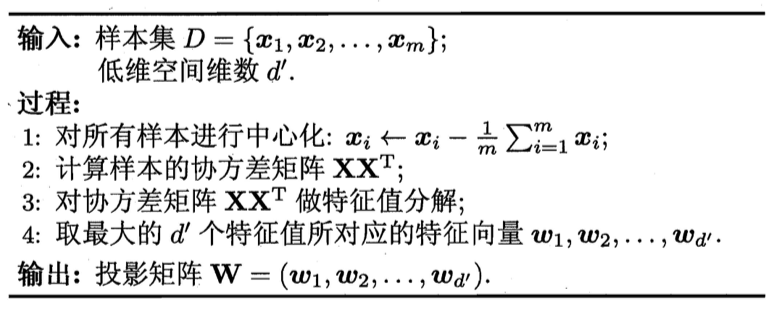

# 降维

## k 近邻学习

k 近邻 (k-Nearest Neighbor，简称kNN) 学习的**工作机制**：给定测试样本，基于某种距离度量找出训练集中与其最靠近的k 个训练样本，然后基于着k 个邻居的信息来进行预测。在分类中常使用投票法；在回归任务中可使用平均法。也可以将距离考虑在内，使用加权平均或者加权投票。

kNN 其实是**懒惰学习** (lazy learning) 的主要代表。这种学习技术在训练时仅仅是把样本保存起来，训练时间开销为0，在接收到测试样本后再进行处理。与之对应的，在训练阶段就对样本进行学习处理的方法称为**急切学习**。

对于kNN 来说，**参数k** 十分重要：当k 取不同值时，分类结果会有显著不同；不同的**距离计算方式**找出的“近邻”则可能有显著差别。

令k = 1，我们就得到了**最近邻分类器**。给定测试样本x，若对应的最近邻样本为z，则最近邻分类器出错的概率就是x 与z 类别标记不同的概率：
$$
P(err)=1-\sum_{c \in Y} P(c|\mathbf{x}) P(c | \mathbf{z})
$$
假设对任意测试样本，总能在任意近的范围内找到式(1) 中的训练样本z，令$c^{*}=\arg\max_{c \in Y} P(c|\mathbf{x})$ 表示贝叶斯最优分类器的结果，则有：
$$
\begin{align}
P(error) & = 1 - \sum_{c \in Y} P(c | \mathbf{x}) P(c | \mathbf{z}) \\
 & \approx 1 - \sum_{c \in Y} P^2(c | \mathbf{x}) \\
 & \le 1 - P^2(c^* | \mathbf{x}) \\
 & = (1 + P(c^* | \mathbf{x})) (1 - P(c^*|\mathbf{x})) \\
 & \le 2 \times (1 - P(c^* | \mathbf{x}))
\end{align}
$$
上式的**结论**就是：最近邻分类器的泛化错误率不超过贝叶斯最优分类器的错误率的两倍。

## 低维嵌入

面前的讨论有一个重要的**假设**：任意测试样本x 附近足够下的距离范围内总能找到一个训练样本（密采样）。

但在高维情形下，将出现**数据样本悉数，距离计算困难**等问题，成为**维数灾难** (curse of dimensionality)。

缓解维数灾难有两种办法：**特征选择**和**降维** (dimension reduction)。

*降维*就是通过数学变换将原始高维属性空间转变为一个低维**子空间** (subspace)。在这个子空间中样本密度大幅提高，距离计算也较为容易。

进行降维背后的**假设**是：数据样本虽然是高维的，但是**与学习任务密切相关的知识其中某个低维分布**。

###MDS

若要求原始空间中样本之间的**距离**在低维空间中**得以保持**，即得到**多维缩放** (Multiple Dimensional Scaling，简称 MDS)。

假定m个样本在原始空间中的**距离矩阵**为$D \in R^{m \times m}$，dist~ij~ 为样本x~i~ 和x~j~ 之间的距离。我们希望获得样本在d' 维空间中的表示$Z \in R^{d' \times m},\ d' \le d$，且任意两个样本在d‘ 维空间中的（欧式）距离等于原始空间中的距离，即$||\mathbf{z}_i - \mathbf{z}_j|| = dist_{ij}$。

令$\mathbf{B} = \mathbf{Z}^T \mathbf{Z} \in R^{m \times m}$，则B 为降维后样本的内积矩阵，$b_{ij} = z_i^T z_j$，有
$$
\begin{align}
dist_{ij}^2 & = ||z_i||^2  + ||z_j||^2 - 2 z_i^T  z_j \\
 & = b_{ii} + b_{jj} - 2 b_{ij}
\end{align}
$$
假设降维后的样本Z 被**中心化**，即$\sum_{i=1}^m z_i = 0$，显然，矩阵B 的行与列之和均为0，即$\sum_{i=1}^m b_{ij} = \sum_{j = 1}^m b_{ij} = 0$ （将z~j~ 或者z~i~ 提取出来），易知：
$$
\begin{align}
\sum_{i=1}^m dist^2_{ij} & = \sum_{i=1}^m (b_{ii} + b_{jj} - 2 b_{ij}) \\
 & = \sum_{i=1}^m b_{ii} + \sum_{i=1}^m b{jj} -2 \sum_{i=1}^m b_{ij} \\
 & = tr(\mathbf{B}) + m \cdot b_{jj}
\end{align}
$$
类似的，有：
$$
\begin{align}
 & \sum_{j=1}^m dist^2_{ij} = tr(\mathbf{B}) + m b_{ii} \\
 & \sum_{i=1}^m \sum_{j=1}^m dist^2_{ij} = 2m\ tr(\mathbf{B})
\end{align}
$$
tr 为矩阵的迹，$tr(\mathbf{B}) = \sum_{i=1}^m ||z_i||^2$。令
$$
\begin{align}
dist^2_{i \cdot} & = \frac{1}{m} \sum_{j=1}^m dist^2_{ij} \\
dist^2_{\cdot j} & = \frac{1}{m} \sum_{i=1}^m dist^2_{ij} \\
dist^2_{\cdot \cdot} & = \frac{1}{m^2} \sum_{i=1}^m \sum_{j=1}^m dist^2_{ij}
\end{align}
$$
由以上这些式子可以得到：
$$
b_{ij} = -\frac{1}{2} (dist^2_{ij} - dist^2_{i \cdot} - dist^2_{\cdot j} + dist^2_{\cdot \cdot})
$$
说明**可以通过降维前后保持不变的距离矩阵D 来求解内积矩阵B**。

对矩阵B 进行**特征值分解**，$\mathbf{B} = \mathbf{V} \Lambda \mathbf{V}^T$。其中，$\Lambda = diag(\lambda_1, \lambda_2, \ldots, \lambda_d)$ 为特征值构成的对角阵，V 为特征向量矩阵。取前d^*^个不为零的特征值，构成对角阵$\Lambda_*=diag(\lambda_1, \ldots, \lambda_{d^*})$, V~*~ 为对应的特征向量矩阵，则Z 为
$$
\mathbf{Z} = \Lambda_* ^{1/2} \mathbf{V}_*^T \in R^{d^* \times m}
$$
在现实应用中为了有效降维，往往仅需降维后的距离与原始空间中的距离尽可能接近而不必严格相等。所以可取$d' \le d^* \ll d$ 个最大特征值。

###线性降维方法

而最简单的降维方法就是对原始高维空间做线性变换。设d 维空间中样本 $\mathbf{X} = (\mathbf{x}_1, \ldots, \mathbf{x}_m) \in R^{d \times m}$ ，变换后得到d' 维空间中的样本：
$$
\mathbf{Z} = \mathbf{W}^T \mathbf{X}
$$
$\mathbf{W} \in R^{d \times d'}$ 是变换矩阵。可以将之看作是d' 个d 维（竖）基向量，$\mathbf{z_i} = \mathbf{W}^T \mathbf{x}_i$ 是第i 个样本与这d' 个基向量**分别内积**而得到的d' 维属性向量。即z~i~ 是原属性向量x~i~ 在新坐标系W 中的**坐标向量**。显然，新空间中的属性是原空间的线性组合。

## 主成分分析

对于正交属性空间中的样本点，想用一个超平面对所有样本进行恰当的表达。该超平面有如下性质：

- **最近重构性**：样本点到超平面的距离足够近；
- **最大可分型**：样本点在这个超平面上的投影尽可能分开。

假定数据样本已去中心化，即$\sum_i \mathbf{x}_i = 0$；投影变换后的坐标系为$\mathbf{W} = \{\mathbf{\omega}_1, \ldots, \mathbf{\omega}_d \}$, 其中，w~i~ 是**标准正交基向量**，$||\omega_i || = 1,\ \omega_i^T \omega_j = 0$；将维度降低到d'，样本点x~i~ 的投影为$\mathbf{z}_i = (z_{i1}; \ldots; z_{id'}),\ z_{ij} = \omega_j^T \mathbf{x}_i$ 是x~i~ 在低维坐标系下第j 维的坐标；而重构的$\mathbf{\hat x}_i =\sum_{j=1}^{d'} z_ij \omega_j$。

考虑整个训练集，原样本点x~i~ 和基于投影重构的样本点$\mathbf{\hat x}_i$ 之间的**距离**为：
$$
\begin{align}
\sum_{i = 1}^m \begin{Vmatrix} \sum_{j = 1}^{d'} z_{ij} \omega_j - \mathbf{x}_i \end{Vmatrix}^2_2
 & = \sum_{i=1}^m \mathbf{z}^T_i \mathbf{z}_i - 2 \sum_{i=1}^m \mathbf{z}_i^T \mathbf{W}^T \mathbf{x}_i + const \\
 & \propto -tr \begin{pmatrix} \mathbf{W}^T(\sum_{i=1}^m \mathbf{x}_i \mathbf{x}_i^T) \mathbf{W} \end{pmatrix}
\end{align}
$$
依据最近重构性，上式应该被最小化。考虑到$\sum_{i=1}^m \mathbf{x}_i \mathbf{x}_i^T$ 是协方差矩阵，有
$$
\min_{\mathbf{W}} \ -tr(\mathbf{W}^T \mathbf{X} \mathbf{X}^T \mathbf{W}) \ \ s.t. \mathbf{W}^T \mathbf{W} = \mathbf{I}
$$
这就是PCA 的优化目标。

从最大可分行出发，能得到同样的结果。样本点x~i~ 在子空间的投影为$\mathbf{W}^T \mathbf{x}_i$，若所有样本点的投影能尽可能分开，则应该使投影后的样本点的**方差最大化**。而投影后的样本点的方差为$\sum_i \mathbf{W}^T \mathbf{x}_i \mathbf{x}_i^T \mathbf{W}$，优化目标就可以写为：
$$
\max_{\mathbf{W}} \ tr(\mathbf{W}^T \mathbf{X} \mathbf{X}^T \mathbf{W}) \ \ s.t. \mathbf{W}^T \mathbf{W} = \mathbf{I}
$$
显然，式(23) 和式(22) 等价。对这两个式子使用*拉格朗日乘子法*可得
$$
\mathbf{X} \mathbf{X}^T \mathbf{W} = \lambda \mathbf{W}
$$
只需要对协方差矩阵$\mathbf{X} \mathbf{X}^T$ 进行特征值分解（实践中常常对$\mathbf{X}$ 进行SVD 分解），取降序排序后的前d' 个特征值对应的**特征向量**构成$\mathbf{W} = (\omega_1, \ldots, \omega_{d'})$，就是PCA 的解。

PCA 也可以看作是逐一选取**方差最大**方向：对协方差矩阵进行特征值分解，取最大特征值对应的特征向量w~1~；再对$\sum_i \mathbf{x}_i \mathbf{x}^T_i - \lambda_1 \omega_1 \omega_1^T$ 进行特征值分解，去最大特征值对应的特征向量w~2~；如此循环。该方法与前述算法等价。

d' 的确定：

- 用户指定；
- 通过在d' 值不同的低维空间中对k 近邻分类器进行**交叉验证**来选取；
- 设置**重构阈值**：$\frac{\sum_{i=1}^{d'} \lambda_i}{\sum_{i=1}^d \lambda_i} \ge t$。

PCA 仅仅需要保留W 和样本的**均值向量**即可通过向量加减和矩阵乘法将新样本投影到低维空间中。但最小的d - d' 个特征值的特征向量被**舍弃**了。**影响**：

- 舍弃这部分信息能使样本的**采样密度**增大；
- 当数据受到噪声影响时，最小的特征值对应的特征向量往往与噪声有关。舍弃能达到**去噪**的效果。

## 核化线性降维

线性降维假设从高维到低维空间的的函数映射是线性的。

非线性降维是基于**核技巧**对线性降维方法进行**核化** (kernelized)。

假设过程为原特征x~i~ （非线性）映射到一个高维（甚至无限维）的空间中，得到z~i~，然后在这个高维空间中找到一个映射超平面W 从而将数据映射回低维空间（origianl space -> feature space -> reduced space）。数学上，PCA 欲求解：
$$
(\sum_{i=1}^m \mathbf{z}_i \mathbf{z}_i^T) \mathbf{W} = \lambda \mathbf{W}
$$
z~i~ 是样本点x~i~ 在高维特征空间中的像。易知
$$
\mathbf{W} = \frac{1}{\lambda} (\sum_{i=1}^m \mathbf{z}_i \mathbf{z}_i^T) \mathbf{W} = \sum_{i=1}^m \mathbf{z}_i \frac{\mathbf{z}_i^T \mathbf{W}}{\lambda} = \sum_{i=1}^m \mathbf{z}_i \alpha_i
$$
假定z~i~ 是原始属性空间中的样本点x~i~ 通过映射$\phi$ 产生，即$\mathbf{z}_i = \phi(\mathbf{x}_i)$，如果其已知，上两式就可以写为
$$
(\sum_{i=1}^m \phi(\mathbf{x}_i) \phi(\mathbf{x}_i)^T) \mathbf{W} = \lambda \mathbf{W}
$$

$$
\mathbf{W} = \sum_{i=1}^m \phi(\mathbf{x}_i) \alpha_i
$$

但类似的，我们不清楚$\phi$ 的形式，于是引入核函数
$$
\kappa(\mathbf{x}_i, \mathbf{x}_j) = \phi(\mathbf{x}_i)^T \phi(\mathbf{x}_j)
$$
将式(28), (29) 代入式(27)可得
$$
\mathbf{K} \mathbf{A} = \lambda \mathbf{A}
$$
K 为核矩阵，$(\mathbf{K})_{ij} = \kappa(\mathbf{x}_i, \mathbf{x}_j),\ \mathbf{A} = (\alpha_1; \ldots; \alpha_m)$。显然，上式就是一个特征值分解的问题。取K 最大的d' 个特征值对应的特征向量即可。

对于新样本x，投影后的第j 维 (j = 1, 2, …, d') 坐标为
$$
z_j = \omega_j^T \phi(\mathbf{x} = \sum_{i=1}^m \alpha_i^j \phi(\mathbf{x}_i)^T \phi(\mathbf{x})) = \sum_{i=1}^m \alpha_i^j \kappa(\mathbf{x}_i, \mathbf{x})
$$
上式表明，为获得投影后的坐标，KPCA 需要对所有样本**求和**，因此计算开销较大。

## 流形学习

**流形学习** (manifold learning) 是一类借鉴了*拓扑流形*概念的降维方法。"流形"是在局部与欧氏空间**同胚**的空间，换言之，它在**局部具有欧氏空间性质**，能用欧氏距离来进行距离计算。

**基本思想**：若低维流形嵌入到高维空间中，则数据样本在高维空间的分布虽然看上去非常复杂，但在局部上仍具有欧氏空间的性质，因此，可以容易地在**局部**建立阵维映射关系，然后再设法将局部映射关系推广到全局。

### 等度量映射

**等度量映射** (Isometric Mapping) 是认为低维流形嵌入到高维空间之后，直接在高维空间中计算直线距离具有误导性，因为高维空间中的直线距离在低维嵌入流形上是不可达的。

例如上图中两点间的距离应该是**测地线** (geodesic) 距离而非直线距离。

思想：利用流形在局部上与欧氏空间同胚这个性质，对每个点基于欧氏距离找出其近邻点，然后就能建立一个**近邻连接图**，图中近邻点之间存在连接，而非近邻点之间不存在连接，于是，计算两点之间测地线距离的问题就转变为**计算近邻连接图上两点之间的最短路径问题**。再将这个距离作为MDS算法的输入。

**注意**：Isomap 仅是得到了训练样本在低维空间的坐标。为得到新样本的映射，可以是将训练样本的高维空间坐标作为输入，低维空间坐标作为输出，训练一个回归学习器来对新样本的低维空间坐标进行预测。

近邻图的构建：

1. 指定近邻点个数：例如欧氏距离最近的 k 个点为近邻点，这样得到的近邻图称为 **k近邻图**；
2. 指定距离阈值 e，距离小于e 的点被认为是近邻点，这样得到的近邻图称为 **e近邻图**。

缺点：

1. 近邻范围指定得较大，距离很远的点可能被误认为近邻，这样就出现**短路问题**；
2. 近邻范围指定得较小，则圈中有些区域可能与其他区域不存在连接，这样就出现**断路问题**。

### 局部线性嵌入

**局部线性嵌入** (locally linear embedding, LLE) 试图报次邻域内样本之间的线形关系。假定样本点x~i~ 的坐标能通过其邻域内样本x~j~, x~k~, x~l~ 构建出来：
$$
\mathbf{x}_i = \omega_{ij} \mathbf{x}_j + \omega_{ik} \mathbf{x}_k + \omega_{il} \mathbf{x}_l
$$
LLE 希望该关系能在低维空间内得以保持。

LLE 先为每个样本x~i~ 找到其近邻下标集合Q~i~，然后计算出基于Q~i~ 中的样本点对x~i~ 进行线性重构的系数w~i~ （类似于多项式拟合）：
$$
\min_{\omega_1, \ldots, \omega_m} \sum_{i=1}^m 
\begin{Vmatrix}
\mathbf{x}_i - \sum_{j \in Q_i} \omega_{ij}\mathbf{x}_j
\end{Vmatrix}^2_2 \ \ s.t. \ \ \sum_{j \in Q_i} \omega_{ij} = 1
$$
其中x 均为已知，令$C_{jk} = (\mathbf{x}_i - \mathbf{x}_j)^T (\mathbf{x}_i - \mathbf{x}_k)$，则有闭式解
$$
\omega_{ij} = \frac{\sum_{k \in Q_i} C_{jk}^{-1}}{\sum_{l, s \in Q_i} C^{-1}_{ls}}
$$
LLE 在低维空间中报次w~i~ 不变，于是x~i~ 对应于低维空间坐标z~i~ 可以通过下式求解：\
$$
\min_{\mathbf{z}_1, \ldots, \mathbf{z}_m} \sum_{i=1}^m || \mathbf{z}_i - \sum_{j \in Q_i} \omega_{ij} \mathbf{z}_j || _2^2
$$
式(33) 和(35) 的优化目标**同型**。唯一区别是前者中去要确定的是w，后者需要确定的是z。

令$\mathbf{Z} = (\mathbf{z}_1, \ldots, \mathbf{z}_m) \in R^{d' \times m},\ (\mathbf{W})_{ij} = \omega_{ij}$，
$$
\mathbf{M} = (\mathbf{I} - \mathbf{W})^T (\mathbf{I} - \mathbf{W})
$$
式(35) 可以重写为
$$
\min_{\mathbf{Z}}\ tr(\mathbf{Z} \mathbf{M} \mathbf{Z}^T)\ \ s.t.\ \ \mathbf{Z}\mathbf{Z}^T = \mathbf{I}
$$
上式可以通过**特征值分解**求解：M **最小**的d' 个特征值对应的特征向量组成的矩阵则为Z^T^。

可以看到，对于不在样本x~i~ 邻域内的样本x~j~，无论其如何变化都对x~i~和z~i~ 没有任何影响。这种**将变动限制在局部**的思想在许多地方都有用。

## 度量学习

在机器学习中，对高维数据进行降维的**主要目的**是找一个合适的低维空间，在此空间中进行学习能比原始空间性能更好。

每个空间对应 在样本属性上定义的一个**距离度量**，而寻找合适的空间，**实质**上就是在寻找一 个合适的距离度量。

基于此，可以考虑直接学习一个合适的距离度量，成为**度量学习** (metric learning)。

假设有两个d 维样本x~i~ 和x~j~，平方欧式距离为：
$$
dist^2_{wed} (\mathbf{x}_i, \mathbf{x}_j) = ||\mathbf{x}_i - \mathbf{x}_j||_2^2
$$
假定不同属性的重要性不同，可以引入属性权重w，可得（加权欧式距离）
$$
dist^2_{wed} (\mathbf{x}_i, \mathbf{x}_j) = ||\mathbf{x}_i - \mathbf{x}_j||_2^2 = (\mathbf{x}_i - \mathbf{x}_j)^T\mathbf{W}(\mathbf{x}_i - \mathbf{x}_j)
$$
其中w~i~ 大于0。而W 是一个对角矩阵。

上式中的W 可以通过学习确定。**更进一步**， W 的非对角元素都为0，这就意味着**坐标轴正交**，即**属性之间无关**。可以将W 替换为一个普通的**半正定对称矩阵**M，就得到了**马氏距离**：
$$
dist^2_{mah} (\mathbf{x}_i, \mathbf{x}_j) = ||\mathbf{x}_i - \mathbf{x}_j||_M^2 = (\mathbf{x}_i - \mathbf{x}_j)^T\mathbf{M}(\mathbf{x}_i - \mathbf{x}_j)
$$
其中M 称为**度量矩阵**，而度量学习就是对M 进行学习。**要求**：距离非负且对称，所以M 必须是（半）正定对称矩阵，基必有正交基P 使得M = PP^T^。

