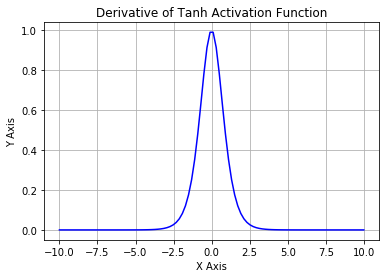

# 深度学习

##DNN

深度神经网络 (DNN) 意为具有两个或以上隐层的感知机。TensorFlow 有对应的高级API，`tf.contrib.learn.DNNClassifier()`。在此讨论如何利用tf 搭建一个DNN。

### 搭建DNN

#### 建图

1. **参数设置**：输入输出，隐层神经元个数等；

   ```python
   n_inputs = 28*28  # MNIST
   n_hidden1 = 300
   n_hidden2 = 100
   n_outputs = 10
   ```

2. **设置输入输出数据**：使用*占位符* (placeholder)；

   ```python
   X = tf.placeholder(tf.float32, shape=(None, n_inputs), name="X")
   y = tf.placeholder(tf.int64, shape=(None), name="y")
   ```

   此时，要注意每层输入输出的**维度**：X 为n_instances * n_features 大小的矩阵，**每一行是一个样本**；y 为n_instances * 1 的向量。

3. **创建神经层** (neuron layer)；

   1. 自建

      ```python
      def neuron_layer(X, n_neurons, name, activation=None):
          with tf.name_scope(name):
              n_inputs = int(X.get_shape()[1])
              stddev = 2 / np.sqrt(n_inputs)
              init = tf.truncated_normal((n_inputs, n_neurons), stddev=stddev)
              W = tf.Variable(init, name="kernel")
              b = tf.Variable(tf.zeros([n_neurons]), name="bias")
              Z = tf.matmul(X, W) + b
              if activation is not None:
                  return activation(Z)
              else:
                  return Z
      ```

      其中，W 为n_features * n_neurons 大小的权值矩阵，**每一列是一个神经元的权值**，初始化技巧后面详述，注意到这里使用截断高斯分布 (truncated_normal) ；b 为bias term；输出为z = X W + b。

   2. 使用tf 函数

      ```python
      tf.layers.dense(...)
      ```

      基本函数和自建函数类似。

4. **搭建隐层和输出层**：注意到输入层只为接受输入，这里不用显式建立；

   ```python
   with tf.name_scope("dnn"):
       hidden1 = neuron_layer(X, n_hidden1, name="hidden1", activation=tf.nn.relu)
       hidden2 = neuron_layer(hidden1, n_hidden2, name="hidden2", activation=tf.nn.relu)
       logits = neuron_layer(hidden2, n_outputs, name="outputs")
   ```

   或者

   ```python
   with tf.name_scope("dnn"):
       hidden1 = tf.layers.dense(X, n_hidden1, name="hidden1", activation=tf.nn.relu)
       hidden2 = tf.layers.dense(hidden1, n_hidden2, name="hidden2", activation=tf.nn.relu)
       logits = tf.layers.dense(hidden2, n_outputs, name="outputs")
   ```

   注意到这里的输入logits 还是不是softmax 的分类结果，这样是为了后面更好地进行损失函数定义、求解。

5. **定义损失函数**：使用*交叉熵* (cross-entropy) 来作为cost function；

   ```python
   with tf.name_scope("loss"):
       xentropy = tf.nn.sparse_softmax_cross_entropy_with_logits(labels=y, logits=logits)
       loss = tf.reduce_mean(xentropy, name="loss")
   ```

6. **训练**：定义优化方法（和设置待优化变量）；

   ```python
   learning_rate = 0.01

   with tf.name_scope("train"):
       optimizer = tf.train.GradientDescentOptimizer(learning_rate)
       training_op = optimizer.minimize(loss)
   ```

7. **评估**：这里使用精度 accuracy 来作为评判标准；

   ```python
   with tf.name_scope("eval"):
       correct = tf.nn.in_top_k(logits, y, 1)
       accuracy = tf.reduce_mean(tf.cast(correct, tf.float32))
   ```

8. **初始化**：最后，初始化数据图（和设置模型保存路径）；

   ```python
   init = tf.global_variables_initializer()
   saver = tf.train.Saver()
   ```

#### 计算

1. **设置参数**：epoch, mini-batch 的大小和数据集准备等；

   ```python
   n_epochs = 400
   n_batches = 50
   ```

2. **建立会话** (session)：

   ```python
   with tf.Session() as sess:
       init.run()
       for epoch in range(n_epochs):
           for iteration in range(mnist.train.num_examples // batch_size):
               X_batch, y_batch = mnist.train.next_batch(batch_size)
               sess.run(training_op, feed_dict={X: X_batch, y: y_batch})
           acc_train = accuracy.eval(feed_dict={X: X_batch, y: y_batch})
           acc_test = accuracy.eval(feed_dict={X: mnist.test.images, y: mnist.test.labels})
           print(epoch, "Train accuracy:", acc_train, "Test accuracy:", acc_test)

       save_path = saver.save(sess, "./my_model_final.ckpt")
   ```

3. **复用模型**：加载与使用；

   ```python
   with tf.Session() as sess:
       saver.restore(sess, "./my_model_final.ckpt") # or better, use save_path
       X_new_scaled = mnist.test.images[:20]
       Z = logits.eval(feed_dict={X: X_new_scaled})
       y_pred = np.argmax(Z, axis=1)
   ```


至此，一个简单的DNN 模型就搭建并训练完毕了。

### 参数调节

一个DNN 包含了许多可以调节的参数，包括但不限于：网络的拓扑结构，隐层层数，每层的神经元数量，激活方程和参数初始化方法等等。

对于隐层层数来说，具有多隐层的神经网络具有更高的**parameter efficiency**：相比于浅层神经网络，它们可以**利用 (exponentially) 更少的神经元**来逼近任意复杂的方程，使得**训练速度更快**。此外，深层神经网络具有更好的**泛化能力**。

对于每层的神经元数量，一般遵循**漏斗**原则，即越深（靠近输出）的层拥有越少的神经元。

## 训练DNN

DNN 在训练过程中会面临许多问题，主要可以分为三类：

1. 梯度消失/爆炸；
2. 训练过慢；
3. 过拟合；

其中，这三类问题可以一起通过某种（数学）方法加以解决。

### 梯度爆炸/消失

之前利用梯度下降法来训练神经网络，但这带来了问题：

1. 随着梯度下降法运行到**浅层**神经层，梯度会变得**越来越小**。这就使得浅层神经元的权值**几乎不变**。这就是**梯度消失** (vanishing gradients)；
2. 对于某些损失和激活函数函数，浅层神经元的梯度会**越来越大**（较少发生），使得算法**发散**。这就是**梯度爆炸** (exploding gradients)

导致该问题的**重要原因**之一就是使用Sigmoid 方程作为激活方程和权值随机初始化（使用均值为0标准差为1的高斯分布）。因为这样的策略使得每一层的输出的方差 (variance) 都大于其输入的方差，最后使得Sigmoid 方程饱和 (satured)。而且Sigmoid 方程的均值为0.5而非1.

### 参数初始化

**要求**：数据在**前向**和**反向**过程中都能够恰当的传播，即每层的输入和输出都具有接近的方差且梯度在前向和反向中也有类似的方差。

要完全满足以上要求是比较难的，但依然可以利用较好的参数初始化技巧来完成。

#### Xavier initialization

若使用Sigmoid 方程作为激活方程，常用Xavier 初始化方法：

- 均值为0 的高斯分布 (normal distribution)，标准差为$\sigma = \sqrt{\frac{2}{n_{inputs} + n_{outputs}}}$；
- uniform distribution between -r and r, with $r = \sqrt{\frac{6}{n_{inputs} + n_{outputs}}}$。

其中，n_inputs 和n_outputs 为对应层的输入和输出数目。

#### He initialization

若使用tanh 方程或ReLU 方程或其变体（包括ELU方程）作为激活方程，常使用He 初始化方法：


### 激活函数

神经网络的激活函数可分为**线形**或**非线性**。非线性激活函数可以使神经网络逼近任意复杂函数。没有激活函数带来的非线性，多层神经网络和单层无异。

#### Sigmoid 方程

$$
\sigma (z) = \frac{1}{1 + e^{-z}}
$$


Sigmoid 函数具有三个**缺陷**：

- 易饱和。在输入很大或很小时是，其梯度趋近于0，造成梯度消失；
- 输出不以0（而以0.5）为中心；
- 计算成本较高。

#### tanh 函数




可以看到，tanh (双曲正切) 函数一样会遭遇梯度消失（或称为dying neuron）问题。

#### ReLU 函数

$$
f(x) = \max(0, z)
$$


ReLU (修正线形单元) 函数被认为是**好的默认激活函数**。其计算简单，且在输入为正时不会有梯度消失问题。但它也存在问题：

- 不以0为中心；
- 在前向传导中，若输入的加权和小于0，即x < 0的话，输出恒为0。在后向传播中，其梯度为0，权重无法更新，称为**dying ReLU**。

#### leaky ReLU

$$
f(x) = \max(\alpha x, x)
$$


为解决ReLU 方程存在的问题，引入了leaky ReLU 方程，a 通常设置为0.01。它具有ReLu 方程的优点，但也有不连续的缺点。

#### parametric leaky RuLU

不把leaky ReLU 方程中的a 当作参数的话，又可以引出ReLU 的两个变体。

- 一是Randomized leaky ReLU (RReLU)：在训练过程中，在一个取值范围内随意挑选a 的取值，然后在测试/使用时将之固定为均值。该方法可以在一定程度上作为正则化；
- 二是直接讲a 作为学习参数在训练过程中加以学习。

总之，ReLU 是一个很好的默认选择，但也可以试用其他激活函数。

#### ELU 函数

$$
ELU_{\alpha} = 
\begin{cases}
\alpha (\exp (z) - 1), z < 0 \\
z, z \ge 0
\end{cases}
$$


ELU (exponential linear unit) 函数类似于ReLU，但具有以下**优点**：

- 在z < 0 时其取值为负，一来促使输出的均值接近0，而来也减缓梯度消失问题；
- 当z < 0 时其梯度不为0， 避免了dying unit 问题；
- 函数光滑，方便了梯度计算。

但它也具有计算量比ReLU 大的问题。但ELU 可以**加速收敛**，一定程度上缓解了这个问题。

#### SELU 函数

SELU 函数是ELU 函数的改良。在ELU 的基础上增加了一个scaling 并确定了a 的取值。

```python
def selu(z,
         scale=1.0507009873554804934193349852946,
         alpha=1.6732632423543772848170429916717):
    return scale * elu(z, alpha)
```


使用SELU 函数使得即使是有100层的神经网络也能 preserves roughly mean 0 and standard deviation 1 across all layers，并且避免梯度消失/爆炸问题。

### Batch Normalization

BN 是在每一层的数据在**进入激活函数前**对其进行处理，以避免梯度消失/爆炸的问题。本质上，它是为了解决 Internal Covariate Shift problem, which is the problem that the distribution of each layer’s inputs changes during training, as the parameters of the previous layers change. 它对输入进行zero-centering 和normalizing，并且对结果进行scaling 和shifting。这使得**每一层**多了两个训练参数。

计算流程如下：

1. $\mu_B = \frac{1}{m_B} \sum\limits_{i=1}^{m_B} \mathbf{x}^{(i)}$
2. $\sigma_B^2 = \frac{1}{m} \sum\limits_{i=1}^{m_B} (\mathbf{x}^{(i)} - \mu_B)^2$
3. $\mathbf{\hat x}^{(i)} = \frac{\mathbf{x}^{(i)} - \mu_B}{\sqrt{\mu_B^2} + \epsilon}$
4. $\mathbf{z}^{(i)} = \gamma \mathbf{\hat x}^{(i)} + \beta$

其中，

- $\mu_B$ 是该mini-batch 的经验均值；
- $\sigma_B$ 是标准差；
- $m_B$ 是mini-batch 的大小；

若没有mini-batch 可供计算，可以试用整个训练集的均值和方差。

最后，BN 也可以作为正则化的手段之一。但它确实增加了网络的计算复杂性。

```python
training = tf.placeholder_with_default(False, shape=(), name='training')

hidden1 = tf.layers.dense(X, n_hidden1, name="hidden1") # activation default is None
bn1 = tf.layers.batch_normalization(hidden1, training=training, momentum=0.9)
bn1_act = tf.nn.elu(bn1)
```

### Gradient Clipping

最后，关于梯度爆炸的另一个解决方法就是简单地将梯度限制在一定范围内。该方法称为**Gradient Clipping**。

为此，在优化的时候我们需要先计算出梯度，然后通过模长阈值限制梯度的大小，最后才利用剪切后的梯度来进行优化运算。

```python
threshold = 1.0

optimizer = tf.train.GradientDescentOptimizer(learning_rate)
grads_and_vars = optimizer.compute_gradients(loss)
capped_gvs = [(tf.clip_by_value(grad, -threshold, threshold), var)
              for grad, var in grads_and_vars]
training_op = optimizer.apply_gradients(capped_gvs)
```

## 迁移学习

一般我们应该避免从头训练一个深度神经网络，而应该复用一个已经训练好、用于类似任务的网络，保留其提取底层信息的浅层网络而只训练深层网络，这样的方法叫做**迁移学习** (transfer learning)。


考虑到被冻结的隐层其参数不会发生变化，所以可以预先计算出每个训练样例对应的隐层输出。在训练过程中，就利用这些输出来训练神经网络。这样可以大幅提高训练效率。

对于迁移学习，常用的训练方法有：

- 先冻结所有隐层，只修改输出层。查看此时模型的表现。接着“解冻”最上面的1 - 2 层隐层，利用反向传播来调整其参数。在查看模型的表现是否有提升。如此循环往复。当我们拥有越多训练样例，就可以解锁更多隐层。

- 非监督学习：如果我们有大量未标记的数据，我们可以从第一个隐层开始，利用非监督特征检测算法，如受限玻尔兹曼机，逐层训练神经网络。最后，再利用带标记的数据来对整个模型进行训练、微调。

  

- 最后，我们可以根据训练目的，先训练一个用于类似目的且具有大量标记数据的神经网络。然后利用这个模型来进行迁移学习。或者，我们可以先讲所有未标记的数据标注为good，然后对每个样例加以扰动并标注扰动后对数据为bad。这样，我们就可以预先训练一个区分数据“好坏”的神经网络。

## 损失函数

对于神经网络，我们希望错误越大或越明显，其学习过程能够更快。

###MSE

在之前的回归任务中，我们使用MSE 作为损失函数。在神经网络中，早期也一样使用Sigmoid 函数作为激活函数和MSE 作为损失函数。这样不仅会造成**梯度消失**问题，还会导致收敛速度过慢点问题。

考虑
$$
C = \frac{1}{2}(y - \sigma(z)),\ \sigma(z) = \frac{1}{1 + e^{-z}},\ z = \sum_{i=1}^n \omega_i x_i + b
$$
则有
$$
\begin{align}
\frac{\partial C}{\partial \omega_i} & = (\sigma(z) - y)  \cdot \sigma^{\prime}(z) \cdot x_i \\
\frac{\partial C}{\partial b} & = (\sigma(z) - y) \cdot \sigma^{\prime}(z)
\end{align}
$$
由前可知，$\sigma^{\prime}(z)$ 在z 过大或过小点时候梯度为0，此时学习的效率很低，还会有梯度消失、dying unit问题。

### 交叉熵

通过上面对MSE 的分析，我们知道问题集中在$\sigma^{\prime}(z)$ 上。很自然地，我们希望损失函数对于参数的倒数可以不包含它，既为
$$
\begin{align}
\frac{\partial C}{\partial \omega_i} & = (\sigma(z) - y)  \cdot x_i \\
\frac{\partial C}{\partial b} & = (\sigma(z) - y)
\end{align}
$$
而
$$
\frac{\partial C}{\partial b} = \frac{\partial C}{\partial \sigma(z)} \cdot \sigma^{\prime}(z) = \frac{\partial C}{\partial \sigma(z)} \cdot \sigma(z)(1 - \sigma(z))
$$
所以
$$
\frac{\partial C}{\partial \sigma(z)} = \frac{(\sigma(z) - y)}{\sigma(z)(1 - \sigma(z))}
$$
令$a = \sigma(z)$ 表示该神经元的输出，对上式积分就可以得到
$$
C = -[y \ln a + (1 - y) \ln (1-a)] + constant
$$
注意上式是针对单个单个神经元的，将所有神经元的输出求和取平均，并令积分而得的常数项为零即可得
$$
C = - \frac{1}{n} \sum_{i=1}^n [y^{(i)} \ln a^{(i)} + (1 - y^{(i)}) \ln (1 - a^{(i)})]
$$
上式极为交叉熵损失函数。

#### 含义

参考[这篇文章](https://blog.csdn.net/rtygbwwwerr/article/details/50778098)。

## 优化器

对于深度神经网络，普通的梯度下降法是远远不够的。为了更好、更快的训练DNN，应该使用其他更为复杂的优化器。

### Momentum Optimization

**思想**：Imagine a bowling ball rolling down a gentle slope on a smooth surface: it will start out slowly, but it will quickly pick up momentum until it eventually reaches terminal velocity.

考虑梯度下降法，为了更新权重w，它计算损失函数J 相对其的导数 (梯度)，再以此更新w：$\omega \leftarrow \omega - \eta \nabla_{\omega} J(\omega)$.

而Momentum Optimization则考虑了此前的梯度。在每次迭代中，它将当前梯度加到一个momentum vector m 上，然后再利用m 来更新w。此时，当前梯度更像是一个加速度。而且为了防止m 过大，算法引入了一个新的参数beta，通常设为0.9。
$$
\begin{align}
\mathbf{m} & \leftarrow \beta \mathbf{m} + \eta \nabla_{\omega} J(\omega) \\
\omega & \leftarrow \omega - \mathbf{m}
\end{align}
$$
**优点**：

1. Momentum Optimization 有比梯度下降更快的速度逃出plateaus和跳出局部极小；
2. 由前可知，梯度下降在类别不均衡时对较大的类别下降较快。而Momentum Optimization则对此不敏感。


```python
optimizer = tf.train.MomentumOptimizer(learning_rate = learning_rate, momentum = 0.9)
```

###Nesterov Accelerate Gradient

NAG 是Momentum Optimization 的一个变体。其**思想**是measure the graident of the cost function not at the local position but slightly ahead in the direction of the momentum。
$$
\begin{align}
\mathbf{m} & \leftarrow \beta \mathbf{m} + \eta \nabla_{\omega} J(\omega + \beta \mathbf{m}) \\
\omega & \leftarrow \omega - \mathbf{m}
\end{align}
$$


```python
optimizer = tf.train.MomentumOptimizer(learning_rate = learning_rate, momentum = 0.9, use_nesterov = True)
```

### AdaGrad

再次考虑类别不平衡的问题，梯度下降法会在数量较大的类别上先收敛。我们希望优化器能尽早发现这个问题，调整方向指向全局最小。

AdaGrad 算法 achieves this by scaling down the gradient vector along the steepest dimensions。


第一个符号代表element-wise multiplication，第二个符号代表element-wise division。

第一个式子将损失函数梯度的平方加到向量s 上。如果cost function is steep along the i-th dimension, 那么s~i~ 就会越来越大；

第二个式子先利用向量s scaling down 损失函数的梯度，再利用其更新权重参数。

该算法减小了更新的梯度，且对于steep dimension（即数量大的类别）见效更大。该方法也称为**adaptive learning rate**。这种方法的一个好处就是对于调整学习率 eta 的需求减小。


AdaGrad 算法对于较简单的二次问题表现良好，但对于神经网络，它往往太早停止。

###RMSProp

AdaGrad 算法衰退太快而无法收敛至全局最小。为了解决这个问题，RMSProp 算法值累加最近几次迭代的梯度。


这里衰减率 beta 通常设定为0.9。

```python
optimizer = tf.train.RMSPropOptimizer(learning_rate = learning_rate, momentum = 0.9, decay = 0.9, epsilon = 1e-10)
```

### Adam Optimization

Adam 意为 adaptive moment estimation，结合了Momentum Optimization 和RMSProp 二者的思想：just like Momentum Optimization it keeps track of an exponentially decaying average of past gradients, and just like RMSProp it keeps track of an exponentially decaying average of past squared gradients.


这里，T 从1开始，代表迭代次数。

通常，momentum decay hyperparameter beta1 通常设置为0.9，scaling decay hyperparameter beta2 则常设置为0.999。

```python
optimizer = tf.train.AdamOptimizer(learning_rate = learning_rate)
```

由于Adam 也是一个adaptive learning rate 算法，其对于学习率eta 的设置要求较低，默认值通常为0.001.

### 小结

上述介绍的优化器最后都会产生一个稠密模型 (dense model)。为了节省内存空间和加速计算，有时我们想要个稀疏模型 (sparse model)。有三种方法：

- 直接设置数值很小的权重为0；
- 使用**l1 正则化**，强迫优化器精简权重参数；
- 利用**Dual Averaging**，也称为**Follow The Regularized Leader** (FTRL)。

### Learning rate scheduling

对于非adaptive learning rate 算法，学习率的设置十分关键。通常的**策略**是：在开始时使用一个较大的学习率加快收敛速度，然后逐渐减小避免震荡或发散。常见的learning schedules 有

- Predetermined piecewise constant learning rate：设置一个学习率集，从第一个学习率eta0 开始，经过n 次迭代就试用下一个学习率eta1；如此循环；
- Performance scheduling：每经过n 次迭代就计算一次validation error，若错误率停止下降或下降缓慢就reduceing the learning rate by a factor of lambda；
- Exponential scheduling：将学习率设置为迭代次数t 的函数：$\eta(t) = \eta_0 \cdot 10^{-\frac{t}{r}}$，即每经过r 次迭代，学习率就被除以10。除了初始学习率eta0，还有参数r 需要设置；
- Power scheduling：$\eta(t) = \eta_0 \cdot (1 + \frac{t}{r})^{-c}$。这里c 通常设置为1。该方法和exponential scheduling 相似，但学习率衰退地较慢。

```python
initial_learning_rate = 0.1
    decay_steps = 10000
    decay_rate = 1/10
    global_step = tf.Variable(0, trainable=False, name="global_step")
    learning_rate = tf.train.exponential_decay(initial_learning_rate, global_step, decay_steps, decay_rate)
```

而对于AdaGrad, RMSProp 和Adam 等可以在训练时自行调整学习率的算法，则不需要额外的学习率调整策略。