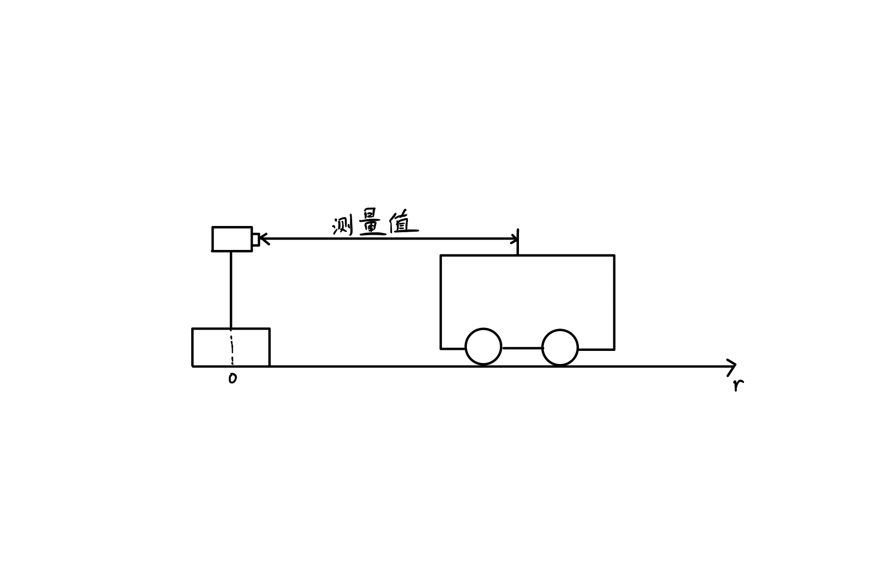
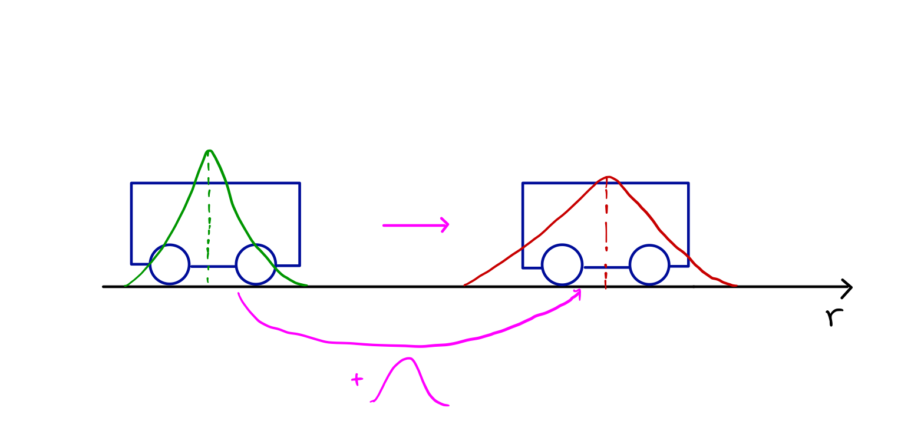
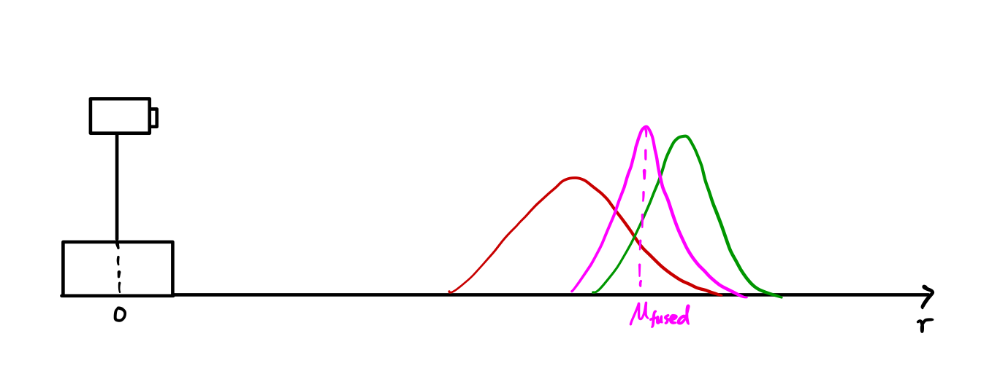
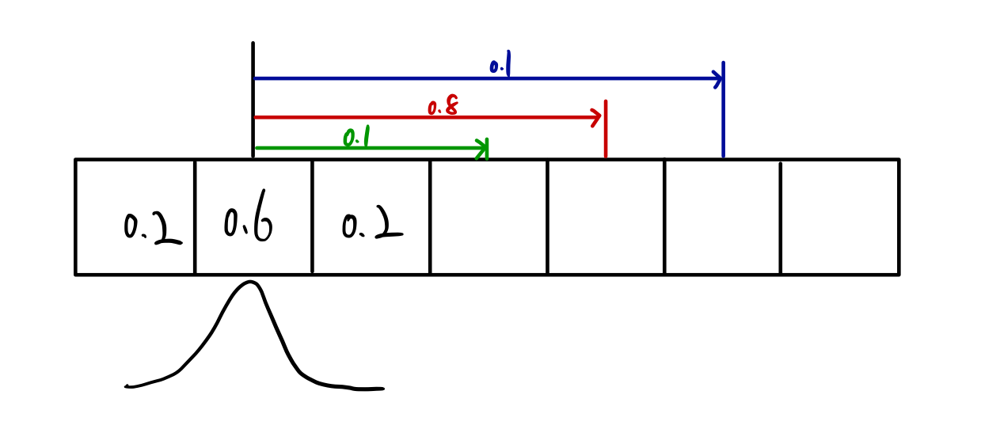
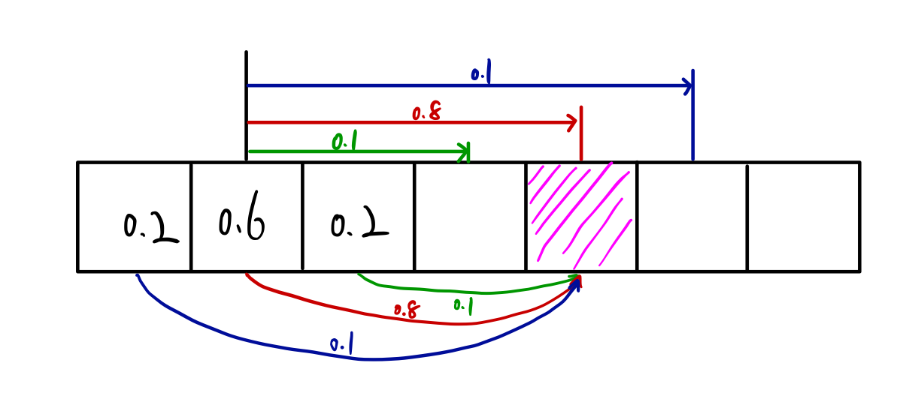

# 卡尔曼滤波：从入门到精通

最早接触卡尔曼滤波是在卫星导航课中，GPS 和IMU 结合时常会用到卡尔曼滤波。但学完了也只明白了数学推导，不过是“会做题的机器”。最近在学习SLAM 时想要重新好好温习一下卡尔曼滤波，虽然现在SLAM 的主流趋势是利用图优化，但卡尔曼滤波仍然为我们提供了一个很好的参考。

## 导论

卡尔曼滤波本质上是一个**数据融合**算法，将具有同样测量目的、来自不同传感器、(可能) 具有不同单位 (unit) 的数据*融合*在一起，得到一个**更精确**的目的测量值。

卡尔曼滤波的局限性在于其只能拟合**线形高斯系统**。但其最大的优点在于计算量小，能够利用前一时刻的状态（和可能的测量值）来得到当前时刻下的状态的最优估计。

本文虽然是小白教程，但还是需要各位至少知道高斯分布，一点点线性代数，还有状态向量这样的名词。

## 简述

考虑一个SLAM 问题，它由一个运动方程：
$$
\mathbf{x}_t=f(\mathbf{x}_{t-1},\mathbf{u}_t)+\omega_t
$$
和一个观测方程组成：
$$
\mathbf{z}_{t,j}=h(\mathbf{y}_j,\mathbf{x}_t) + v_{t,j}
$$
就把它当作一个线性系统吧（非线性系统请看下一讲扩展卡尔曼滤波），并且为了简化推导，忽略路标的下标j，并把路标y 并入到状态向量一起优化，那么运动方程就可以写为：
$$
\mathbf{x}_t = \mathbf{F}_t \mathbf{x}_{t-1} + \mathbf{B}_t \mathbf{u}_t + \omega_t
$$
其中，

- $\mathbf{x}_t$ 为t 时刻的状态向量，包括了相机位姿、路标坐标等信息，也可能有速度、朝向等信息；
- $\mathbf{u}_t$ 为运动测量值，如加速度，转向等等；
- $\mathbf{F}_t$ 为状态转换方程，将t-1 时刻的状态转换至t 时刻的状态；
- $\mathbf{B}_t$ 是控制输入矩阵，将运动测量值$\mathbf{u}_t$ 的作用映射到状态向量上；
- $\omega_t$ 是预测的高斯噪声，其均值为0，协方差矩阵为$\mathbf{Q}_t$。

这一步在卡尔曼滤波中也称为预测 (predict)。

类似地，测量方程可以写为：
$$
\mathbf{z}_t = \mathbf{H}_t \mathbf{x}_t + \mathbf{v}_t
$$
其中，

- $\mathbf{z}_t$ 为传感器的测量值；
- $\mathbf{H}_t$ 为转换矩阵，它将状态向量映射到测量值所在的空间中；
- $\mathbf{v}_t$ 为测量的高斯噪声，其均值为0，协方差矩阵为$\mathbf{R}_t$。

而卡尔曼滤波就是预测 - 测量之间不断循环迭代。当然，对于某些情况，如GPS + IMU，由于IMU 测量频率远比GPS 高，在只有IMU 测量值时，只执行运动更新，在有GPS 测量值时再进行测量更新。

## 一个小例子

用一个在解释卡尔曼滤波时最常用的一维例子：小车追踪。如下图所示：

状态向量为小车的位置和速度：
$$
\mathbf{x}_t = \begin{bmatrix}
x_t \\ \dot x_t
\end{bmatrix}
$$
而司机要是踩了刹车或者油门，小车就会具有一个加速度，$\mathbf{u}_t = \frac{f_t}{m}$。

假设t 和t-1 时刻之间的时间差为$\Delta t$。根据物理知识，有：
$$
\begin{cases}
x_t = x_{t-1} + \dot x_{t-1} \Delta t + \frac{1}{2} \frac{f_t}{m} \Delta t^2 \\
\dot x_t = \dot x_{t-1} + \frac{f_t}{m} \Delta t
\end{cases}
$$
写成矩阵形式就有
$$
\begin{bmatrix}
x_t \\ \dot x_t
\end{bmatrix}
=
\begin{bmatrix}
1 & \Delta t \\
0 & t
\end{bmatrix}
\begin{bmatrix}
x_{t-1} \\ \dot x_{t-1}
\end{bmatrix}
+
\begin{bmatrix}
\frac{\Delta t^2}{2} \\ \Delta t
\end{bmatrix}
\frac{f_t}{m}
$$
跟之前的运动方程对比，就知道
$$
\mathbf{F}_t =\begin{bmatrix}
1 & \Delta t \\
0 & t
\end{bmatrix},\ 
\mathbf{B}_t = \begin{bmatrix}
\frac{\Delta t^2}{2} \\ \Delta t
\end{bmatrix}
$$
上式就写为
$$
\mathbf{\hat x}_{t|t-1} = \mathbf{F}_t \mathbf{\hat x}_{t-1} + \mathbf{B}_t \mathbf{u}_t
$$
$\mathbf{\hat x}_{t-1}$ 表示t-1 时刻卡尔曼滤波的状态估计；$\mathbf{\hat x}_{t|t-1}$ 则表示在预测更新中t-1 到t 时刻的状态向量。

再利用运动模型对状态向量进行更新后，还要继续更新状态向量的协方差矩阵P，公式为：
$$
\mathbf{P}_{t|t-1} = \mathbf{F}_t \mathbf{P}_{t-1} \mathbf{F}^T_t + \mathbf{Q}_t
$$
假设$\mathbf{x}_t$ 为t 时刻下状态向量的真值（自然是永远未知的），由之前的现形运动方程（式(3)）给出，将式(3) 与式(9) 相减可得：
$$
\mathbf{x}_t - \mathbf{\hat x}_{t|t-1} = \mathbf{F} (\mathbf{x}_{t-1} - \mathbf{\hat x}_{t|t-1}) + \omega_t
$$
而
$$
\begin{align}
\mathbf{P}_{t|t-1} & = E[(\mathbf{x}_t - \mathbf{\hat x}_{t|t-1})(\mathbf{x}_t - \mathbf{\hat x}_{t|t-1})^T]\\
 & = E[(\mathbf{F} (\mathbf{x}_{t-1} - \mathbf{\hat x}_{t|t-1}) + \omega_t) \cdot (\mathbf{F} (\mathbf{x}_{t-1} - \mathbf{\hat x}_{t|t-1}) + \omega_t)^T] \\
 & = \mathbf{F}  E[(\mathbf{x}_{t-1} - \mathbf{\hat x}_{t|t-1}) \cdot (\mathbf{x}_{t-1} - \mathbf{\hat x}_{t|t-1})^T]\mathbf{F}^T \\
 & + \mathbf{F} E[(\mathbf{x}_{t-1} - \mathbf{\hat x}_{t|t-1}) \omega_t^T] \mathbf{F}^T \\
 & + \mathbf{F} E[(\omega_t \mathbf{x}_{t-1} - \mathbf{\hat x}_{t|t-1})^T] \mathbf{F}^T \\
 & + E[\omega_t \omega_t^T]
\end{align}
$$
考虑到状态向量和噪声是**不相关**的，则$E[(\omega_t \mathbf{x}_{t-1} - \mathbf{\hat x}_{t|t-1})^T] = 0$，上式就可以简化为
$$
\begin{align}
\mathbf{P}_{t|t-1} & = \mathbf{F}  E[(\mathbf{x}_{t-1} - \mathbf{\hat x}_{t|t-1}) \cdot (\mathbf{x}_{t-1} - \mathbf{\hat x}_{t|t-1})^T]\mathbf{F}^T + E[\omega_t \omega_t^T] \\
 & = \mathbf{F}_t \mathbf{P}_{t-1} \mathbf{F}^T_t + \mathbf{Q}_t
\end{align}
$$
推导完毕。

可以看到，经过预测更新，协方差矩阵P 变大了。这是因为状态转换并不完美，而且运动测量值含有噪声，具有较大的不确定性。

预测更新实际上相当于“**加法**”：将当前状态转换到下一时刻（并增加一定不确定性），再把外界的干扰（运动测量值）叠加上去（又增加了一点不确定性）。

上面即为卡尔曼滤波中预测这一步。这一步相对比较直观，推导也较测量更新简单，就只在这里详细给出了。

如果得到了测量值，那么我们就可以对状态向量进行测量更新了，对应的公式为
$$
\begin{align}
\mathbf{\hat x}_t & = \mathbf{\hat x}_{t|t-1} + \mathbf{K}_t (\mathbf{z}_t - \mathbf{H}_t \mathbf{\hat x}_{t|t-1}) \\
\mathbf{P}_t & = \mathbf{P}_{t|t-1} - \mathbf{K}_t \mathbf{H}_t \mathbf{P}_{t|t-1}
\end{align}
$$
其中，
$$
\mathbf{K}_t = \mathbf{P}_{t|t-1} \mathbf{H}^T_t (\mathbf{H}_t \mathbf{P}_{t|t-1} \mathbf{H}^T_t + \mathbf{R}_t)^{-1}
$$
为Kalman Gain（抱歉，想半天不知咋翻译）。

从这里就可以看到，测量更新显然比预测更新复杂，难点也集中在这里。下面就给出测量更性的详细推导。

## 推导

### 一维case

从t-1 时刻起，小车运动后，经过前面所述的预测更新后，我们就得到了t 时刻的小车位置的估计，由于在卡尔曼滤波中，我们使用高斯概率分布来表示小车的位置，因此这个预测的位置可以写为：
$$
y_1(r; \mu_1, \sigma_1) = \frac{1}{\sqrt{2 \pi \sigma_1^2}} e ^{-\frac{(r - \mu_1)^2}{2 \sigma_1^2}}
$$
为了与前面的通用的推导区别开来，在这个一维的例子中我们使用了新的符号。不过熟悉高斯概率分布的话应该可以马上看出来，$\mu_1$ 为这个高斯分布的均值，$\sigma_1$ 为方差，而r 为小车的可能位置，$y_1$ 为某个可能位置 (r) 的概率分布。

假设在t 时刻，我们通过某测距仪测得小车距离原点的距离r，由于测量包含噪声（且在面前我们假设了其为高斯噪声），因此该测量值也可以利用高斯概率分布来表示：
$$
y_2(r; \mu_2, \sigma_2) = \frac{1}{\sqrt{2 \pi \sigma_2^2}} e ^{-\frac{(r - u_2)^2}{2 \sigma_2^2}}
$$
除了下标外，其余的字母的含义都和上面的式子一样。

如上图琐事，现在在t 时刻，我们有了两个关于小车位置的估计。而我们所能得到的关于小测位置的**最佳估计**就是将预测更新和测量更新所得的数据**融合**起来，得到一个新的估计。而这个融合，就是一个简单的“**乘法**”，并利用了一个**性质**：两个高斯分布的乘积仍然是高斯分布。
$$
y_{fused}(r; \mu_1, \sigma_1, \mu_2, \sigma_2) 
=  \frac{1}{\sqrt{2 \pi \sigma_1^2}} e ^{-\frac{(r - u_1)^2}{2 \sigma_1^2}} \cdot \frac{1}{\sqrt{2 \pi \sigma_2^2}} e ^{-\frac{(r - u_2)^2}{2 \sigma_2^2}} 
=  \frac{1}{\sqrt{2 \pi \sigma_1^2 \sigma_2^2}} e ^{-(\frac{(r - u_1)^2}{2 \sigma_1^2} + \frac{(r - u_2)^2}{2 \sigma_2^2})}
$$
将上式化简一下：
$$
y_{fused}(r;\mu_{fused}, \sigma_{fused}) =  \frac{1}{\sqrt{2 \pi \sigma_{fused}^2}} e ^{-\frac{(r - u_{fused})^2}{2 \sigma_{fused}^2}}
$$
其中，$\mu_{fused}$ 为$\mu_1$ 和$\mu_2$ 的加权平均，$\sigma_{fused}$ 则是$\sigma_1$ 和$\sigma_2$ 的调和平均的二分一：
$$
\mu_{fused} = \frac{\mu_1 \sigma_2^2 + \mu_2 \sigma_1^2}{\sigma_1^2 + \sigma_2^2} = \mu_1 + \frac{\sigma_1(\mu_2 - \mu_1)}{\sigma_1^2 + \sigma_2^2}
$$

$$
\sigma_{fused} = \frac{1}{\frac{1}{\sigma_1} + \frac{1}{\sigma_2}} = \frac{\sigma_1 \sigma_2}{\sigma_1^2 + \sigma_2^2} = \sigma_1^2 - \frac{\sigma_1^4}{\sigma_1^2 + \sigma_2^2}
$$

最右边的式子是为了后面的计算而准备的。

本质上，这（高斯分布相乘）就是卡尔曼滤波中测量更新的全部了。

那么， 怎么由上面两个简单的一维的式子得到前一节$\mathbf{\hat x}_t$ 和$\mathbf{P}_t$ 呢？一步一步来。

###转换矩阵H 的引入

在刚刚的一维情况的小例子中，我们其实做了一个隐式的**假设**，即有预测更新得到的位置的概率分布和测距仪所得的测量值具有相同的单位 (unit)，如米 (m)。

但实际情况往往不是这样的，比如，测距仪给出的可能不是距离，而是信号的飞行时间（由仪器至小车的光的传播时间），单位为秒 (s)。这样的话，我们就无法直接如上面一般直接将两个高斯分布相乘了。

此时，就该转换矩阵$\mathbf{H}_t$ 闪亮登场了。由于$r = c \cdot t$，c 为光速。所以此时$H_t = \frac{1}{c}$ （测量方程为$t = \frac{r}{c}$，可以回去参考一下式(4)）。

预测值就要写为：
$$
y_1 (s; \mu_1, \sigma_1, c) = \frac{1}{\sqrt{2 \pi (\frac{\sigma_1}{c})^2}} e ^{-\frac{(s - \frac{\mu_1}{c})^2}{2 (\frac{\sigma_1}{c})^2}}
$$
而测量值保持不变：
$$
y_2(s; \mu_2, \sigma_2) = \frac{1}{\sqrt{2 \pi \sigma_2^2}} e ^{-\frac{(s - u_2)^2}{2 \sigma_2^2}}
$$
这样，两个高斯概率分布在转换矩阵H 的作用下又在同一个空间下了。根据前面$\mu_{fused}$ 和$\sigma_{fused}$ 的公式 （式(27) 和式(28)），可得：
$$
\frac{\mu_{fused}}{c} = \frac{\mu_1}{c} + \frac{(\frac{\sigma_1}{c})^2(\mu_2 - \frac{\mu_1}{c})}{(\frac{\sigma_1}{c})^2 + \sigma_2^2}
$$
将上式两端都乘以c 则可得：
$$
\mu_{fused} = \mu_1 + \frac{\frac{\sigma_1^2}{c}}{(\frac{\sigma_1}{c})^2 + \sigma_2^2} \cdot (\mu_2 - \frac{\mu_1}{c})
$$
由于$H = \frac{1}{c}$（这里转换矩阵H 不随时间变化而变化，所以把下标t 略去），并记$K = \frac{H \sigma_1^2}{H^2 \sigma_1^2 + \sigma^2_2}$，则上式可以写为：
$$
\mu_{fused} = \mu_1 + K (\mu_2 - H \mu_1)
$$
类似的有，
$$
\frac{\sigma^2_{fused}}{c^2} = (\frac{\sigma_1}{c})^2 - \frac{(\frac{\sigma_1}{c})^4}{(\frac{\sigma_1}{c})^2 + \sigma_2^2} \\
$$
两边乘以$c^2$ 有：
$$
\sigma^2_{fused} = \sigma^2_1 -\frac{\frac{\sigma_1^2}{c}}{(\frac{\sigma_1}{c})^2 + \sigma_2^2} \cdot \frac{\sigma_1^2}{c} = \sigma^2_1 - K H \sigma_1
$$

###推广至高维

到了这一步，这个一维情况下卡尔曼滤波的测量更新步骤就已经彻底讲完了。剩下的就是将这个一维例子推广至高维空间中。其实大家仔细观察一下就会得到答案。

- $\mu_{fused}$ 就是$\mathbf{\hat x}_t$，是测量更新后所得的状态向量；
- $\mu_1$ 就是$\mathbf{\hat x}_{t|t-1}$，是t-1 时刻到t 时刻的小车的预测更新（或叫运动更新）后的状态向量；
- $\mu_2$ 是$\mathbf{z}_t$，是测量值；
- $\sigma_{fused}^2$ 在高维空间中为$\mathbf{P}_t$，为测量更新后，状态向量的协方差矩阵；
- $\sigma_1^2$ 在高维空间中就成了协方差矩阵$\mathbf{P}_{t|t-1}$，是预测更新后状态向量的协方差矩阵；
- $\sigma_2^2$ 是$\mathbf{R}_t$，是测量值的协方差矩阵；
- H 就是$\mathbf{H}_t$ 了，高维空间中的转换矩阵。
- 而最重要的，Kalman gain $K = \frac{H \sigma_1^2}{H^2 \sigma_1^2 + \sigma^2_2}$，在高维空间中就可以写为$\mathbf{K}_t = \mathbf{H}_t \mathbf{P}_{t|t-1} \cdot (\mathbf{H}_t \mathbf{P}_{t|t-1} \mathbf{H}^T_t + \mathbf{R}_t)^{-1}$。看着很复杂，但仔细对照的话就是把前面相迎的数据替换带入即可。

最后，根据式(33) $\mu_{fused} = \mu_1 + K (\mu_2 - H \mu_1)$ 就可得：
$$
\mathbf{\hat x}_t = \mathbf{\hat x}_{t|t-1} + \mathbf{K}_t (\mathbf{z}_t - \mathbf{H}_t \mathbf{\hat x}_{t|t-1}) 
$$
根据$\sigma^2_{fused} = \sigma^2_1 - K H \sigma_1$ 就可得：
$$
\mathbf{P}_t  = \mathbf{P}_{t|t-1} - \mathbf{K}_t \mathbf{H}_t \mathbf{P}_{t|t-1}
$$

## 讨论

至此，相信你已经明白了卡尔曼滤波的推导过程。而具体的问题就取决于你的建模了。如在上面的小车的例子中，
$$
\begin{align}
\mathbf{F}_t & =\begin{bmatrix}
1 & \Delta t \\
0 & t
\end{bmatrix},\\
\mathbf{B}_t & = \begin{bmatrix}
\frac{\Delta t^2}{2} \\ \Delta t
\end{bmatrix} \\
\mathbf{H}_t & = \frac{1}{c}
\end{align}
$$

### 多问个为什么

如果只关心卡尔曼滤波的推导和方程，到这里就可以停止啦。

但推完卡尔曼滤波，我还有几个个为什么。知其然更要知其所以然。下面是我对于自己的疑惑学习、思考得到的解答，而且碍于表达能力，不敢说百分百正确。

首先是对于预测更新。前面也说到了，预测更新相当于“加法”。这相对好理解一些。在t-1 时刻我们有了对于小车位置的一个估计，根据对小车速度（状态向量之一），小车的加速度（运动测量值）的建模，在辅以时间间隔，自然可以计算出小车在该时间间隔内的位移和速度增量，再将之叠加到原有的状态向量上即可。由于建模和测量的过程带有噪声，所以此时小车的位置估计的精度是下降的（方差增大）。

那么为什么测量更新就是乘法而预测更新是加法呢？

因为测量更新的依据是**贝叶斯法则**。在有了测量值之后，我们求小车位置的概率分布其实就是在求$P(\mathbf{x} | \mathbf{z})$。根据贝叶斯法则有：
$$
P(\mathbf{x} | \mathbf{z}) = \frac{P(\mathbf{z} | \mathbf{x}) P(\mathbf{x})}{P(\mathbf{z})}
$$
$P(\mathbf{x} | \mathbf{z})$ 是后验概率。直接求后验概率比较困难（为什么？）。假设就在这个一维的小车例子中，当我们得到一个距离测量值z，那么小车的位置可能是距离远点的-z 或z 的两个点上。对于二维就可能是一个圆，三维则是一个球。此时要精确地知道小车的位置（消除歧义），一则我们可以继续测量，二则需要额外的信息。这就使得求后验概率比较不划算。

反观贝叶斯法则的右侧，此时我们已经有了先验概率$P(\mathbf{x})$，这是上一时刻的状态向量，并且我们也有了$P(\mathbf{z} | \mathbf{x})$，因为所得的测量值$\mathbf{z}_t = \mathbf{H}_t \mathbf{x}_t + \mathbf{v}_t$ 表达的就是在当前位置下，我们能得到的测量值，亦即贝叶斯中的似然。在$P(\mathbf{z})$ 为一个常数的情况下，最大化$P(\mathbf{z} | \mathbf{x}) P(\mathbf{x})$ 就得到了最优的$P(\mathbf{x} | \mathbf{z})$。

既然测量更新是以贝叶斯公式为基础，那么反观预测更新，除了前面那个直观的解释之外，是不是也有一个概率上的解释呢？

连续的高斯分布所表示的小车位置和预测更新我没找到（不好意思），但就离散情况的话还是有一个依据的，就是**全概率公式**。以下图为例，假设t-1 时刻，小车的位置分布概率如图所示，到了t 时刻，小车向前运动了3米（3个格子），但由于模型的不确定性和噪音，我们不能保证小车精确地向前走了3米，根据概率分布，我们可以假设小车有80%的概率往前走了3米，10%的概率往前走了两米，而另有10%的概率往前走了4米。

那么，在t 时刻，小车真的运动到了这个位置，其概率分布是怎样的呢？它既有可能是在距离该位置3米远的地方以0.8的概率运动到现在这个位置的，也有可能是以0.1 的概率从2或4米远的地方为初始位置的，根据全概率公式，可以表达为

$$
P(z) = 0.8 \cdot 0.6 + 0.1 \cdot 0.2 + 0.1 \cdot 0.2 = 0.52
$$
类似地，t时刻下，小车运动后在其他位置上的概率也可以用权概率公式表达出来。当然，最后的计算结果还需要进行**归一化处理**。

如果我们不断地减小每个方格的分辨率，并按照高斯分布给予每个方格一个概率值，并对小车运动也做如此的离散化处理，应该也是可以不断逼近连续的情况（个人猜想）。

至此，关于卡尔曼滤波的个人浅见就到此为止了。精通还需要不断地实践，但希望读完本文，能让你对卡尔曼滤波有全面的了解。