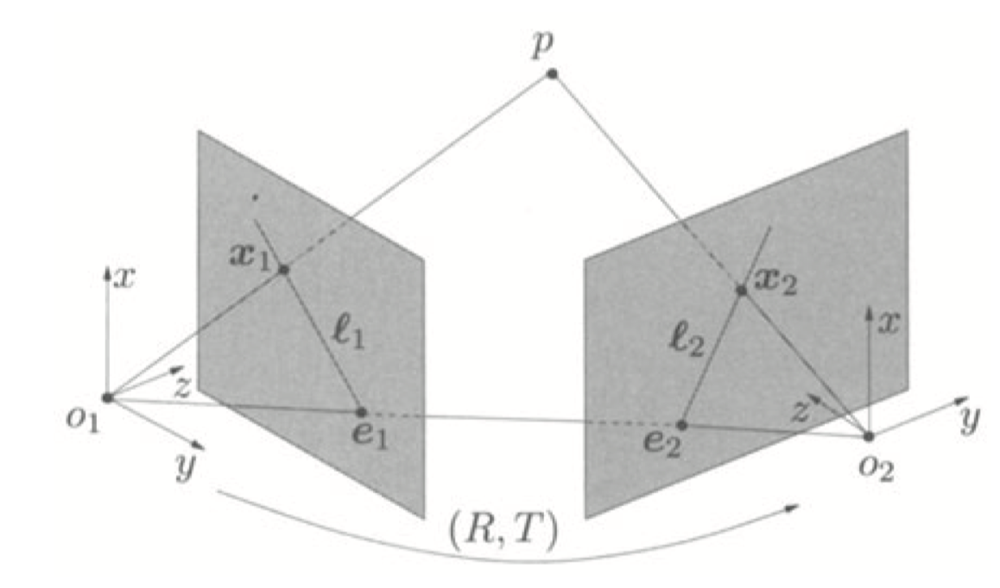
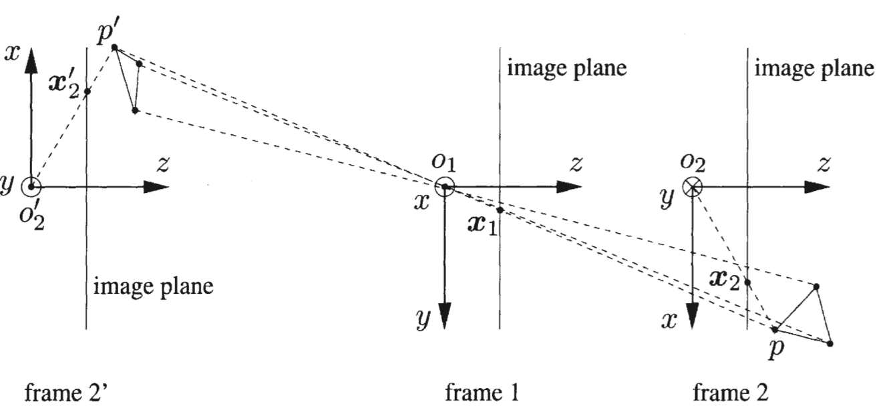
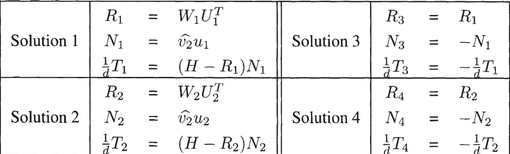
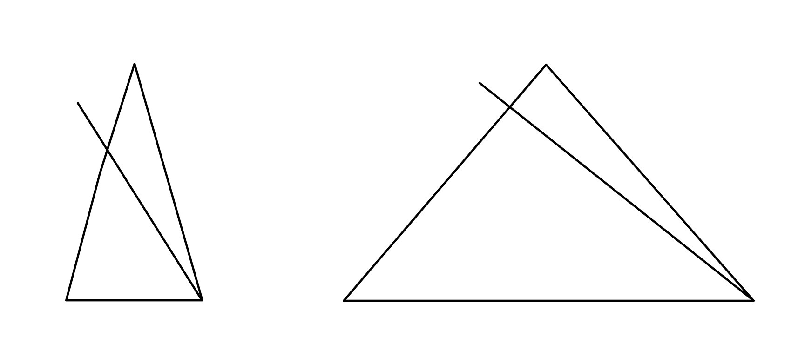
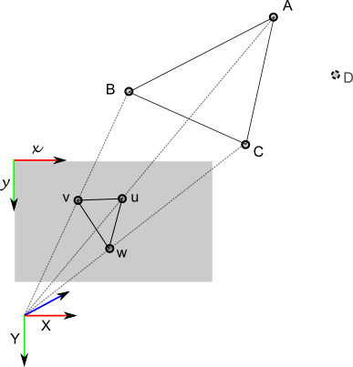

# 特征点法前端

前端又称为*视觉里程计* (VO)，它根据相邻图像间的信息来估计出相机的运动。估计值既可作为结果输出，也可以作为初始值提供给后端来进行优化。VO 的实现，按照是否提取图像特征，分为*特征点法前端*和*直接法前端*。本讲介绍的是特征法前端。

## 特征点与特征点匹配

如前所述，VO 的主要问题是**根据图像信息来估计相机的运动**。一般来说，我们首先从图像中选取出比较有代表性的点，然后根据这些点来估计相机的位姿（和点的定位）。在SLAM 中，这些点也称为**路标**。

### 特征点

影像在计算机中是以数值矩阵的方式来进行存储的。因此，单个像素也是一种特征。但我们希望所提取的特征能够在**相机运动后保持稳定**，即有一定程度的不变性。而单个像素往往收到光照、视角、形变等等因素的影响而变得不稳定。因此，在计算机视觉中，常常通过人工设计的特征提取器来获取具有鲁棒性的图像特征。

常见的图像特征就是角点。角点有易辨认易提取的特点。但它也存在一些问题。比如距离的影响：从远处看是角点的地方，相机移近之后却不是了。还有旋转的影响：相机旋转后，不同影像上的同一角点可能就具有不同的外观。

为此，研究者们设计了许多能够提取具有足够鲁棒性特征提取算法，如SIFT, SURE, ORB 等等。这些人工设计的特征点一般都具备如下**性质**：

1. 可重复性：相同的特征点可以在不同的影像上找到；
2. 可区别性：不同的特征点具有不同的表达；
3. 高效率：同一图像中，特征点的数量远小于像素的数量；
4. 本地性：提取的特征点仅仅和一小片图像区域相关。

一个特征点由**关键点** (key-point) 和**描述子** (descriptor) 两部分组成。关键点指的是该特征点在图像上的位置信息，有些还具有方向、大小等其他信息。描述子通常是一个向量，它按照某种人为设计的方式，描述了特征点周围像素点信息。描述子点一个重要设计原则就是**外观相似的特征具有相似的描述子**。

由于SLAM 是一种实时应用，因此除了鲁棒性之外，算法的**实时性**也应该被考虑。实际上，特征点提取和匹配占据了SLAM 主要的时间消耗。因此选用合适的特征提取算法至关重要。如SIFT 算子虽好，但计算量太大，时间消耗过多。虽然大部分的特征提取都具有良好的并行性，可以使用GPU 来加速运算，但由此带来的成本提升也要纳入考量。而ORB算子是质量和效率之间比较好的折中方案，常被用在目前的视觉SLAM 方案中。

####ORB

网上关于ORB 算子的资料很多，相关论文也可以直接获取。这里仅仅进行一个简要的叙述。

ORB 特征一样由*关键点*和*描述子*两部分组成。它的关键点为*Oriented FAST*，是FAST 算子的一种改进；描述子则是BRIEF。

FAST 算子很高效，但不具备尺度和旋转不变性。通过构建**影像金字塔**，在不同尺度的影像上提取特征来增加尺度不变性。然后引入**像素重心**来确定特征点的方向，引入旋转不变性。中间还可以使用Harris 角点滤波来提取出N 个最有可能的角点。

传统的BRIEF 描述子一样不具备旋转不变性，同样通过像素重心所确定的特征点方向来作为描述子点方向，得到*steer BRIEF*。最后，为了得到更好的两两比较模式，利用一个角点数据集和贪心算法得到一个具有高方差、低相关的模式，用以构建合适的描述子，称为*rBRIEF*。

原论文[ORB](http://www.cs.zju.edu.cn/~gpan/course/materials/ORB.pdf) 在此。

### 特征匹配

完成特征提取后，就可以进行特征匹配了。特征匹配解决了SLAM 中的**数据关联**问题，即**确定了当前看到的路标和之前看到的路标之间的对应关系**。

最简单的特征匹配方法就是**暴力匹配** (brute-force matching)：计算待匹配特征点与其他特征点之间的距离，然后按距离排序，选取距离最近的特征点作为匹配点。在这里，描述子间的距离表示了两个特征点之间的**相似程度**，有欧式距离，汉明距离等等。对于特征点数量巨大的情况，**快速近似最邻近** (FLANN) 算法会更为高效。

接下来，我们希望根据匹配的特征点对来估计相机的运动。根据相机原理或所有的数据等不同，有三种情况：

1. 当使用单目相机时，我们只知道二维的像素坐标，因此问题是根据两组匹配的2D 点来估计相机运动。该问题用**对极几何**来解决。
2. 当相机为双目或为RGB-D 相机时，由于我们可以获得深度信息，问题就是估计两组3D 点间的运动。该问题用**ICP** 来解决。
3. 如果有3D 点云及其对应像素点的2D 坐标，也能顾及相机运动。该问题通过PnP 求解。

## 对极几何

### 对极约束

上图展示了一对匹配好的特征点。我们希望求取这两帧之间的运动。设两个相机关心分别为O1 和O2，第一帧到第二帧到运动为R，t。点p1 (x1) 和点p2 (x2) 是同一个空间点在两个成像平面上的投影。连线O1p1 和O2p2 在三维空间中相交于点P。这时，O1, O2 和P 三点确定一个平面，称为**极平面** (epipolar plane)。O1O2 连线与像平面I1, I2 的交点分别为e1, e2。点e1, e2 称为**极点** (epipoles)，是相机光心在另一幅影像上的投影。注意到这里e1, e2 都位于像平面内。有时候它们有可能会落在成像平面**之外**。O1O2 称为**基线** (baseline)。而极平面与两个像平面之间的交线l1, l2 为**极线** (epipolar line)，它们分别是射线O2p2 和O1p2 在对方影像上的投影。

从几何上来看，射线O1p1 是像素点p1 所对应的物方点可能出现的位置：该射线上的所有点都有可能投影到点p1 上。射线O1p2 是像素点p2 所对应的物方点可能出现的位置。**如果匹配正确的话**，像素点p1, p2 对应于同一个物方点。这两条射线的交点就是就是点P 的空间位置。如果没有特征匹配，我们就必须在极线l2 上搜索p1 的匹配点。

现在我们从代数的角度上看，**在第一帧的相机坐标系下**，点P 的空间位置为：
$$
\mathbf{P}=[X, Y, Z]^T
$$
根据针孔相机模型，不考虑畸变，两个像素点p1, p2 点像素坐标分别为：
$$
s_1\mathbf{p}_1=\mathbf{K}\mathbf{P},\ s_2\mathbf{p}_2=\mathbf{K}(\mathbf{R}\mathbf{P}+\mathbf{t})
$$
这里，K 为相机内参矩阵。如果使用齐次坐标，则前面的系数s1, s2 可以省略。设：
$$
\mathbf{x}_1=\mathbf{K}^{-1}\mathbf{p}_1,\ \mathbf{x}_2=\mathbf{K}^{-1}\mathbf{p}_2
$$
这里，x1 和x2 分别为两个像素点**在各自相机坐标系下**的**归一化平面坐标**。将之代入式(2) 可得：
$$
\mathbf{x}_2 = \mathbf{R}\mathbf{x}_1+\mathbf{t}
$$
将上式两边同时左乘$\mathbf{t}^{\wedge}$，这相当于两侧同时和t 做外积：
$$
\mathbf{t}^{\wedge}\mathbf{x}_2=\mathbf{t}^{\wedge}\mathbf{R}\mathbf{x}_1
$$
再将两侧同时左乘$\mathbf{x}^T_2$：
$$
\mathbf{x}^T_2\mathbf{t}^{\wedge}\mathbf{x}_2=\mathbf{x}^T_2\mathbf{t}^{\wedge}\mathbf{R}\mathbf{x}_1
$$
注意到$\mathbf{t}^{\wedge}\mathbf{x}_2$ 是一个垂直于二者的向量，因此它和$\mathbf{x}_2$ 的内积为0。由此可得：
$$
\mathbf{x}^T_2\mathbf{t}^{\wedge}\mathbf{R}\mathbf{x}_1=0
$$
如果我们代入p1, p2 则可得：
$$
\mathbf{p}^T_2\mathbf{K}^{-T}\mathbf{t}^{\wedge}\mathbf{R}\mathbf{K}^{-1}\mathbf{x}_1
$$
这两个式子（式(7) 和式(8)）称为**对极约束**。它的**几何意义**为O1, O2 和P 三点共面。这两个式子的中间部分分别称为**本质矩阵** (essential matrix) E 和**基础矩阵** (fundamental matrix) F。
$$
\mathbf{E} = \mathbf{t}^{\wedge}\mathbf{R},\ \mathbf{F} =\mathbf{K}^{-T}\mathbf{t}^{\wedge}\mathbf{R}\mathbf{K}^{-1}
$$
对极约束给出了两个匹配点的空间位置关系。E 和F 之间只差了相机内参。在SLAM 中，相机内参一般都是已知的（也可以通过相机标定获得），所以实践中常常使用形式更简单的E。注意到E 完全有旋转矩阵R 和平移向量t 组成，由此我们也希望能够通过E 来求得R, t。因此，相机位姿的估计就可以描述为：

1. 通过匹配点求出E；
2. 根据E 求取R, t。

实际情况自然会比这个复杂。下面我们就来了解下这个求解过程。

### 本质矩阵

**关于本大节（对极几何）的更详细的讲解和推导推荐看书 An Invitation to 3-D vision 的第五章。这章也正好是sample chapters 之一，可以免费阅读。地址在此[Reconstruction from Two Calibrated Views](http://vision.ucla.edu//MASKS/MASKS-ch5.pdf) .**

本质矩阵$\mathbf{E} = \mathbf{t}^{\wedge} \mathbf{R}$ 是一个3 * 3 大小的矩阵，共9个未知数。它包含了一个相对位置信息t 和一个旋转矩阵R。所有本质矩阵也构成一个集合，具有以下的性质：

- 本质矩阵是由对极约束定义的。由上可知对极约束是一个**等式为零**的约束，所以对E 乘以**任意非零常**数后，对极约束仍然满足。说明E 在**不同尺度下**是**等价**的。
- 根据$\mathbf{E} = \mathbf{t}^{\wedge} \mathbf{R}$，本质矩阵E 的奇异值必定是$[\sigma,\sigma,0]^T$ 的形式。这称为**本质矩阵的内在性质**。想要详细的证明还请看上面的章样。
- 平易和旋转各自有3 个自由度，所以$\mathbf{t}^{\wedge} \mathbf{R}$ 一共只有6个自由度。考虑到尺度等价性，本质矩阵E 实际上只有5个自由度。

既然E 只有5个自由度，说明我们可以只用5对点来对其进行求解。但E 的内在性质是非线性的，只用5对点求解会更麻烦些。考虑E 的尺度等价性，可以使用8对点来求解E。这就是**八点法**。

考虑一对匹配点，它们的**归一化坐标**为$\mathbf{x}_1 = [u_1, v_1,1]^T$ 和$\mathbf{x}_2 = [u_2, v_2,1]^T$。根据对极约束则有：
$$
\begin{pmatrix}
u_1, v_1, 1
\end{pmatrix}
\begin{pmatrix}
e_1 & e_2 & e_3 \\
e_4 & e_5 & e_6 \\
e_7 & e_8 & e_9 \\
\end{pmatrix}
\begin{pmatrix}
u_2 \\ v_2 \\ 1
\end{pmatrix} = 0
$$
把矩阵E 展开，写成向量的形式 (stacked version)：
$$
\mathbf{e} =[ e_1, e_2, e_3, e_4, e_5, e_6, e_7, e_8, e_9]^T
$$
对极约束就可以写成与e 有关的线形形式：
$$
[u_1u_2, u_1 v_2, u_1, v_1 u_2, v_1 v_2, v_1, u_2, v_2, 1] \mathbf{e} = 0
$$
8个特征点对就构成了一个线性方程组。设系数矩阵为A，它是一个8 * 9 大小的矩阵，e 位于该矩阵的零空间 (Null Space) 中。如果矩阵A 满足秩为8（满秩）的条件（8个点不共面），那么其零空间维度为1，即e 构成**一条线**，这与e 的尺度等价性是一致的。

求解出E 后，问题就变成了如何从E 中恢复出相机的运动R，t。该过程可以由奇异值分解 (SVD) 得到。且对于任意一个本质矩阵E，有**两组**相对运动 (R, t) 与之对应。同样地，详细证明请看上面的书籍章样。假设E 的SVD 分解为：
$$
\mathbf{E} = \mathbf{U} \mathbf{\Sigma} \mathbf{V}^T
$$
其中，U, V 是正交阵，$\mathbf{\Sigma}$ 是奇异值矩阵。与E 对应的两组 (R, t) 分别为：
$$
\begin{align}
\mathbf{t}_1^{\wedge} = \mathbf{U} \mathbf{R}_z(\frac{\pi}{2}) \mathbf{\Sigma} \mathbf{U}^T, & \ \mathbf{R}_1 = \mathbf{U} \mathbf{R}^T_z(\frac{\pi}{2}) \mathbf{V}^T \\
\mathbf{t}_2^{\wedge} = \mathbf{U} \mathbf{R}_z(-\frac{\pi}{2}) \mathbf{\Sigma} \mathbf{U}^T, & \ \mathbf{R}_2 = \mathbf{U} \mathbf{R}^T_z(-\frac{\pi}{2}) \mathbf{V}^T \\
\end{align}
$$
其中，$\mathbf{R}_z(\frac{\pi}{2})​$ 表示沿z 轴旋转90度的旋转矩阵。对比上面两个式子可以发现，这两组解其实是以参考帧为中心，绕z 轴呈180度旋转对称的两组解，如下图所示（来自上面推荐的书籍）：

同时，由于E 可以取任意符号，即 -E 和 E 是等价的，所以对任意一个 t 取负号又取得一个符合条件的解，所以一共有四组符合条件的解。

我们可以将任意一对特征点代入所取得的4组解中，检测该点在两个相机下的深度值。显然物方特征点应该位于两个相机的前方，取两个**深度值都为正**的解即是正确的解。

最后，使用带有噪声的数据利用线形方程组求解得到的E 可能并不是一个”正确“的解，即奇异值矩阵并不满足E 的内在性质$\mathbf{\Sigma} = diag(\sigma, \sigma, 0)$ 而是$\mathbf{\Sigma} = diag(\lambda_1, \lambda_2, \lambda_3)$，为从大到小的排序。通常的做法是取$\mathbf{\Sigma} = diag(\frac{\lambda_1 + \lambda_2}{2},\ \frac{\lambda_1 + \lambda_2}{2}, 0)$ 或者直接取 (1, 1, 0)。

### 单应矩阵

前面我们提到，利用八点法来求解本质矩阵的一个前提是系数矩阵满秩，这也意味着八组特征点不能（近似）落在同一个平面上。但在一些情况中，如无人机俯拍影像，这个假设就不成立了。此时，可以利用单应矩阵 (Homography) H 来求解相机运动。

考虑图像I1 和I2 有匹配好的特征点对p1 和p2，这些特征点所对应的物方点P 落在同一平面上。以第一张影像的相机坐标系为惯性系，该平面的法向量为n，到惯性系的原点的距离为d，则该平面可以表示为：
$$
\mathbf{n}^T \mathbf{P}=d
$$
整理得：
$$
\frac{\mathbf{n}^T \mathbf{P}}{d} = 1
$$
影像I2 相对于影像I1 的运动为 (R, t)，则有：
$$
\begin{align}
\mathbf{P}_2 & = \mathbf{R} \mathbf{P}_1 + \mathbf{t} \\
 & = \mathbf{R} \mathbf{P}_1 + \mathbf{t} \cdot \frac{\mathbf{n}^T \mathbf{P}_1}{d} \\
 & = (\mathbf{R} + \frac{\mathbf{t} \mathbf{n}^T}{d}) \cdot \mathbf{P}_1
\end{align}
$$
这样，我们就得到了描述两个相机坐标系下同一物方点的转换关系，把中间括号内的部分抽取出来就得到了单应矩阵H。当然，也可以在括号两端各加上相机矩阵K，得到$\mathbf{K} (\mathbf{R} + \frac{\mathbf{t} \mathbf{n}^T}{d}) \mathbf{K}^{-1}$，这是高博书中的表示方式，描述了两个图像坐标之间的转换关系。

单应矩阵包含了相机运动信息 (R, t) 和对应平面的参数 (n, d)，同样是一个3 * 3 大小的矩阵，同样可以先通过匹配的特征点对计算H 然后将之分解得到平移和旋转。值得注意的是，若相机运动为**纯旋转**，情形仍和单应矩阵相同，因为此时$\mathbf{X}_2 = \mathbf{R} \mathbf{X}_1$ 或$\mathbf{x}_1 = \mathbf{K} \mathbf{R} \mathbf{K}^{-1} \mathbf{x}_2$。可见，**旋转矩阵也是单应矩阵的一种**。

由上可得：
$$
\begin{pmatrix}
u_2 \\ v_2 \\ 1
\end{pmatrix} = 
\begin{pmatrix}
h_1 & h_2 & h_3 \\
h_4 & h_5 & h_6 \\
h_7 & h_8 & h_9 \\
\end{pmatrix}
\begin{pmatrix}
u_1 \\ v_1 \\ 1
\end{pmatrix}
$$
需要注意的是这里的等号是在一个**非零因子**下成立的（齐次坐标）。实际处理中常常乘以一个非零因子使得h9 = 1。然后去掉这个非零因子可得：
$$
u_2  = \frac{h_1 u_1 + h_2 v_1 + h_3}{h_7 u_1 + h_8 v_1 + h_9} \\
v_2 = \frac{h_4 u_1 + h_5 v_1 + h_6}{h_7 u_1 + h_8 v_1 + h_9}
$$
整理得：
$$
h_1 u_1 + h_2 v_1 + h_3 - h_7 u_1 u_2 - h_8 v_1 u_2 = u_2 \\
h_4 u_1 + h_5 v_1 + h_6 - h_7 u_1 v_2 - h_8 v_1 v_2 = v_2
$$
如此，一组匹配点可以构造出两个约束（三组约束中只有两组线性独立）。于是，自由度为8 的单应矩阵可以由4对特征点算出（不存在三点共线的情况）。这种将H 转化为向量形式来直接求解的方式称为直接线性变换 (Direct Linear Transform, DLT)。

和本质矩阵的分解类似，分解单应矩阵H 也会得到4组解（如下所示）。这里的推导比较复杂（我也没看得很明白），还请参看前面的书籍章样。利用物方点的深度值为正（位于相机前方）的特性，可以排除两组解，剩下的两组解则需通过其他先验信息进行验证。

### 补充

####尺度不确定性

前面提到，E 具有尺度等价性，由它分解得到的 (R, t) 也具有一个尺度等价性，但由于旋转矩阵R 自身带有约束（行列式为1等），所以只有t 具有一个尺度。换言之，分解E 得到的其实是qt, q 为一个分零因子。而在通过分解H 得到 (R, t) 的时候，由于平面到坐标原点的距离未知，得到的t 同样具有一个尺度等价性。在这种情况下，通常是将t 进行归一化处理，即令其模长为1.

对t 长度的归一化直接导致了**单目视觉的尺度不确定性**。如果对轨迹和地图同时缩放任意倍数，我们得到的图像仍然是一样的。而对两张图像间的平移t 进行归一化相当于**固定尺度**。以t 的长度作为为**单位长度**，计算相机轨迹和特征点的三维位置。这被称为单目slam 的初始化。初始化后，就可以利用3D - 2D 来计算相机运动了。进行初始化的两张图像必须有一定程度的平移，而后都将以此步的平移为单位。

#### 纯旋转

在只有纯旋转的情况下，我们可以通过H 来秋去旋转。此时由于t = 0，E 也为0。但此时我们无法利用三角测量来计算特征点的空间位置（不构成对极几何）。所以，**单目初始化不能只有纯旋转，必须有一定程度的平移**。

#### 多余匹配

求解E 和H 都只需要用到少量的特征点对。而通过特征提取和匹配，往往能获得远超需要的特征点对。拥有这么多匹配点，在求解E 或H 的过程中当然可以构造一个最小二乘问题。但是，在可能存在**误匹配**的情况下，**随机采样一致性** (RANSAC) 更受青睐。

## 三角测量

在使用对极约束估计了相机运动之后，利用估计而得的相机位姿和匹配点对，可以通过**三角测量**来计算特征点的深度信息。

考虑图像I1 和I2，以I1 为参考，图像I2 的位姿为T12， 表示第二幅影像到第一幅影像的变换关系。相机光心为O1 和O2。现在有特征点对p1 和p2。理论上射线O1p1 和射线O2p2 会在物方空间中交会于一点P。但由于**噪声**的影像，这两条射线往往无法相交，需要利用**最小二乘法**来进行求解。

设x1 和x2 分别为p1 和p2 的归一化坐标，则有：
$$
s_1 \mathbf{x}_1 = s2 \mathbf{R}_{12} \mathbf{x}_2 + \mathbf{t}_{12}
$$
现在，我们已经通过对极约束的到了R 和t，想要求解两个特征点的深度s1 和s2。先来求s2，对上式两侧坐乘$\mathbf{x}_1^{\wedge}$，有
$$
s_1 \mathbf{x}_1^{\wedge} \mathbf{x}_1 = 0 = s_2 \mathbf{x}_1^{\wedge} \mathbf{R} \mathbf{x}_2 + \mathbf{x}_1^{\wedge} \mathbf{t}
$$
上式可以看成是s2 的一个方程。但由于噪声的存在，之前求得的R 和t 并不一定使其精确为0。所以更常见的做法是求最小二乘解。

### 补充

三角测量是由**平移**得到的，只有平移才会有对极几何中的三角形 (即三角形O1 O2 P)。因此，纯旋转是无法进行三角测量的，因为此时**对极约束永远满足**。

而当平移存在时，也会出现**三角测量的矛盾**。回顾 *相机与图像* 一讲，深度值$z = \frac{fb}{d}$，这里b 为基线长度，也就是平移t，而b 为视差，反映了特征点的测量精度。假设特征点测量有一个小误差$\delta x$ 时，视线角度会变化一个角度$\delta \theta$，使得深度测量值发生$\delta z$ 的变化。当**平移很小**时，$\delta z$ 的变化较大；而当**平移较大**时，$\delta z$ 将明显变小。如下图所示。

所以，要提高三角测量的精度，一是**提高特征点的提取精度**，亦即提高视差的精度，这也就提高图像的分辨率，但这就会使得图像变大，增加计算成本；二是增大平移量。但这也会使得**图像外观**发生明显变化，可能导致匹配失败。

总而言之，增大平移，可能导致匹配失败；平移太小，则导致三角测量精度不够。这就是三角化的矛盾。

## PnP

PnP (Perspective-n-Point) 是求解3D - 2D 点对运动的一种方法。和摄影测量中的后方交会类似。它描述了当已知n 个3维空间点及其在相片上的2D 投影点时，如何估计相机的位姿。

在特征点的三维位置已知的情况下，那么最少只需要3个点对就可以估计相机的运动（还需要额外一个点对来验证结果）。特征点的3D 位置可以由RGB-D 相机获得，或者由之前的三角化获得。PnP 的求解方法有很多，下面主要介绍直接线性变换 (DLR)，P3P 和非线性优化。

### 直接线性变换

考虑某个空间点P = (X, Y, Z, 1)^T^。在对应的图像I1 中，对应特征点的**归一化平面**齐次坐标为x1 = (u1, v1, 1)^T^。I1 对应的相机位姿R, t 未知。设 T = [R | t]，则有
$$
s \begin{pmatrix} u_1 \\ v_1 \\ 1 \end{pmatrix} = 
\begin{pmatrix}
t_1 & t_2 & t_3 & t_4 \\
t_5 & t_6 & t_7 & t_8 \\
t_9 & t_{10} & t_{11} & t_{12}
\end{pmatrix}
\begin{pmatrix}
X \\ Y \\ Z \\ 1
\end{pmatrix}
$$
消去s 后可得：
$$
\begin{align}
u_1 & = \frac{t_1 X + t_2 Y + t_3 Z + t_4}{t_9 X + t_{10} Y + t_{11} Z + t_{12}} \\
v_1 & = \frac{t_5 X + t_6 Y + t_7 Z + t_8}{t_9 X + t_{10} Y + t_{11} Z + t_{12}} \\
\end{align}
$$
定义矩阵T 的行向量为：
$$
\mathbf{T} = 
\begin{pmatrix}
\mathbf{t}^T_1 \\
\mathbf{t}^T_2 \\
\mathbf{t}^T_3
\end{pmatrix}
$$
于是有
$$
\begin{align}
\mathbf{t}^T_1 \mathbf{P} - \mathbf{t}^T_3 \mathbf{P} u_1 & = 0 \\
\mathbf{t}^T_2 \mathbf{P} - \mathbf{t}^T_3 \mathbf{P} v_1 & = 0
\end{align}
$$
可以看到，每个特征点提供了两个关于T 的线形约束。则有
$$
\begin{pmatrix}
\mathbf{P}^T_1 & 0 & -u_1 \mathbf{P}^T_1 \\
0 & \mathbf{P}^T_1 & -v_1 \mathbf{P}^T_1 \\
\vdots & \vdots & \vdots \\
\mathbf{P}^T_N & 0 & -u_N \mathbf{P}^T_N \\
0 & \mathbf{P}^T_N & -v_N \mathbf{P}^T_n
\end{pmatrix}
\begin{pmatrix}
\mathbf{t}_1 \\
\mathbf{t}_2 \\
\mathbf{t}_3 \\
\end{pmatrix} = 0
$$
由于T 一共有12 个未知量，DLT 最少需要6 对匹配点来求解T。当匹配点对的个数大于6时，也可使用SVD 等方法对超定方程求最小二乘解。

在DLT 中，我们直接将T 的12个元素当作12 个未知量来求解，而忽略了它们之间的内在联系。对于旋转矩阵R，求得的结果可能并不满足SO3 群的要求。可以利用QR 分解，寻找一个最合适的旋转矩阵R 来近似T 左边3 * 3 的矩阵块。这相当于把计算所得的T 重新投影到SE3 的流形上，转换成旋转和平移两部分。

### P3P

求解PnP 的另一种方法是P3P，该算法仅仅使用3个3D - 2D 匹配点对（和一对验证点对），对数据要求较少。十四讲中的推导主要借鉴了这篇[文章](https://app.yinxiang.com/shard/s2/nl/4424600/5e9a66e9-a14d-445f-bb76-c174738dbc4d/)（原文无法访问了，这里是我保存在印象笔记中的副本）。更加详细的介绍和推导也可以参看这篇[论文](http://www.mmrc.iss.ac.cn/~xgao/paper/ieee.pdf)。这里仅仅做简单介绍。

设3对匹配点对中，物方点为A, B, C，它们在**世界坐标系**中的坐标已知。对应的2D 点为a, b, c（图中分别为u, v, w）。验证点对则为D - d。相机光心为O。

显然，图中的三角形存在对应关系：
$$
\Delta Oab (Ouv) - \Delta OAB,\ \ \Delta Obc (Ovw) - \Delta OBC,\ \ \Delta Oac (Ouw) - \Delta OAC
$$
先来查看第一对三角形Oab 和OAB，利用**余弦定理**，有：
$$
OA^2 + OB^2 - 2OA \cdot OB \cdot \cos(a,b) = AB^2
$$
类似的，对于其他两对三角形也有类似的性质。合起来就有：
$$
\begin{align}
OA^2 + OB^2 - 2OA \cdot OB \cdot \cos(a,b) & = AB^2 \\
OB^2 + OC^2 - 2OB \cdot OC \cdot \cos(b,c) & = BC^2 \\
OA^2 + OC^2 - 2OA \cdot OC \cdot \cos(a,c) & = AC^2
\end{align}
$$
上面三个式子统一除以$OC^2$，并记x = OA / OC, y = OB / OC，得：
$$
\begin{align}
x^2 + y^2 - 2xy \cos (a, b) & = \frac{AB^2}{OC^2} \\
y^2 + 1 - 2y \cos(b, c) & = \frac{BC^2}{OC^2} \\
x^2 + 1 - 2x \cos(a, c) & = \frac{AC^2}{OC^2}
\end{align}
$$
记$v = \frac{AB^2}{OC^2}, uv = \frac{BC^2}{OC^2}, wv = \frac{AC^2}{OC^2}$，有
$$
\begin{align}
x^2 + y^2 -2xy \cos(a,b) - v & = 0\\
y^2 +1 - 2y \cos (b, c) - uv & = 0 \\
x^2 + 1 - 2x \cos(a, c) -wv & = 0
\end{align}
$$
将第一个等式中的v 移到右边，并代入后两式可得
$$
\begin{align}
(1 - u) y^2 - u x^2 - 2 y \cos (b, c) + 2 u x y \cos (a, b) + 1 & = 0 \\
(1 - w) x^2 - w y^2 - 2 x \cos (a, c) + 2 w x y \cos (a, b) + 1 & = 0
\end{align}
$$
由于我们知道2D 点的图像坐标，所以三个余弦角cos(a, b), cos(b, c) 和cos(b, c) 可以计算出来；u 和w 由于是比例关系，可以通过A, B, C 三点的世界坐标算出，变换到相机坐标系下之后，**比值不变**。所以，以上两个等式中只有x 和y 是未知的，会随着相机位姿的变化而变化。所以该方程组是一个二元二次方程组。

求解该方程组比较复杂，详细的理论可以参考以上的两个链接。利用吴消元法，最多可以得到4 组可能解。此时，就可以利用验证点对D - d 来寻找最可能的解。这样就得到了A, B, C 三点在**相机坐标系**下的**三维坐标**。就可以利用ICP 求解R, t。

除了P3P，还有许多其他方法，如EPnP, UPnP 等等。

###Bundle Adjustment

除了线性方法之外，如果使用李代数来表示相机位姿，就可以把PnP 问题构建成一个定义于李代数上的非线性最小二乘问题。前面所介绍的各种方法，往往是将相机位姿和空间点位置分开求解，而非线性优化则是把它们都看作是优化变量**一起求解**。在PnP 中，光束法平差的核心就是**最小化重投影误差**。

假设我们有n 个三维空间点P 及其对应投影p，空间点在**世界坐标系**下的坐标为P = [X, Y, Z] 而对应投影p 的像素坐标为[u, v]。未知量则是相机的位姿R, t。相应地有：
$$
s_i \begin{bmatrix}u_i \\ v_i \\1 \end{bmatrix} =
\mathbf{K} \exp(\xi^{\wedge })
\begin{bmatrix}
X_i \\ Y_i \\ Z_i \\ 1
\end{bmatrix}
$$
矩阵形式为
$$
s_i \mathbf{u}_i = \mathbf{K} \exp(\xi^{\wedge}) \mathbf{P}_i
$$
实践中，由于噪声的原因，上式并不严格成立，即等式存在误差。而我们的目标就是最小化误差的平方和。
$$
\xi ^* =\arg\min_{\xi} \frac{1}{2} \sum_{i=1}^n ||\mathbf{u}_i - \frac{1}{s_i} \mathbf{K} \exp(\xi^{\wedge}) \mathbf{P}_i ||_2^2
$$
可以看到，这里的误差项，是观测所得的像素坐标和对应空间点的三维位置根据当前估计的位姿投影到像片上的位置之间的差异，因此称为**重投影误差**。忽略齐次坐标的最后一维，这个误差项是一个二维向量。此外，我们最小化的是**所有点对**重投影误差的平方和，所以最后得到的是一个总体误差最小的结果，而单个点的误差并不会精确为零。

可以看到上式是非线性的，根据之前的介绍，我们要对误差项进行**线性化**处理。
$$
\mathbf{e}(\mathbf{x} + \Delta \mathbf{x}) \approx \mathbf{e}(\mathbf{x}) + \mathbf{J} \Delta \mathbf{x}
$$
这里的J 是雅可比矩阵。这里，e 是像素坐标之差，显然是二维的；状态量x 则包含两部分：相机位姿（6维）和物方坐标（3维）。所以J 也包含了这两部分的雅可比矩阵，一个是2 * 6 大小，一个是2 * 3 大小。

先考虑误差对于相机位姿的雅可比矩阵。这里需要用到链式法则，考虑e 是如何计算的（参考式(48)）。
$$
e = u - u^{\prime} = u - \mathbf{K} \mathbf{P}^{\prime} = u - \mathbf{K}\mathbf{T}\mathbf{P}
$$
其中，P‘ = [X', Y', Z', 1] 是P 变换到相机坐标系下的空间点坐标。对相机位姿T 施加一个扰动，并让e 对其求导可得
$$
\frac{\partial e}{\partial \delta \xi} = \frac{\partial e}{\partial u^{\prime}} \cdot \frac{\partial u^{\prime}}{\partial \mathbf{P}^{\prime}} \cdot \frac{\partial (\mathbf{TP})}{\partial \delta \xi}
$$
由前可知，
$$
\begin{align}
u^{\prime} & = f_x \frac{X^{\prime}}{Z^{\prime}} + c_x \\
v^{\prime} & = f_y \frac{Y^{\prime}}{Z^{\prime}} + c_y
\end{align}
$$
可得
$$
\frac{\partial u^{\prime}}{\partial \mathbf{P}^{\prime}} =
\begin{bmatrix}
\frac{\partial u^{\prime}}{\partial X^{\prime}} & \frac{\partial u^{\prime}}{\partial Y^{\prime}} & \frac{\partial u^{\prime}}{\partial Z^{\prime}} \\
\frac{\partial v^{\prime}}{\partial X^{\prime}} & \frac{\partial v^{\prime}}{\partial Y^{\prime}} & \frac{\partial v^{\prime}}{\partial Z^{\prime}}
 \end{bmatrix}
 = \begin{bmatrix}
 \frac{f_x}{Z^{\prime}} & 0 & -\frac{f_x X^{\prime}}{Z^{\prime 2}} \\
 0 & \frac{f_y}{Z^{\prime}} & -\frac{f_y Y^{\prime}}{Z^{\prime2}}
 \end{bmatrix}
$$
而
$$
\frac{\partial (\mathbf{TP})}{\partial \delta \xi} = (\mathbf{TP})^{\bigodot} = 
\begin{bmatrix}
\mathbf{I} & -\mathbf{P}^{\prime \wedge} \\
0^T & 0^T
\end{bmatrix}
$$
对于齐次坐标点P‘，我们只关心其前三维，将之取出，可得
$$
\frac{\partial (\mathbf{P}^{\prime})}{\partial \delta \xi} =
\begin{bmatrix}
\mathbf{I} & -\mathbf{P}^{\prime \wedge} \\
\end{bmatrix}
$$
将各个求导结果相乘，即可得
$$
\frac{\partial e}{\partial \delta \xi} = -
\begin{bmatrix}
\frac{f_x}{Z^{\prime}} & 0 & - \frac{f_x X^{\prime}}{Z^{\prime 2}} & - \frac{f_x X^{\prime} Y^{\prime}}{Z^{\prime 2}} & f_x + \frac{f_x X^2}{Z^{\prime 2}} & - \frac{f_x Y^{\prime}}{Z^{\prime}} \\
0 & \frac{f_y}{Z^{\prime}} & -\frac{f_y Y^{\prime}}{Z^{\prime 2}} & -f_y - \frac{f_y Y^{\prime 2}}{Z^{\prime 2}} & \frac{f_y X^{\prime} Y^{\prime}}{Z^{\prime 2}} & \frac{f_y X^{\prime}}{Z^{\prime}}
\end{bmatrix}
$$
这个雅可比矩阵描述了重投影误差关于相机位姿李代数的一阶变化关系。注意到前面半部分是e 关于平移的导数，而后半部分是e 关于旋转的导数。

为了优化空间点的位置，我们还需要e 关于空间点P 的导数。同样，根据链式法则有：
$$
\frac{\partial e}{\partial \mathbf{P}} = \frac{\partial e}{\partial u^{\prime}} \cdot \frac{\partial u^{\prime}}{\partial \mathbf{P}^{\prime}} \cdot \frac{\partial \mathbf{P}^{\prime}}{\partial \mathbf{P}}
$$
前面两项已经算过了，而$\mathbf{P}^{\prime} = \mathbf{R} \mathbf{P} + \mathbf{t}$。所以
$$
\frac{\partial \mathbf{P}^{\prime}}{\partial \mathbf{P}} = \mathbf{R}
$$
最后，
$$
\frac{\partial e}{\partial \mathbf{P}} = -
\begin{bmatrix}
\frac{f_x}{Z^{\prime}} & 0 & -\frac{f_x X^{\prime}}{Z^{\prime 2}} \\
 0 & \frac{f_y}{Z^{\prime}} & -\frac{f_y Y^{\prime}}{Z^{\prime2}}
\end{bmatrix}
\mathbf{R}
$$
至此，我们就求得了重投影误差关于相机位姿和空间点的导数，可以通过高斯牛顿法或列文伯格-马夸尔特法来进行优化。

## ICP

如果对两幅RGB - D 图像进行了特征匹配，由于通过RGB - D 图像可以较为轻松地获得特征点在对应**相机坐标系**下的三维坐标，我们就得到了一组匹配好的3维点：
$$
\mathbf{P} = \{\mathbf{p}_1, \ldots, \mathbf{p}_n \},\ \mathbf{P}^{\prime} = \{ \mathbf{p}^{\prime}_1, \ldots, \mathbf{p}^{\prime} _n\}
$$
我们的目标是找到一个欧式变换R, t，使得
$$
\forall i, \mathbf{p}_i = \mathbf{R} \mathbf{p}^{\prime}_i + \mathbf{t}
$$
这个问题可是使用**迭代最近点** (ICP) 来求解。而ICP 的求解也分两种方式：

1. 利用线性代数进行求解：主要是SVD；
2. 利用非线性优化的方式求解。

### SVD

定义第i 对匹配点的误差项：
$$
\mathbf{e}_i = \mathbf{p}_i - (\mathbf{R} \mathbf{p}^{\prime}_i + \mathbf{t})
$$
构建一个最小二乘问题，优化目标是求R, t 使得总体误差平方和最小：
$$
\min_{\mathbf{R,t}} J = \frac{1}{2} \sum_{i=1}^n ||\mathbf{p}_i - (\mathbf{R} \mathbf{p}^{\prime}_i + \mathbf{t})||_2^2
$$
下面就来推导该最小二乘问题的线性解法。

定义这两组点的质心分别为：
$$
\mathbf{p} = \frac{1}{n} \sum_{i=1}^n \mathbf{p}_i,\ \ \mathbf{p}^{\prime} = \frac{1}{n} \sum_{i=1}^n \mathbf{p}_i ^{\prime}
$$
对于误差函数，则有
$$
\begin{align}
\frac{1}{2} \sum_{i=1}^n ||\mathbf{p}_i - (\mathbf{R} \mathbf{p}^{\prime}_i + \mathbf{t})||_2^2 & = 
\frac{1}{2} \sum_{i=1}^n ||\mathbf{p}_i - \mathbf{R} \mathbf{p}^{\prime}_i - \mathbf{t} - \mathbf{p} + \mathbf{R} \mathbf{p}^{\prime} + \mathbf{p} - \mathbf{R} \mathbf{p}^{\prime}||^2_2 \\
 & = \frac{1}{2} \sum_{i=1}^n || (\mathbf{p}_i - \mathbf{p} - \mathbf{R}(\mathbf{p}_i^{\prime} - \mathbf{p}^{\prime}) ) + (\mathbf{p} - \mathbf{R} \mathbf{p}^{\prime} - \mathbf{t}) ||^2 \\
 & = \frac{1}{2} \sum_{i=1}^n \{||\mathbf{p}_i - \mathbf{p} - \mathbf{R}(\mathbf{p}_i^{\prime} - \mathbf{p}^{\prime})||^2 +||\mathbf{p} - \mathbf{R} \mathbf{p}^{\prime} - \mathbf{t}||^2 \\ 
 &+ 2(\mathbf{p}_i - \mathbf{p} - \mathbf{R}(\mathbf{p}_i^{\prime} - \mathbf{p}^{\prime} ) )^T (\mathbf{p} - \mathbf{R} \mathbf{p}^{\prime} - \mathbf{t})\}
\end{align}
$$
注意到展开后的交叉项中$(\mathbf{p}_i - \mathbf{p} - \mathbf{R}(\mathbf{p}_i^{\prime} - \mathbf{p}^{\prime} ) )$ 在求和之后为0，所以误差函数可以简化为
$$
\min_{\mathbf{R, t}} J = \frac{1}{2} \sum_{i=1}^n ( ||\mathbf{p}_i - \mathbf{p} - \mathbf{R}(\mathbf{p}_i^{\prime} - \mathbf{p}^{\prime})||^2 +||\mathbf{p} - \mathbf{R} \mathbf{p}^{\prime} - \mathbf{t}||^2)
$$
上式之中，求和符号里的第一项只和旋转矩阵R 相关，而第二项则和R, t 都相关。所以求解的**思路**变为通过最小化第一项获得旋转矩阵R，再令第二项为0就得到平移项t。

此时，ICP 就由以下三步求解：

1. 计算两组点的质心p, p'，然后计算各个匹配点的**去质心坐标**：$\mathbf{q}_i = \mathbf{p}_i - \mathbf{p},\ \mathbf{q}_i^{\prime} = \mathbf{p}_i^{\prime} - \mathbf{p}^{\prime}$.
2. 求解旋转矩阵R：$\mathbf{R}^* = \arg\max\limits_{\mathbf{R}} \frac{1}{2}\sum_{i=1}^n || \mathbf{q}_i - \mathbf{R} \mathbf{q}_i^{\prime} ||^2$.
3. 根据求得的旋转矩阵计算t：$\mathbf{t}^* = \mathbf{p} - \mathbf{R} \mathbf{p}^{\prime}$

此时，优化问题就转变成了如何求解旋转矩阵R。展开关于R 的误差项：
$$
\frac{1}{2}\sum_{i=1}^n || \mathbf{q}_i - \mathbf{R} \mathbf{q}_i^{\prime} ||^2 = \frac{1}{2} \sum_{i=1}^n \mathbf{q}_i^T \mathbf{q}_i + \mathbf{q}^{\prime T}_i \mathbf{R}^T \mathbf{R} \mathbf{q}_i^{\prime}  - 2\mathbf{q}_i^T \mathbf{R} \mathbf{q}^{\prime}_i
$$
看到上式中由于$\mathbf{R}^T \mathbf{R}= \mathbf{I}$，前两项和R 都无关。目标函数简化为
$$
\sum_{i=1}^n -\mathbf{q}_i^T \mathbf{R} \mathbf{q}_i^{\prime} = \sum_{i=1}^n -tr(\mathbf{R} \mathbf{q}_i^{\prime} \mathbf{q}_i^T) = -tr(\mathbf{R} \sum_{i=1}^n \mathbf{q}^{\prime}_i \mathbf{q}^T_i)
$$
为了求解这个优化问题，定义矩阵：
$$
\mathbf{W} = \sum_{i=1}^n \mathbf{q}^{\prime}_i \mathbf{q}^T_i
$$
W 是一个3 * 3 大小的矩阵，对其进行SVD 分解可得
$$
\mathbf{W} = \mathbf{U} \Sigma \mathbf{V}^T
$$
其中，$\Sigma$ 是由奇异值组成的对角矩阵，对角线元素从大到小排列；而U 和V 为对角阵。**当W 满秩时**，
$$
\mathbf{R} = \mathbf{U} \mathbf{V}^T
$$
解得R 后，即可求解t。

###  非线性优化

求解ICP 的另一个方法是使用非线性优化，用迭代的方式去寻找最优解。和SVD 解法一样，优化目标函数可以

表达为
$$
\min_{\xi} = \frac{1}{2} \sum_{i = 1}^n || (\mathbf{p}_i - \exp(\xi ^{\wedge}) \mathbf{p}^{\prime}_i) ||_2^2
$$
待求解的变量为相机位姿T，而单个匹配点对之间的误差项关于位姿的导数可以推导为：
$$
\frac{\partial e}{\partial \delta \xi} = - (\exp(\xi^{\wedge}) \mathbf{p}^{\prime}_i)^{\bigodot} = - (\mathbf{T} \mathbf{p}^{\prime}_i) ^{\bigodot}
$$
利用非线性优化，即使用高斯牛顿法或列文伯格-马夸尔特法不断迭代，即可求得最优解。

最后，十四讲在Mac 系统下的随书代码练习在[这里](https://github.com/DavidLee999/SLAMbook)。

