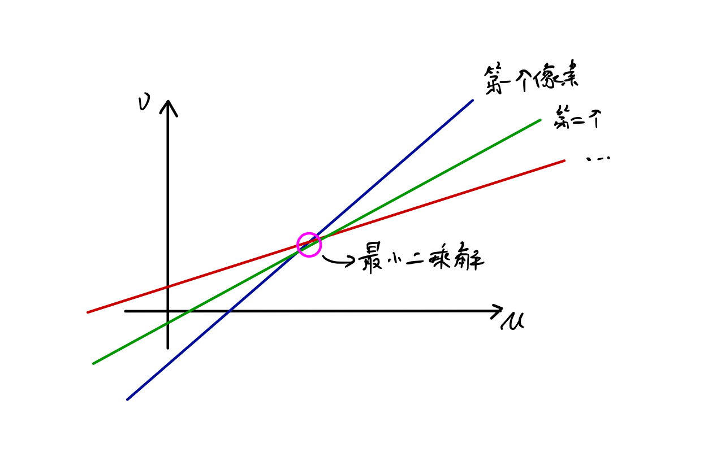

# 直接法前端

## 特征点法和直接法的讨论

特征点法不可避免的会有以下几个缺点：

- 特征点的提取和描述子的计算非常耗时；
- 只使用特征点，而忽略了图像上的其他信息；
- 在**纹理缺失**的情况下容易失效。

为了克服这些缺点，产生了以下几个思路：

- 仍然提取特征点，但**不计算描述子**。使用**光流法** (Optical Flow) 来跟踪特征点的运动；
- 同样只提取特征点但不计算描述子，使用**直接法** (Direct Method) 来计算特征点的运动；
- **既不提取特征点，也不计算描述子**，根据图像间的**像素灰度差异**，**直接**计算相机的运动。

对于第一种方法，只是把描述子计算和特征匹配替换成了光流跟踪。之后仍然要靠前一讲介绍的方法来计算相机位姿。对于后两种方法，我们可以直接来计算、优化相机位姿，故称为**直接法**。

在直接法中，我们不明确的计算点与点之间的对应关系（特征匹配），单纯计算像素（或像素块）亮度之间的差异，**最小化光度误差** (Photometric error) 来求得相机位姿。因此，直接法要求场景中存在**明暗变化**即可（不必如特征点法般要求有梯度）。根据所使用的像素的数量，直接法分为稀疏、半稠密和稠密三种。所以直接法也拥有重构半稠密或稠密地图的能力。

## 光流

直接法由光流演变而来。光流是一种描述像素随时间在图像之间运动的方法。随着时间的流逝（机器人的运动），一个像素会在图像中“**运动**”，即从上一张图像的某个位置运动到下一张图像的另一个位置。而我们希望能够求得这个运动。

其中，只追踪部分像素或特征点的方法称为*稀疏光流*，而计算所有像素的称为*稠密光流*。稀疏光流以Lucas - Kanada 光流为代表。这里介绍的也是LK 光流。

### LK 光流

在LK 光流中，通过相机获得的图像被看作是时间的函数，记为 I(t)。那么对于像素坐标为 (x, y) 的像素，其灰度可以写为 I(x, y, t)。

对于t 时刻位于 (x, y) 处的像素，假设其t + dt 时刻运动到了(x + dx, y + dy) 处。根据光流法的基本假设，**灰度不变假设**：同一个空间点的像素灰度值在各个图像中是**固定不变**的。我们就得到了：
$$
\mathbf{I} (x + dx, y + dy, t + dt) = \mathbf{I} (x, y, t)
$$
显然，灰度不变假设在现实中很难成立。一般认为在**相机运动运动很微小**（运动连续）的情况下近似成立，此时上式带有少量误差。

先认为假设成立，对上式左侧进行泰勒一阶展开可得：
$$
\mathbf{I}(x + dx, y + dy, t + dt) \approx \mathbf{I}(x, y, t) + \frac{\partial \mathbf{I}}{\partial x} dx + \frac{\partial \mathbf{I}}{\partial y} dy + \frac{\partial \mathbf{I}}{\partial t} dt
$$
考虑式 (1) （灰度不变假设），即可得到：
$$
\frac{\partial \mathbf{I}}{\partial x} dx + \frac{\partial \mathbf{I}}{\partial y} dy + \frac{\partial \mathbf{I}}{\partial t} dt = 0
$$
两边除以dt 可得：
$$
\frac{\partial \mathbf{I}}{\partial x} \frac{dx}{dt} + \frac{\partial \mathbf{I}}{\partial y} \frac{dy}{dt} = - \frac{\partial \mathbf{I}}{\partial t}
$$
其中，dx/dt 是该像素在x 轴上的**运动速度**，dy/dt 是其在y 轴上的速度，记为u, v。而$\frac{\partial \mathbf{I}}{\partial x}$ 为该像素在x 方向上的**梯度**，另一项则为在y 方向上的梯度，分别记为Ix, Iy。同时把上式写成矩阵形式就有：
$$
\begin{bmatrix}
\mathbf{I}_x & \mathbf{I}_y
\end{bmatrix}
\begin{bmatrix}
u \\ v
\end{bmatrix} = -\mathbf{I}_t
$$
上式中，待求解的未知数为速度u, v。（这里对于$\mathbf{I}_t$ 如何计算不是很清楚，是$\mathbf{I}_t$和$\mathbf{I}_{t+1}$ 之间的差值么？）这个式子是一个二元一次方程。要求解它需要引入额外的约束。

在LK 光流中，我们假设**该像素临域内的所有像素都具有相同的运动**。因此，考虑一个大小为w * w 的图像块，它含有$w^2$ 个像素。此时，我们就有了$w^2$ 个方程：
$$
\begin{bmatrix}
\mathbf{I}_x & \mathbf{I}_y
\end{bmatrix}_k
\begin{bmatrix}
u \\ v
\end{bmatrix} = -\mathbf{I}_{tk},\ k = 1, \ldots, w^2
$$
记
$$
\mathbf{A} = \begin{bmatrix}
[\mathbf{I}_x,\ \mathbf{I}_y]_1 \\
\vdots \\
[\mathbf{I}_x,\ \mathbf{I}_y]_k \\
\end{bmatrix},\ 
\mathbf{b} = \begin{bmatrix}
\mathbf{I}_{t1} \\
\vdots \\
\mathbf{I}_{tk}
\end{bmatrix}
$$
于是整个方程就可以写为：
$$
\mathbf{A}
\begin{bmatrix}
u \\ v
\end{bmatrix} = -\mathbf{b}
$$
这是一个超定方程，根据我们在 *非线性优化* 中的推导，该方程的**最小二乘解**为：
$$
\begin{bmatrix}
u \\ v
\end{bmatrix}^*
= -(\mathbf{A}^T \mathbf{A})^{-1} \mathbf{A}^T \mathbf{b}
$$
这样，我们就求得了像素在图像间的运动速度u, v。当t 取离散时间序列时，我们可以估计某个像素在若干张图像之间的**运动**及其出现的**位置**。考虑到图像梯度仅在局部有效，和LK 光流本身的假设，可以**多次迭代**以求得更精确的解。

根据LK 光流我们可以直接得到特征点之间的对应关系，但与特征匹配不同的是，LK 光流更经常遇到特征点跟丢的情况而不是误匹配。而且光流法的速度往往比特征点法快。最后，如前所述，LK 光流要求相机运动是**微小**的，这使得其健壮性比描述子差一些。

### 讨论

上面提到光流法无法利用单一像素求解，我们进而考虑了以该像素为中心的图像块。回顾式(5) $\begin{bmatrix} \mathbf{I}_x & \mathbf{I}_y \end{bmatrix} \begin{bmatrix} u \\ v \end{bmatrix} = -\mathbf{I}_t$，以u, v 作为变量，可以发现这是一个**直线方程**。而利用多个像素来求解[u, v] 的过程，就是在求多条直线的**交点**，如下图所示（随便画画…）

而在最小二乘中，我们要求矩阵$\mathbf{A}^T \mathbf{A}$ 可逆，先注意到这是一个2 * 2 大小的矩阵，从代数上来说，这要求其特征值必须足够大且相近，即比值$\frac{\lambda_{max} }{\lambda_{min}}$ （也即$\frac{\lambda_1}{\lambda_2}$）不能太大。再进一步，可以发现
$$
\mathbf{A}^T \mathbf{A} = 
\begin{bmatrix}
\sum \mathbf{I}_x \mathbf{I}_x & \sum \mathbf{I}_x \mathbf{I}_y \\
\sum \mathbf{I}_y \mathbf{I}_x & \sum \mathbf{I}_y \mathbf{I}_y
\end{bmatrix}
$$
该矩阵即为Harris 角点检测中的*二阶矩矩阵* (second moment matrix)。而刚刚所述的对于特征值的要求也正好是Harris 角点检测中对于一个角点特征的要求

## 直接法

对于一对图像，假设有某个空间点P，其世界坐标为[X, Y, Z]，其对应的像点的**非齐次**像素坐标为p1, p2。我们的求解目标是**第一个相机到第二个相机**的位姿变换。以第一个相机为参照，则第二个相机的旋转和平移为R 和t。相机矩阵为K，则有
$$
\mathbf{p}_1 = 
\begin{bmatrix}
u \\ v \\ 1
\end{bmatrix}_1 = \frac{1}{Z_1} \mathbf{K} \mathbf{P}
$$

$$
\mathbf{p}_2 =
\begin{bmatrix}
u \\ v \\ 1
\end{bmatrix}_2 = \frac{1}{Z_2} \mathbf{K} (\mathbf{R} \mathbf{P} + \mathbf{t}) = \frac{1}{Z_2} \mathbf{K} (\exp(\xi)^{\wedge} \mathbf{P})_{1:3}
$$

其中，Z1 为P 在第一个相机下的深度，Z2 为其在第二个相机坐标系下的深度。

在直接法中，由于不计算描述子，不进行特征匹配，因此我们并没有特征点间的对应关系，即不知道第二张相片上哪一个点p2 对应着第一张相片上的点p1。

对此，直接法的**思路**为给位姿一个初始估计T（猜测），由当前的估计值来寻找p2 的位置。若给出的位姿估计很差，那么p2 的外观（亮度）会和p1 有明显区别。为了减小这个差别，我们不断调整相机位姿，来寻找和p1 更相似的p2。即通过**优化**的方法来求解T。在这里，最小化的对象为**光度误差** (Photometric Error)：
$$
e = \mathbf{I}_1 (\mathbf{p}_1) - \mathbf{I}(\mathbf{p}_2)
$$

$$
\min_{\xi} J(\xi) = ||e||^2
$$

直接法的**前提**仍然是灰度不变假设。假设我们跟踪N 个空间点P1, …, Pn，那么整体优化问题就成为：
$$
\min_{\xi} J(\xi) = \sum_{i=1}^N e_i^T e_i,\ e_i = \mathbf{I}_1(\mathbf{p}_{1, i}) - \mathbf{I}_2(\mathbf{p}_{2, i})
$$
注意到这里的优化变量是相机位姿$\xi$，且这是一个非线性优化的问题。自然，我们就需要求解光度误差e 对于相机位姿的导数。利用左乘扰动模型，有：
$$
\begin{align}
e(\delta \xi \bigoplus \xi) & = \mathbf{I}_1(\frac{1}{Z_1} \mathbf{K} \mathbf{P}) - \mathbf{I}_2 (\frac{1}{Z_2} \mathbf{K} \exp(\delta \xi^{\wedge}) \exp(\xi^{\wedge}) \mathbf{P}) \\
 & \approx \mathbf{I}_1(\frac{1}{Z_1} \mathbf{K} \mathbf{P}) - \mathbf{I}_2 (\frac{1}{Z_2} \mathbf{K} (\mathbf{I} + \delta \xi^{\wedge}) \exp(\xi^{\wedge}) \mathbf{P}) \\
 & = \mathbf{I}_1(\frac{1}{Z_1} \mathbf{K} \mathbf{P}) - \mathbf{I}_2 (\frac{1}{Z_2} \mathbf{K} \exp(\xi^{\wedge})\mathbf{P} + \frac{1}{Z_2} \mathbf{K} \delta \xi^{\wedge} \exp(\xi^{\wedge}) \mathbf{P})
\end{align}
$$
记
$$
\begin{align}
\mathbf{q} & = \delta \xi \exp(\xi^{\wedge}) \mathbf{P} \\
\mathbf{u} & = \frac{1}{Z_2} \mathbf{K} \mathbf{q}
\end{align}
$$
这里，q 是**原有点经扰动后**在**第二个相机坐标系**下的坐标，而u 为其像素坐标。这样式(17) 就可以写成：
$$
e(\delta \xi \bigoplus \xi)  = \mathbf{I}_1(\frac{1}{Z_1} \mathbf{K} \mathbf{P}) - \mathbf{I}_2 (\frac{1}{Z_2} \mathbf{K} \exp(\xi^{\wedge})\mathbf{P} + \mathbf{u})
$$
把等式右侧的第二项再次看成一个泰勒展开式，u 就是那个小量，就可以写成：
$$
\begin{align}
e(\delta \xi \bigoplus \xi) & = \mathbf{I}_1(\frac{1}{Z_1} \mathbf{K} \mathbf{P}) - \mathbf{I}_2 (\frac{1}{Z_2} \mathbf{K} \exp(\xi^{\wedge})\mathbf{P} + \mathbf{u}) \\
 & \approx \mathbf{I}_1(\frac{1}{Z_1} \mathbf{K} \mathbf{P}) - \mathbf{I}_2 (\frac{1}{Z_2} \mathbf{K} \exp(\xi^{\wedge}) \mathbf{P}) - \frac{\partial \mathbf{I}_2}{\partial \mathbf{u}} d\mathbf{u} \\
 & = e(\xi) - \frac{\partial \mathbf{I}_2}{\partial \mathbf{u}} \frac{\partial \mathbf{u}}{\partial \mathbf{q}} \frac{\partial \mathbf{q}}{\partial \delta \xi} \cdot \delta \xi
\end{align}
$$

可以看到，$\frac{\partial \mathbf{I}_2}{\partial \mathbf{u}} d \mathbf{u}​$  由于链式法则分成了3项，其中

- $\frac{\partial \mathbf{I}_2}{\partial \mathbf{u}}$ 是第二张图像上的像素梯度；

- $\frac{\partial \mathbf{u}}{\partial \mathbf{q}}$ 是像素坐标相对于归一化平面坐标的导数，根据前一讲有：
  $$
  \frac{\partial u }{\partial \mathbf{q} } =
  \begin{bmatrix}
  \frac{\partial u }{\partial X } & \frac{\partial u }{\partial Y } & \frac{\partial u }{\partial Z } \\
  \frac{\partial v }{\partial X } & \frac{\partial v }{\partial Y } & \frac{\partial v }{\partial Z }
   \end{bmatrix}
   = \begin{bmatrix}
   \frac{f_x}{Z } & 0 & -\frac{f_x X }{Z^{\prime 2}} \\
   0 & \frac{f_y}{Z } & -\frac{f_y Y }{Z^{\prime2}}
   \end{bmatrix}
  $$

- $\frac{\partial \mathbf{q}}{\partial \delta \xi}$ 则是实行变换后所得的三维点对于左乘的扰动的导数，同样根据前一讲有：

  
  $$
  \frac{\partial \mathbf{q}}{\partial \delta \xi}  = [\mathbf{I},-\mathbf{q}^{\wedge}]
  $$

将后两项合并在一起则有：
$$
\frac{\partial \mathbf{u}}{\partial \delta \xi} = -
\begin{bmatrix}
\frac{f_x}{Z } & 0 & - \frac{f_x X }{Z^{\prime 2}} & - \frac{f_x X  Y }{Z^{\prime 2}} & f_x + \frac{f_x X^2}{Z^{\prime 2}} & - \frac{f_x Y }{Z } \\
0 & \frac{f_y}{Z } & -\frac{f_y Y }{Z^{\prime 2}} & -f_y - \frac{f_y Y^{\prime 2}}{Z^{\prime 2}} & \frac{f_y X  Y }{Z^{\prime 2}} & \frac{f_y X }{Z }
\end{bmatrix}
$$
上式和前一讲中推到重投影误差对于左乘扰动的导数是一样的。如此，就得到了光度误差相对于李代数的雅可比矩阵：
$$
\mathbf{J} = - \frac{\partial \mathbf{I}_2}{\partial \mathbf{u}} \frac{\partial \mathbf{u}}{\partial \delta \xi}
$$
利用这个雅可比矩阵，即可利用非线性优化迭代求解相机位姿。

但在上面的推到中，可以发现我们利用了三维空间点P 的**世界坐标**。显然我们需要先求解P 的世界坐标。对于RGB-D 相机或者双目相机，需要通过三角化来求解；对于单目相机，则必须先进行初始化。

针对于P 的数量或者来源，可以将直接法分为：

- **稀疏直接法**：如LK 光流法，对于影像提取关键点，但不计算描述子，在直接法中跟踪提取的特征点；
- **半稠密直接法**：计算图像中具有梯度像素点，然后跟踪这些像素点。而像素梯度不明显的地方则不会对计算有任何贡献；
- **稠密直接法**：P 为所有像素。稠密直接法重构了所有像素，难以实现实时化。而且对于缺少梯度的像素点，在计算三维点的时候也难以准确估计其位置。

### 讨论

前面我们只依靠单个像素间的亮度差异来进行优化，但单个像素往往区分性太低，周围可能有很多像素与之相似。为了提高鲁棒性，可以使用**图像块** (patch) 来引导优化技术，并利用更复杂的**差异度量**，如*归一化互相关* (NCC)，而不是简单的差值。

直接法完全依靠**优化**来求解相机位姿，为了得到可靠的结果，就需要大部分像素梯度能够把优化引导到正确的方向，即当沿着计算的梯度优化时，**灰度误差会不断下降**。然后，图像是一个很强烈的**非凸函数**（具有多个局部极小值），所以我们有可能落在局部最小中而无法继续进行优化。只有当**相机运动十分微小**的时候，图像中的梯度不具有很强的非凸性，此时直接法才成立。

