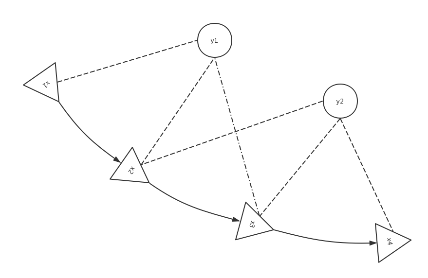

# 非线性优化

在SLAM 中，由于噪声的影响，观测方程和运动方程都只能近似成立。但在整个过程中，会有很多多余观测，即一个特征会被机器人在不同位置、不同时间进行观测，机器人每次也都会观测到多个特征，这就形成了约束。利用这些约束，就可以对数据进行优化。test

## 状态估计问题

###问题的引出

一个经典的SLAM 模型由一个运动方程和一个观测方程组成：
$$
\begin{cases}
\mathbf{x}_k=f(\mathbf{x}_{k-1},\mathbf{u}_k)+\omega_k \\
\mathbf{z}_{k,j}=h(\mathbf{y}_j,\mathbf{x}_k) + v_{k,j}
\end{cases}
$$
注意，这里上一时刻的位姿$\mathbf{x}_{k-1}$ 是已知的；第j 个路标的观测值$\mathbf{z}_j$ 和机器人运动测量值$\mathbf{u}_k$ 是已知的；最后两项是噪声。而未知值是此刻的位姿$\mathbf{x}_{k}$ 和路标的世界坐标$\mathbf{y}_{j}$。

通过上一讲我们知道，相机的位姿可以用$\mathbf{T}_k$ 或者$\exp(\xi_k^\wedge)$ 来表达，设相机矩阵为**K**，观测值**z** 为对应路标的像素坐标，观测方程就可以写为：
$$
s\mathbf{z}_{k,j}=\mathbf{K}\exp(\xi^\wedge)\mathbf{y}_j
$$
s 为路标$\mathbf{z}_j$ 在对应相机坐标系下的深度。这里我们使用了齐次坐标并包含有一次齐次到非齐次的坐标转换。作为引出这里先不展开，后面会详细解释。

如前所述，由于噪声的存在，这个式子只能在数学上成立。实际中必须在后面加上一个噪声项v。通常都假设两个方程的噪声都满足**零均值的高斯分布**：
$$
\omega_k \sim N(0, \mathbf{R}_k),\ \mathbf{v}_k\sim N(0,\mathbf{Q}_{k, j})
$$
在这些噪声的影响下，我们希望通过带噪声的数据**z** 和**u** 来推断位姿**x** 和地图**y**，这就构成了一个状态估计问题。常用的方法有滤波器和非线性优化。滤波器会在后续章节中介绍，这里重点介绍非线性优化的方法。

### 最大后验和最大似然

我们从概率学的角度检视下这个状态估计问题。在非线性优化中，所有待优化的变量都放在一个*状态变量*中：
$$
\mathbf{x}=\{\mathbf{x}_1,\ldots\mathbf{x}_N,\mathbf{y}_1,\ldots\mathbf{y}_M\}
$$
表示包含了N 个时刻的相机位姿和M 个路标。而对机器人状态的估计，就是已知输入数据**u** 和观测数据**z** 的条件下，求状态**x** 的条件概率分布：
$$
P(\mathbf{x}|\mathbf{z},\mathbf{u})
$$
如果我们并没有测量运动的传感器，如IMU等，只考虑视觉部分，则上式就变成了$P(\mathbf{x}|\mathbf{z})$。利用贝叶斯法则可得：
$$
P(\mathbf{x}|\mathbf{z})=\frac{P(\mathbf{z}|\mathbf{x})P(\mathbf{x})}{P(\mathbf{z})}\propto P(\mathbf{z}|\mathbf{x})P(\mathbf{x})
$$
等式的左侧称为**后验概率**，P(**x**) 和P(**z**) 是先验概率，P(**z**|**x**) 称为似然。先验概率一般通过观测频率而得到。而P(**z**) 和状态变量**x** 无关（一般也为固定值），所以略去。**直接去求解后验分布一般比较困难，但是求一个状态最优估计，使得在该状态下后验概率最大化 (MAP)，则是可行的**。
$$
\mathbf{x}^*_{MAP}=\arg \max P(\mathbf{x}|\mathbf{z})=\arg \max P(\mathbf{z}|\mathbf{x})P(\mathbf{x})
$$
从上式可以看到，求解最大后验概率相当于**最大化似然和先验概率的乘积**。更进一步地，我们可以说：呃，其实我也不太知道机器人现在大概在什么地方哎。此时连先验概率P(**x**) 也可以忽略（P(**x**) 一般可由之前的状态估计得到，在这一步中一般也是一个固定值，忽略了也没影响）。那么，问题就变成了**求解x 的最大似然估计 (MLE)**：
$$
x^*_{MLE}=\arg\max P(\mathbf{z}|\mathbf{x})
$$
从概率的角度来说，上式就是*在事件**x** 已经发生的情况下，事件**z** 发生的概率*。代入到SLAM 的背景中，似然就指*在现有的位姿下，能够产生什么样的观测数据*。前面说过，**z** 才是已知量，所以上式应该理解成*在什么样的位姿下，可以产生现在这些观测数据*。

## 最小二乘

### 引出

回顾上一节的观测模型：
$$
\mathbf{z}_{k,j}=h(\mathbf{y}_j,\mathbf{x}_k) + \mathbf{v}_{k,j}
$$
我们假设了噪声项满足零均值的高斯分布：
$$
\mathbf{v}_k\sim N(0,\mathbf{Q}_{k, j})
$$
要注意的是，式(9) 的前半部分并不包含任何概率项，是噪声项**v** 引入了概率（高斯分布）。所以，式(9) 相当于把零均值的高斯分布平移了一段$h(\mathbf{y}_j,\mathbf{x}_k)$。所以，观测数据的条件概率为：
$$
P(\mathbf{z}_{j,k}|\mathbf{x}_k,\mathbf{y}_j) = N(h(\mathbf{y}_j,\mathbf{x}_k), \mathbf{Q}_{k, j}))
$$
即均值为$h(\mathbf{y}_j,\mathbf{x}_k)$ 的高斯分布。为了计算使它最大化的$\mathbf{x}_k,\mathbf{y}_j$，可以使用**最小化负对数**的方法。

考虑任意维的高斯分布$\mathbf{x}_k\sim N(\mu,\mathbf{\Sigma})$ (这里**x** 不表示位姿)，它的概率密度函数为：
$$
P(\mathbf{x})=\frac{1}{\sqrt{(2\pi)^N\det(\mathbf{\Sigma})}}\exp(-\frac{1}{2}(\mathbf{x}-\mu)^T\mathbf{\Sigma}^{-1}(\mathbf{x}-\mu))
$$
取其负对数可得：
$$
-\ln(P(\mathbf{x}))=\frac{1}{2}\ln((2\pi)^N\det(\mathbf{\Sigma}))+\frac{1}{2}(\mathbf{x}-\mu)^T\mathbf{\Sigma}^{-1}(\mathbf{x}-\mu)
$$
求原分布的最大化显然就是求其负对数的**最小化**。而上式第一项和**x** 无关，所以只需要最小化右侧的二次型项。将之代入SLAM 的观测模型可得：
$$
\mathbf{x}^*_{MLE}=\arg\min (\mathbf{z}_{k,j}-h(\mathbf{y}_j,\mathbf{x}_k))^T\mathbf{\Sigma}^{-1}(\mathbf{z}_{k,j}-h(\mathbf{y}_j,\mathbf{x}_k))
$$
该式就相当于**最小化噪声项的平方和**。

对运动方程和观测方程，定义数据和估计值之间的误差为：
$$
\begin{align}
\mathbf{e}_{v, k}& =\mathbf{x}_k-f(\mathbf{x}_{k-1},\mathbf{u}_k) \\
\mathbf{e}_{y,j,k}& = \mathbf{z}_{k,j}-h(\mathbf{x}_k, \mathbf{y}_j)
\end{align}
$$
再求该误差项的平方和就可得：
$$
J(\mathbf{x})=\sum_k\mathbf{e}^T_{v,k}\mathbf{R}^{-1}_k\mathbf{e}_{v,k}+\sum_k\sum_j\mathbf{e}^T_{y,k,j}\mathbf{Q}^{-1}_{k,j}\mathbf{e}_{y,k,j}
$$
这样就得到了一个总体意义下的（非线性）最小二乘问题，它的最优解等价于状态的最大似然估计。对它的求解是一个典型的非线性优化的过程。

### 非线性最小二乘

式(17) 比较复杂，作为基础理论的介绍，我们先考虑一个类似的、简单的非线性最小二乘问题。假设目标函数为：
$$
\min_x \frac{1}{2}||f(x)||^2_2
$$
这里自变量$\mathbf{x}\in R^n$ 是个n 维向量，f 是任意非线性函数，假设它有m 维。下面讨论下如何求解这样一个优化问题。

如果f 在数学上是个很简单函数，那么很自然地，这个问题可以用**解析形式**来求。令目标函数的导数为0，然后求解**x** 的最优值。
$$
\frac{df}{d\mathbf{x}}=0
$$
解这个方程，就可以得到导数为零处的极值，它们可能是极大、极小或者鞍部的点，逐个比较其大小就可以得到结果了。

然后，我想讨论下法方程的解法。后面的一些讨论和公式的推导都和下面类似，这里先列出，后面就不在赘述了。如果我们没有目标函数的具体形式，只有数值。假设目标函数是个线性方程：$\min_x\frac{1}{2}||\mathbf{y}-\mathbf{A}\mathbf{x}||^2_2$， **A** 是一个m*n  的矩阵，表示n 维到m 维空间的映射。这里的1/2 是为了后面求导后消去系数，对方程的解没有影响。该式可以写成：
$$
\min_x \frac{1}{2}(\mathbf{y}-\mathbf{A}\mathbf{x})^T(\mathbf{y}-\mathbf{A}\mathbf{x})
$$
展开可得：
$$
\begin{align}
& \frac{1}{2}(\mathbf{y}-\mathbf{A}\mathbf{x})^T(\mathbf{y}-\mathbf{A}\mathbf{x})\\ 
= & \frac{1}{2}(\mathbf{y}^T\mathbf{y}-\mathbf{y}^T\mathbf{A}\mathbf{x} - \mathbf{x}^T\mathbf{A}^T\mathbf{y}+ \mathbf{x}^T\mathbf{A}^T\mathbf{A}\mathbf{x}) \\
= & \frac{1}{2}(\mathbf{y}^T\mathbf{y}-2\mathbf{y}^T\mathbf{A}\mathbf{x}+ \mathbf{x}^T\mathbf{A}^T\mathbf{A}\mathbf{x})\\
\end{align}
$$
将上式对**x** 求导并等于0 可得：
$$
-\mathbf{A}^T\mathbf{y}+ \mathbf{A}^T\mathbf{A}\mathbf{x}=0
$$
即可解得：
$$
\mathbf{x} = (\mathbf{A}^T\mathbf{A})^{-1}\mathbf{A}^T\mathbf{y}
$$
最后，虽然在上一讲中我们引入了李代数和它的导数形式，但这不意味着我们就可以顺利地用它们来求出解析解。其次，从前面的介绍我们看到问题是非线性的，而且数据量可能很大，也不适合上面这个推导和用法方程来解。类比机器学习中的梯度下降法，我们可以采用**迭代**的方法。从一个**初始值**出发，不断地**更新**当前的优化变量使得目标函数下降。其步骤如下：

> 1. 给定某个初始值$\mathbf{x}_0$；
> 2. 对于第k 次迭代，寻找一个增量$\Delta \mathbf{x}_k$，使得$||f(\mathbf{x}_k+\Delta\mathbf{x}_k)| |^2_2$ 达到极小值；
> 3. 若$\Delta \mathbf{x}_k$ 足够小则停止迭代；
> 4. 否则，令$\mathbf{x}_{k+1}=\mathbf{x}_k + \Delta \mathbf{x}_k$.

这就让求解导数为零的问题变成了一个不断寻找梯度并下降的过程。我们只要找到迭代点的梯度方向即可，而不必寻找全局导数为0 的情况。

接下来的问题就是，如何确定增量$\Delta \mathbf{x}_k$？

### 一阶和二阶梯度法

熟悉机器学习的话可以很快就想到对目标函数进行求导即可。这里我们还是从头说起，并引出其他方法。

最直观地，就是将目标函数在**x** 附近进行**泰勒展开**：
$$
||f(\mathbf{x}+\Delta \mathbf{x})||^2_2\approx||f(\mathbf{x})||^2_2+\mathbf{J}(\mathbf{x})\Delta \mathbf{x}+\frac{1}{2}\Delta \mathbf{x}^T\mathbf{H}\Delta\mathbf{x}
$$
这里，**J** 是$||f(\mathbf{x})||^2_2$ 关于**x** 的导数，称为**雅可比矩阵**；**H** 是二阶导数，称为**海塞矩阵**。**注意**：泰勒展开需要给定一个初始值，所以这里$||f(\mathbf{x})||^2_2$ 是计算出的已知值了。

如果我们只保留一阶梯度，将上式忽略后面的二次项，对$\Delta \mathbf{x}$ 求导就可以得到增量的解：
$$
\Delta \mathbf{x}^*=-\mathbf{J}^T(\mathbf{x})
$$
上式的意义也很直观：沿着与梯度方向相反的方向前进即可。通常我们会在该方向上加上一个**步长**$\lambda$，求得最快的下降方式。该方法被称为**最速下降法**。

如果保留二阶梯度，那么增量方程就变成：
$$
\Delta \mathbf{x}^*=\arg\min||f(\mathbf{x}||^2_2+\mathbf{J}(\mathbf{x})\Delta \mathbf{x}+\frac{1}{2}\Delta \mathbf{x}^T\mathbf{H}\Delta\mathbf{x}
$$
将等式右边对$\Delta \mathbf{x}$ 求导并等于0 即可得：
$$
  \mathbf{H}\Delta \mathbf{x}=-\mathbf{J}^T
$$
该方法又称为牛顿法。但这个方法的问题在于需要计算海塞矩阵**H**，这是我们想要避免的。

基于这节的讨论，下面介绍两种在实践中常用的方法：高斯牛顿法和列文伯格 - 马夸尔特法。

## 非线性优化

### 高斯牛顿法

我们将$f(\mathbf{x})$ 进行一阶泰勒展开（注意不是$||f(\mathbf{x})||^2_2$），得到
$$
f(\mathbf{x}+\Delta \mathbf{x})\approx f(\mathbf{x})+\mathbf{J}(\mathbf{x})\Delta \mathbf{x}
$$
回顾一下，我们的目标是寻找$\Delta \mathbf{x}$ 使得$||f(\mathbf{x}+\Delta \mathbf{x})||^2_2$ 最小。这里我们将函数替换成它的一阶泰勒展开，未知量也变成了$\Delta \mathbf{x}$。则目标函数就变成了关于$\Delta \mathbf{x}$ 的一个线性方程：
$$
  \Delta \mathbf{x}^*=\arg\min \frac{1}{2}||f(\mathbf{x})+\mathbf{J}\Delta \mathbf{x}||^2
$$
再说一遍，此时$f(\mathbf{x})$ 是由给定的泰勒展开初始值计算出的已知值。类似于上一小节讲的法方程方法，将式(31) 展开并对$\Delta \mathbf{x}$ 求导，令导数为0 即可得：
$$
\mathbf{J}(\mathbf{x})^T\mathbf{J}(\mathbf{x})\Delta \mathbf{x}=-\mathbf{J}(\mathbf{x})^Tf(\mathbf{x})
$$
这是一个关于$\Delta \mathbf{x}$ 的线性方程组，称为**增量方程**。把左边的系数定义为**H**，右边定义为**g**，上式就写成：
$$
\mathbf{H}\Delta \mathbf{x}=\mathbf{g}
$$
可见，高斯牛顿法利用$\mathbf{J}^T\mathbf{J}$ 来近似二阶海塞矩阵从而忽略了海塞矩阵的计算过程。求解增量方程就是整个优化问题的核心所在。基于此，高斯牛顿法的步骤为：

> 1. 给定初始值$\mathbf{x}_0$；
> 2. 对于第k 次迭代，求解雅可比矩阵**J** 和误差f(**x**~k~)；
> 3. 求解增量方程 $\mathbf{H}\Delta \mathbf{x}=\mathbf{g}$；
> 4. 若$\Delta \mathbf{x}_k$ 足够下则停止迭代；
> 5. 否则，令$\mathbf{x}_{k+1}=\mathbf{x}_k + \Delta \mathbf{x}_k$，继续第2 步。

从算法步骤可以看出，求解增量方程是最重要的。原则上，它要求$\mathbf{J}^T\mathbf{J}$ 是可逆（并且是正定）的。但实际中，计算所得的$\mathbf{J}^T\mathbf{J}$ 常常是半正定的。因此，在高斯牛顿法中，可能出现$\mathbf{J}^T\mathbf{J}$ 是奇异阵或者病态的情况。此时求的$\Delta\mathbf{x}$ 不稳定，算法可能不收敛。就算**H** 满足要求，回想泰勒展开的一个隐含前提是：近似只在$\mathbf{x}_k$ 附近有效。如果我们求得的步长$\Delta\mathbf{x}$ 太大，也会使得近似不够准确。

### 列文伯格 - 马夸尔特法

泰勒展开只在展开点附近有较好的近似效果，而在高斯牛顿法并没有对这个“附近”有明确的定义。那么很自然地，我们就想给$\Delta \mathbf{x}$ 定义一个范围，限制它的大小。这个范围就叫做**信赖区域** (trust region)，这类方法就叫*信赖区域法*。在信赖区域内，我们认为近似是有效的；在信赖区域外则近似会出现问题。

那问题就变成了**如何确定信赖区域**。一个比较直观也比较好的方法就是依据近似模型和实际函数之间的差异来确定：如果二者之间的差异较小，说明近似地还不错，那么信赖区域就可以大一些。如果二者间的差异大，就让信赖区域小一些。

考虑使用
$$
\rho=\frac{f(\mathbf{x}+\Delta \mathbf{x})-f(\mathbf{x})}{\mathbf{J}(\mathbf{x})\Delta \mathbf{x}}
$$
来判断泰勒展开是否较好地近似了原模型。上式的分子是函数实际下降的数值，而分母是用来近似的泰勒展开下降的值。

*如果$\rho$ 接近1，则近似是好的；如果$\rho$ 比较小，说明实际减小的数值远小于近似出来的值，说近则得不好，需要缩小信赖区域；如果$\rho$ 比较大，说明实际下降的值大于近似值，可以放宽信赖区域。*

因此，列文伯格 - 马夸尔特法的算法步骤如下：

> 1. 给定初始值$\mathbf{x}_0$ 和初始优化半径$\mu$；
>
> 2. 对于第k 次迭代，求解：
>    $$
>    \min_{\Delta \mathbf{x}_k}\ \frac{1}{2}||f(\mathbf{x}_k)+\mathbf{J}(\mathbf{x_k})\Delta \mathbf{x}_k||^2,\ \ s.t.\ ||\mathbf{D}\Delta \mathbf{x}_k||^2\le\mu
>    $$
>
> 3. 计算$\rho$；
>
> 4. 若$\rho >\frac{3}{4}$, 则$\mu=2\mu$; 若$\rho<\frac{1}{4}$, 则$\mu = 0.5\mu$;
>
> 5. 若$\rho$ 大于阈值，则近似可行，$\mathbf{x}_{k+1}=\mathbf{x}_k+\Delta \mathbf{x}_k$;
>
> 6. 判断算法是否收敛，若不收敛则返回第2 步；否则结束。

这里近似范围的扩大和阈值都是经验值。在列文伯格的方法中，**D** 是单位矩阵，以三维空间为例，意味着将增量$\Delta \mathbf{x}$ 限制在一个圆球中，认为只有在这个球中的增量才是有效的；而马夸尔特将**D** 取成非负对角矩阵，实际中常用$\mathbf{J}^T\mathbf{J}$ 的对角元素的平方根，则是将增量限制在一个椭球之中。

问题的关键就在于式(35) 的求解。这是一个带约束条件的平差问题。利用拉格朗日乘子法将之转化为无约束的问题：
$$
\min_{\Delta \mathbf{x}_k}\ \frac{1}{2}||f(\mathbf{x}_k)+\mathbf{J}(\mathbf{x_k})\Delta \mathbf{x}_k||^2 + \frac{\lambda}{2}||\mathbf{D}\Delta \mathbf{x}_k||^2
$$
其中$\lambda$ 是拉格朗日乘子。与之前的推导类似，展开后对$\Delta \mathbf{x}_k$ 求导即可得到关于它的线性方程。令导函数为0 可得
$$
(\mathbf{H}+\lambda\mathbf{D}^T\mathbf{D})\Delta \mathbf{x}_k=\mathbf{g}
$$
可以看到，与高斯牛顿法相比，多了一项正则化项$\lambda\mathbf{D}^T\mathbf{D}$，它一定程度上避免了线性方程组的系数矩阵的非奇异和病态问题，提供更稳定、准确的增量$\Delta \mathbf{x}_k$. 

以较为简单的列文伯格法为例，**D** 为单位矩阵。当参数$\lambda$ 较小的时候，此时矩阵**H** 占据主导地位，说明二次近似模型在该范围内是比较好的，此时列文伯格 - 马夸尔特法接近高斯牛顿法；如果$\lambda$ 比较大，则$\lambda\mathbf{I}$ 是主要的，说明二次近似不够好，列文伯格 - 马夸尔特法接近一阶梯度下降法。

最后谈一下$\lambda$ 的确定。与之前高博在书中说的近似范围$\mu$ 的确定一样是一种启发式的方法。

1. $\lambda_0=\tau\cdot \max(h_{ii}), \nu=2$ ; 其中，$\tau$ 由用户指定，一般为1；$h_{ii}$ 是矩阵**H** 的对角线元素；
2. 计算$\rho$ ;
3. 若$\rho$ 较大，$\lambda = \lambda \cdot \max(\frac{1}{3}, (1-(2\rho-1)^3)),\ \nu=2$ ;
4. 若$\rho$ 较小，$\lambda=2\lambda,\ \nu=2\nu$ ;

### 小结

这节我们介绍了两个常用的非线性优化的算法。需要注意的是，非线性优化常常使用泰勒展开来进行线性近似。而泰勒展开除了要求近似只在展开点附近有效之外，还有一个隐含的前提（我一直认为理论的前提比结果更重要），那就是必须**提供初始值**（泰勒展开点）。而为了得到比较好的最终结果，用户必须提供一个**良好的初始值**。在视觉SLAM 中，常常用ICP、PnP 等算法计算出一个结果作为Bundle Adjustment 的初始值。

还有一个问题就是增量方程的求解常常涉及矩阵求逆的运算。在视觉SLAM 中，状态向量的维度往往特别大，直接进行求逆运算的话基本是不可能的。实际中常常采用**矩阵分解**的方法来求解线性方程。

## 图优化理论简介

我们已经介绍了非线性最小二乘及其求解方法。非线性最小二乘是由许许多多的误差项的平方和组成的。但仅仅看这一组优化变量及其误差我们并不清楚它们的**关系**。譬如，优化变量$\mathbf{x}_j$ 会影响多少个误差项，某个误差项又联系着哪些优化变量呢？我们希望能够直观地看到优化问题**长什么样**。

图优化就是把优化问题表现成**图** (Graph) 的一种方式。*图* 是一种数据结构，这里就不引入了。在图优化中，用**顶点** (vertex) 表示**优化变量**，用**边** (edge) 表示**误差项**。于是，对于任意一个上述形式的非线性最小二乘问题，都可以构建一个与之对应的图。

我们用三角形表示相机，圆表示路标，它们共同构成了图优化的顶点；用实线表示相机的运动模型，用虚线表示观测模型，它们构成了图优化的边。则图就表示成：

有了直观的表示，我们就可以进行更多的操作了。比如，可以**去掉孤立的顶点**或者**先优化边数多（度数大）的顶点**。最基本的图优化是用图来表达一个非线性最小二乘的优化问题，而我们可以利用**图的性质**来做**更好的优化**。