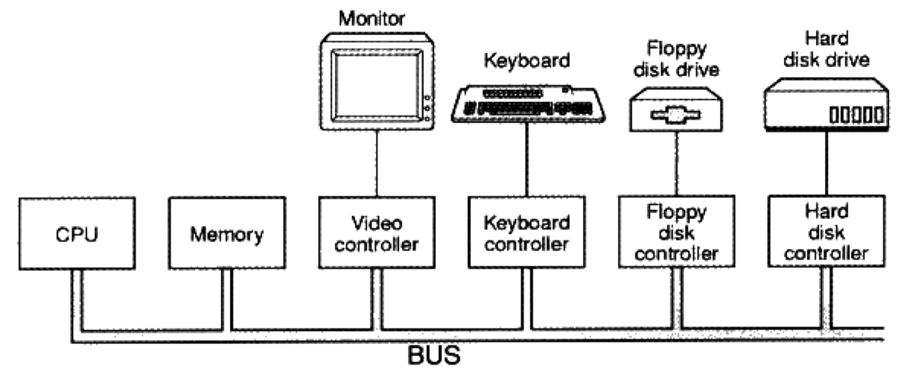
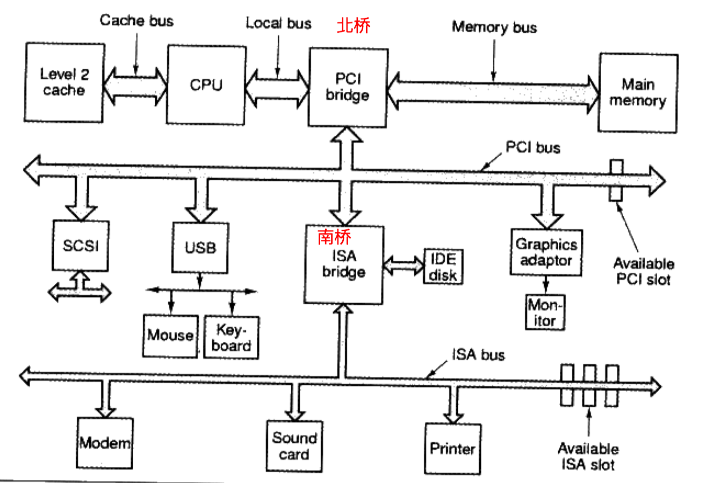
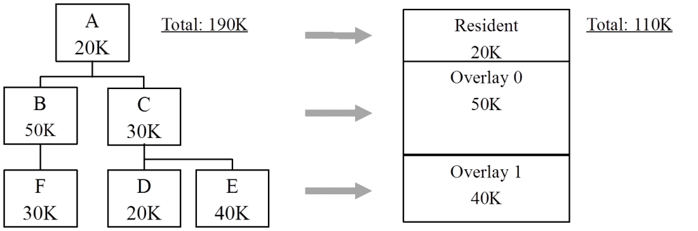
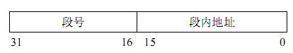
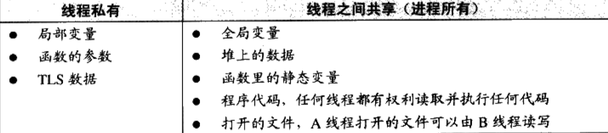

# 计算机的软硬件体系

最关键三部分：

- 中央处理器 CPU；
- 内存 ROM；
- I/O 控制芯片；

## 总体架构

早期计算机都连接在一个**总线** (bus) 上。如下图所示：

随着CPU 越来越快，采用**倍频**的方式和系统总线进行通信。

> 倍频：系统总线以一个较低的频率工作（外频）。而CPU 的工作频率=*倍频 x 外频*。
>
> CPU 的默认倍频只有一个，主板必须支持该倍频数。

为了维持CPU 和系统总线的I/O，又设计了高速的**北桥芯片**和低速的**南桥芯片**。

>北桥芯片：负责CPU 和内存（主要），南桥芯片和图形设备间的通信；
>
>南桥芯片：负责外部I/O，IDE 的控制等等。

## 处理器

多CPU 计算机的常见形式有**对称多处理器** (SMP)，即每个CPU 在系统中的地位和作用是一样的。

由于多芯片太过昂贵，又有了多核处理器。

参考：[free lunch is over](http://www.gotw.ca/publications/concurrency-ddj.htm).

## 层次结构

整个计算机体系结构都是按照严格的层次结构设计的。层之间使用**接口**进行通信。

每个层都是对她下面那层的包装和扩展。

## 操作系统

### CPU

让CPU 充分运行的三种方法：

1. **多道程序** (multiprogramming)：利用一个**监控程序**，发现某个程序暂时无需使用CPU 时就把其他的等待程序载入。
2. **分时系统** (Time-Sharing System)：每个程序运行一段时间后都主动让出CPU 交给其他程序。（但程序可以一直霸占CPU 不出让。）
3. **多任务系统** (Multi-task)：系统运行在**受硬件保护**的级别，程序以**进程** (Process) 的方式运行。每个进程有自己独立的地址空间，CPU 由操作系统**统一分配**（抢占式 (Preemptive)）。

### 设备驱动

操作系统通过驱动程序实现对硬件的管理。相关的设备驱动程序由硬件厂家提供并满足规定的接口。

### 内存

#### 连续单一内存

在这种管理方式中，内存被分为两个区域：**系统区**和**用户区**。应用程序装入到用户区，可使用用户区全部空间。其特点是，最简单，适用于单用户、单任务的操作系统。

#### 分区式存储管理

为了支持**多道程序系统**和**分时系统**，支持**并发**，引入了分区式存储管理。它把内存分为一些大小相等或不等的分区，操作系统占用其中一个分区，其余的分区由应用程序使用。每个应用程序占用一个或几个分区。

分区式存储管理虽然可以支持并发，但难以进行内存分区的共享。并引入了**内碎片**和**外碎片**.

- 内碎片：占用分区内未被利用的空间。
- 外碎片：占用分区之间难以利用的空闲分区。

##### 固定分区

固定式分区的**特点**是把内存划分为若干个固定大小的连续分区。

- 优点：易于实现，开销小；
- 缺点：内碎片；分区数固定；

##### 动态分区

动态创建分区：在装入程序时按其初始要求分配，或在其执行过程中通过系统调用进行分配或改变分区大小。

- 缺点：没有内碎片，但引入了外碎片。

分区分配：

- 最先适配法：按分区先后次序查找。分区分配和释放的时间性能较好，较大的空闲分区可以被保留在内存高端。但随着低端分区不断划分会产生较多小分区，每次分配时查找时间开销便会增大。
- 下次适配法：即从上次分配的分区开始查找。可以使空闲分区的分布更均匀，但较大的分区不容易保留。
- 最佳适配法：找内存大小与要求相差最小的空闲分区进行分配。从整体看会造成较多的外碎片。
- 最坏适配法：找到最大的空闲分区进行分配。

##### 伙伴系统

在伙伴系统，无论已分配分区或空闲分区，其大小均为 2 的 k 次幂，k 为整数。

当要进行内存分配时，找到适当大小的空闲分区进行分配。如果最佳大2^n^的分区已经用完，就向上查找2^n+1^ 大小的分区，将之**分裂**为两个2^n^ 大小的分区并打上伙伴标记。当其中一个被应用程序用完后即和其伙伴合并。

##### 内存紧缩

将各个占用分区向内存一端移动，然后将各个空闲分区合并成为一个空闲分区。

缺点：

- 对占用分区进行内存数据搬移占用CPU时间；
- 如果对占用分区中的程序进行“浮动”，则其重定位需要硬件支持。

紧缩时机：

1. 每个分区释放之后；
2. 在可用分区不够之后在进行紧缩。

#### 覆盖与交换技术

##### 覆盖技术

**原理**：一个程序的几个代码段或数据段，按照时间先后来占用公共的内存空间。将程序必要部分的代码和数据常驻内存；可选部分平时存放在外存(覆盖文件)中，在需要时才装入内存。不存在调用关系的模块不必同时装入到内存，从而可以相互覆盖。

缺点：编程时必须划分程序模块和确定程序模块之间的覆盖关系。只能在同一进程内进行。

##### 交换技术

**原理**：在多个程序并发执行时，可以将暂时不能执行的程序（进程）送到外存中，从而获得空闲内存空间来装入其他程序（进程）。

优点：增加并发程序数目；不影响程序结构。

缺点：换入换出造成程序开销。

##### 小结

以上技术使用的地址都是物理地址。包含了几个缺点：

- 地址空间不隔离；
- 内存使用效率低；
- 程序运行地址不确定。

**解决**：增加中间层，即采用虚拟地址技术。

这样，就有两种地址：**虚拟地址空间**和**物理地址空间**。

#### 分段

在段式存储管理中，将程序的地址空间划分为若干个段(segment)，这样每个进程有一个二维的地址空间。每个段分配一个连续的分区，而进程中的各个段可以不连续地存放在内存的不同分区中。

在为某个段分配物理内存时，可以采用首先适配法、下次适配法、最佳适配法等方法。在回收某个段所占用的空间时，要注意将收回的空间与其相邻的空间合并。

但程序通过分段划分为多个模块，如代码段、数据段、共享段。**优点**是：

- 可以分别编写和编译源程序的一个文件；
- 可以针对不同类型的段采取不同的保护，也可以按段为单位来进行共享。
- 没有内碎片，可以通过内存紧缩消除外碎片。

##### 数据结构

操作系统需要一定的数据结构来实现**进程的地址空间**到**物理内存空间**的**映射**，并跟踪物理内存的使用情况，以便在装入新的段的时候，合理地分配内存空间。

1. 进程段表：包含*段号*和*段内索引*，描述组成进程地址空间的各段。

   

2. 系统段表：系统所有的占用段；

3. 空闲段表：内存中的所有空闲段。

为了完成进程虚拟地址到物理地址到映射，处理器查找内存中的段表，由段号得到段段首地址，加上段内地址，得到实际的物理地址。

#### 分页

将程序的虚拟地址空间划分为固定大小的*页*，而物理内存划分为同样大小的*页框*。程序加载时，可将任意一页放入任意一个页框。

**优点**：

1. 没有外碎片，每个内碎片不超过页大小；
2. 一个程序不必连续存放；
3. 便于改变程序占用空间的大小。

**缺点**：

- 需要足够的内存来装在程序。

##### 数据结构

- 进程页表：完成逻辑页号到物理页号的映射；
- 物理页表：描述物理内存空间的分配使用情况；
- 请求表：描述系统内各个进程页表的位置和大小。

CPU 中的内存管理单元（MMU）按逻辑页号通过进程页表得到物理页框号，加上页内地址就得到物理地址。

### 线程

**线程**是程序执行流的最小单元，一个标准的线程由线程ID、当前指令指针 (PC)、寄存器集合和堆栈组成。

#### 访问权限

线程可以访问进程内存里的所有数据，且还有自己的存储空间，包括：

- 栈；
- 线程局部存储 (TLS)；
- 寄存器。

#### 线程调度与优先级

在线程调度（在处理器上不断切换不同线程）中，有三种状态：

- 运行；
- 就绪：线程可执行，但CPU 被占用；
- 等待：无法执行。

运行中的线程有一段可执行之间，称为**时间片**，一旦用尽则进入就绪状态；若用尽之前就在等待某件事发生，则直接进入等待状态。

主流调度方式：

- 优先级调度：优先级高的线程更早执行。
- 轮转法。

一般把频繁等待的线程称为**IO 密集型线程**，很少等待的线程称为**CPU 密集型线程**。**IO 密集型线程总是比CPU 密集型线程容易得到优先级提升**。

**饿死**：线程优先级较低，总是无法执行。

操作系统会逐步提升等待时间过长、得不到执行的线程的优先级。

线程用尽时间片进入就绪状态的过程称为**抢占**。在*不可抢占线程*执行的时候，线程调度的时机是确定的，线程调度只会发生在*线程主动放弃执行* 或*线程等待* 的时候。

**写时复制**：两个任务可以同时**读取**内存。任意一个任务试图对内存进行修改是，系统会复制一份提供给修改方单独使用。

#### 线程安全

##### 竞争与原子操作

某些操作，如自增 (++) 在被编译为汇编代码后不止一条指令，因此可能被打断。把单指令的操作称为**原子的**，因为其无法被打断。

##### 同步与锁

**同步** (synchronization)：一个线程访问数据未结束时，其它线程不得对同一个数据进行访问。

**锁**：每个线程在访问数据前先试图获取锁，访问结束后释放锁。在锁被占用是试图获取锁会导致线程等待，直至锁重新可用。

- **二元信号量** (Binary Semaphore)：占用与非占用。多元信号量（初始值为 N）允许 N 个线程并发访问：
  - 获取信号量，信号量值 -1；
  - 若值小于 0，则等待；
  - 访问完释放信号量，值 +1；
  - 若值小于1，唤醒一个等待线程。
- **互斥量** (mutex)：信号量可以被某个线程获取后由另一个线程释放；互斥量要求**同一线程**完成获取和释放工作。
- **临界区** (Critical Section)：一个进程创建了一个互斥量或信号量，另一个进程试图去获取是允许的。而临界区的作用范围只限于**本进程**。
- **读写锁** (Read-Write Lock)：两种获取方式：**共享**或**独占**。线程获取锁后，若设置为共享，则其它线程可以以共享的方式获取锁和资源，想要独占则必须等待所有线程的释放；独占则会阻止其他线程获得该锁。
- **条件变量** (Condition Variable)：线程**等待**条件变量，一个条件变量可以被多个线程所等待。线程可以**唤醒**条件变量，此时某个或所有等待此条件变量的线程都会被唤醒而继续执行。

##### 可重入

**重入** (reentrant)：函数未执行完成，因为内部调用或外部因素又进入该函数执行。

**可重入**：函数被重入后不会产生任何不良后果。

#### 过度优化

CPU的动态调度可能交换指令的顺序。可以使用 `volate` 关键字试图防止过度优化：

- 阻止编译器为了提高速度将一个变量缓存到寄存器而不写回；
- 阻止编译器调整操作 `violate` 变量的指令顺序。

`barrier()` 会阻止CPU 将该指令之前的指令交换到`barrier()` 后面。

#### 线程模型

用户使用的线程不是实际的内核线程，而是存在于用户态的**用户线程**。

##### 一对一模型

一个用户使用的线程对应一个内核线程。一般直接只用API 或系统调用创建的线程均为一对一线程。

**优点**：

- 用户线程和内核线程一致。

**缺点**：

- 内核线程数里有限；
- 上下文切换开销较大。

##### 多对一模型

多个用户线程映射到一个内核线程。线程切换由用户态的代码来完成。

**优点**：

- 线程切换快；
- 线程数量无限制。

**缺点**：

- 容易用户线程阻塞；
- 处理器增加对该模型性能提升不显著。

##### 多对多模型

多个用户线程映射到少数但不止一个内核线程。