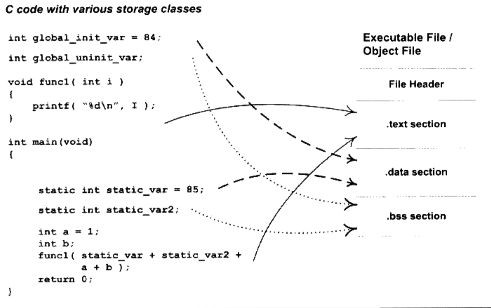

# 编译和链接

[TOC]

应用程序的生成过程可以分解为**4个步骤**：

1. 预处理（Preprocessing）
2. 编译（Compilation）
3. 汇编（Assembly）
4. 链接（Linking）

## 预处理

预编译后的文件扩展名为 .ii。

预编译过程主要处理源代码文件中以 `#` 开头的预编译指令。主要规则有：

- 将所有`#define` 命令删除，展开所有宏定义；
- 处理所有条件预编译指令；
- 处理 `#include` 预编译指令，该过程时**递归**执行的；
- 删除所有注释；
- 添加行号和文件名标识；
- 保留所有`#pragma` 指令供编译器使用。

## 编译

编译过程就是把处理完的文件进行一系列的词法分析、语法分析、语义分析和优化，生成相应的**汇编代码**文件。

> `gcc` 命令指示后台程序的包装，其根据不同的参数调用预编译程序cc1，汇编器as 和链接器ld。

## 汇编

汇编就是将汇编代码转变为机器可以执行的机器指令。每一个汇编指令几乎就对应着一条机器指令。

## 链接

链接即是把用到的各个源文件（包含系统文件）链接到一起从而产生可执行文件的过程。

## 编译过程详解

编译过程一般可以分成6步：扫描，语法分析，语义分析，源代码优化，代码生成和目标代码优化。

示例：

```c++
array[index] = (index + 4) * (2 + 6);
```

### 词法分析

文件被输入到**扫描器**（一种**有限状态机**），将源代码的字符分割为一系列**记号**（token）。

记号可以分为：关键字，标识符，常量和符号等。

程序：lex。

### 语法分析

使用**语法分析器**来对生成的记号进行语法分析，从而产生**语法树**。整个过程采用**上下文无关语法**。

由语法分析器产生的语法树是以**表达式为节点**的树。

符号和数字是最小的表达式，通常就是整个语法书的**节点**；


### 语义分析

语法分析之完成了对表达式的语法层面的分析，并不了解该语句是否真正有意义。

> 编译器所能分析的语义为**静态语义**，即在编译期可以确定的语义。**动态语义**则是只有在运行期才可以确定的语义。

静态语义分析一般包括：声明和类型的匹配，类型转换等等。

经过语义分析后，整个语法树的表达式都被标识了类型。如果需要类型转换，则会在语法树中插入相应的节点。

### 中间语言生成

现代编译器包含很多层次的优化。这里只关注**源码级优化**。

源码级优化器一般把语法树转换为**中间代码**（语法树的顺序表示，与目标机器和运行时环境无关）。中间代码一般有**三地址码**和**P-代码**等形式。以三地址码为例，其格式为：x = y *op* z。

源码：

```c++
t1 = 2 + 6;
t2 = index + 4;
t3 = t2 * t1;
array[index] = t3;
```

优化后：

```c++
t2 = index + 4;
t2 = t2 * 8;
array[index] = t2;
```

中间代码使编译器分为**前端**和**后端**：前端负责产生和机器无关的中间代码；后端将中间代码转换成目标机器代码。

### 目标代码生成和优化

该部分属于编译器后端，主要包括**目标代码生成器**和**目标代码优化器**。

生成器将中间代码转换为目标机器代码；优化器对该代码进行优化。

------

编译器吧一个源代码文件编译为一个为链接对目标文件，由链接器最终将这些目标文件链接起来生成可执行文件。

链接的**主要内容**就是把各个模块之间相互引用的部分处理好，使得各个模块之间可以正确的衔接。**主要过程**包括：地址和空间分配，符号决议（或叫符号绑定）和重定位。

# 目标文件内容

PC 平台流行的**可执行文件格式**（executable）主要是Windows下的PE (Portable Executable) 和Linux下的ELF (Executable Linkable Format)，都是COFF格式的变种。

包括动态链接库（DLL）和静态链接库都按照可执行文件格式存储。

## 格式

目标文件按不同信息的属性，以**段**的形式储存。

- 程序源代码（包含局部变量）编译后的机器指令放在**代码段** .text 中；
- 全局变量和静态局部变量一般放在**数据段** .data;
- 未初始化的全局变量和静态局部变量放在 .bss 段中：.bss段只为为初始化的全局变量和局部静态变量预留位置，本身无内容，在文件中不占据空间。



ELF 文件的开头是一个**文件头**，包含了整个文件的文件属性；并且有一个**段表**（Section Table），即一个描述文件中各个段的数组，包括段在文件中的**偏移位置**和段的**属性**等。

分段的**好处**

- 将数据和指令分别映射到两个虚存区域，权限分别为读写和只读；
- 提高程序的局部性；
- CPU 缓存被设计为数据缓存和指令缓存，分段有助于提高缓存命中率；
- 运行多个该程序的副本时，指令是一样的，只需要保存不同的数据。

## 目标文件详细

主要段示意：


可以看到文件还包含**只读数据段**（.rodata，包括常量，字符等），**注释信息段**（.comment）和**堆栈提示段**（.note.GUN-stack）；.bss段没有 'CONTENTS'，表示其在ELF文件中不存在内容。

### 段表

ELF 文件的段结构由段表决定。


对编译器、链接器来说，最重要的就是**段的类型**，**段的标志位**和**段的链接信息**。

.rel.text 段的类型为 SHT_REL，是一个**重定位表**。对于每一个必须要重定位的代码段和数据段，都会有一个相对应的重定位表。注意到.text 中就有对 `printf` 的引用。

ELF 文件中用到了很多字符串，如段名、字符串变量等等。目标文件中有两个段，**字符串表** .strtab 用来保存普通的字符串，如符号名等，和**段表字符串表** .shstrtab 用来保存段表中用到的字符串，如段名等。

## 符号

源代码中的变量、函数统称为**符号**。

目标文件A **定义**了某个符号，而目标文件B **引用**了该符号。

链接过程很关键的一部分就是符号的管理；整个链接过程正是基于符号才能够正确完成。

符号可以分为：

- 定义在本目标文件中的**全局符号**；
- 目标文件引用的**外部符号**；
- 段名；
- 只在编译单元内部可见的**局部符号**。
- 行号信息。

显然这里我们只关心上面的第一类和第二类。因为链接过程只关注全局符号的相互粘合。

ELF 文件中有 .symtab 段来作为符号表，主要的属性有：

- 符号类型和绑定信息；
- 符号所在的段；
- 符号值：
  - 在目标文件中，是符号的定义且不在 common 块的，值为该符号在所在段中的偏移；
  - 在目标文件中，为 common 块类型的，值表示该符号的对其属性。
  - 在可执行文件中，符号值为其虚拟地址。

### 特殊符号

ld 链接器在链接过程中会产生一些特殊符号。虽然我们没有定义它们，但我们却可以在程序中使用，如`_executable_start`，`_end` 等来控制编译链接。

### 符号修饰

当工程较大时，会产生命名冲突。部分编译器会在符号名前加入下划线 _ 来修饰。

C++ 则更为复杂，会有**符号修饰**（Name Decoration）和**符号改编**（Name Mangling）。典型的就是**函数签名**。

函数签名包含了函数的信息，包括函数名，参数类型，所在的类和名称空间等等。

编译器使用的是**修饰后名称**，用以区分同名函数。

GCC 的C++ 基本名称修饰**规则**如下：所有符号都以 _Z 开头，对于嵌套（在类或名称空间中）的符号，后面紧跟 N，然后是名称空间和类的名字，名字前是该名字字符串的长度，再以 E 结尾。若是函数，其参数列表紧跟在 E 后面。

| 函数签名            | 修饰后名称     |
| ------------------- | -------------- |
| int func(int)       | _Z4funci       |
| int C::func(float)  | _ZN1C4funcEf   |
| int N::C::func(int) | _ZN1N1C4funcEi |

不同的编译器采用不同的名称修饰方法，这是不同编译器不能互操作的主要原因。

### extern "C"

C++ 编译器会在 `extern "C"` 的大括号内部的代码当作C语言代码处理。

而C++编译器会在编译时默认定义宏`__cplusplus`，我们可以以此来判断当前编译单元是不是C++代码。

### 强符号和弱符号

编译器默认**函数**和**初始化了的全局变量**为*强符号*，**未初始化的全局变量**为*弱符号*。

**规则**：

1. 不允许强符号多次定义：符号重复定义错误；
2. 某个符号有一个强符号定义，多个弱符号，以强符号为准；
3. 都为弱符号，则选择占用空间最大的那个。

若链接时，未找到某个符号的定义，链接器报符号未定义错误，这种被称为*强引用*。而在处理*弱引用*时，如果该符号有定义，则链接器将该符号的引用决议；若未定义也不报错。

对于未定义的弱引用，链接器默认其为零。

# 静态链接

静态链接就是将几个输入目标文件加工后合并成一个输出文件。这里主要分为两步：

1. 空间与地址分配；
2. 符号解析与重定位。

## 空间与地址分配

最简单的就是将输入的目标文件按照次序叠加起来。但这样会造成内存碎片等缺点。

### 相似段合并

更常见的做法是把性质相似的段合并到一起。

而*地址和空间的分配*有两个含义：

1. 在输出的可执行文件中分配；
2. 在装载后的虚拟地址中的虚拟地址空间分配。

对于.text 和.data 段，二者在可执行文件和虚存中都需要分配空间。对于.bss 段来说，空间分配只对后者有意义。

链接前后的程序中使用的地址已经是程序在进程中的虚拟地址。所以对于目标文件中的各段，我们只关心其VMA 和SIZE。


链接完后，输入文件中的各个段的虚拟地址就已经确定了。

然后，链接器开始计算各个符号的虚拟地址。因为符号在段内的相对位置固定，此时只要给符号加上偏移量就可以了。

## 符号解析与重定位

### 重定位

空间分配完成后，链接就进入核心的*符号解析和重定位*步骤。